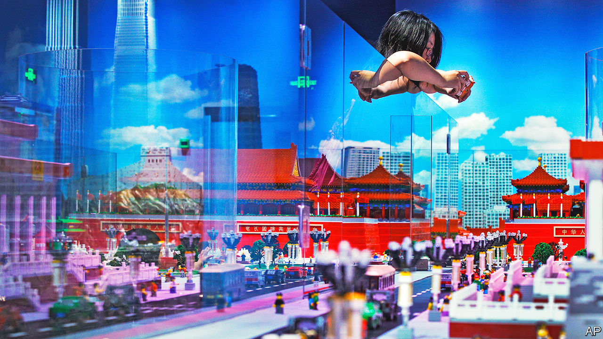

###### Battle of the bricks

# Lego, the world’s top toymaker, focuses on China 

##### Its local rivals are building new weapons, though 

 

> May 4th 2023 

The Chinese name for Lego, Legao, includes the character for happiness. And indeed, China has brought much joy to the world’s top toymaker by revenue. Brick by brick, the Danish company has built up its business in the country, which is increasingly central to the firm’s future. Last year over 60% of the new shops opened by Lego were in China.

That brings with it unique challenges. In 2015, for example, Lego refused to sell bricks to Ai Weiwei, a Chinese artist known for criticising Communist Party leaders. Mr Ai planned to use the toys in a piece on dissidents. The company eventually backed down, saying it would no longer query the purpose of large orders. More recently, a rainbow-coloured set that celebrates inclusivity, called “Everyone is Awesome”, stopped being available in China.

But the focus on China has also led to interesting new creations aimed at the local market. In recent years Lego has released a number of sets that evoke the country’s culture. The latest include a traditional lunar-new-year display and a Chinese money tree adorned with red envelopes. Duplo, a Lego line aimed at younger children, has produced a “Learn about Chinese culture” model that incorporates red lanterns and a Mahjong set.

Lego’s “Monkie Kid” theme is inspired by “Journey to the West”, a 16th-century Chinese legend. Of course, the original monkey king did not have a “dragon jet” or “galactic explorer”. But these sets seem in line with the party’s push to build “cultural confidence”. So too does “Lego Masters”, the local version of a reality-TV show in which adult builders compete. Each episode is inspired by “the profound Chinese traditional culture”, says its broadcaster, Shenzhen Media Group.

Staying on good terms with the party is a common challenge for firms in China. So is protecting intellectual property. Lego has dozens of Chinese competitors. And it has fought several successful copyright battles against imitators selling cheaper sets that resemble its own. 

Some rivals are taking a different approach. Though it produces “starfighters” and “spider tanks”, Lego refuses to make true-to-life models of military equipment. Chinese firms are filling the gap. According to Sixth Tone, a Chinese news site, local toymakers are taking inspiration from the People’s Liberation Army, creating Lego-like models of J-20 fighter jets, DF-41 intercontinental ballistic missiles and other Chinese weapons. Some fans are using the creations to make stop-motion animated films that re-enact historical battles.

But Chinese toymakers are fighting an asymmetric war. Lego has hundreds of stores in China. Last year it opened 95 new ones, including a big flagship branch in the western city of Chongqing. This year it plans to open 80 more. It, too, is on the offensive.■


