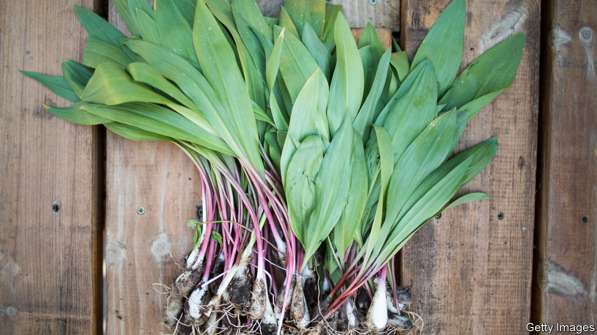

###### World in a dish

# A hunt for ramps exemplifies the pleasures of foraging for dinner 

##### The springtime shoots are a reminder to enjoy fleeting pleasures while you can 

 

> May 4th 2023 

THE SKY looked like the top half of a landscape painting by —cerulean, cloud-dappled and shifting in a light wind. The first pale blossoms were just emerging on the otherwise bare branches of trees; hordes of mayflies flew kamikaze missions into eyes and mouths, delirious after months of winter. For some discerning humans, the real attraction of the spring’s first warm weekend in the American north-east lay not in the air above them, but on the ground: pairs or trios of slim, elegantly tapered dark green oval leaves that sprang up from forest floors all over the eastern United States.

These are ramps, a type of wild allium that tastes like a cross between garlic and spring onions, with a sharp, peppery edge (much like wild garlic in Europe). The search for them is not as competitive as the  can be, but no self-respecting forager will reveal the site of a prized patch. Your correspondent’s is within a four-hour drive of Manhattan, and even typing that much makes him uneasy. 

As with other foraged, hunted or fished foods, only part of the reward of ramps lies in their consumption. That said, the consumption is delicious. Blanching the leaves, pounding them with garlic, almonds and a sprinkling of pecorino, then whisking the paste with olive oil and a bit of salt, yields a wonderfully gutsy pesto. Tossed, when raw, with a hot oil-dressed pasta, the leaves wilt slightly, giving a lovely crunch and perfume to a simple, more-than-the-sum-of-its-parts dish. Ramps go beautifully with asparagus, peas and other early-spring vegetables. The bulbs can be pickled but are best left alone. Snipping off just the leaves ensures they will sprout again next year; digging up the bulb kills the plant.

Ramps are a tricky and elusive crop. They can be grown in gardens, but they are finicky about soil moisture and can take up to a decade to reach maturity. That makes cultivating them commercially risky. And their season is short, lasting just a few weeks: by May, they have either withered or been eaten by insects. In the woods, they appear at roughly the same time as morels (likewise a forager’s treasure and a harbinger of spring). Finding both requires patience, alertness and a bit of good luck. First-timers should be prepared to return home empty-handed.

But so what? The joy of foraging, like the satisfaction of , lies not just in the haul, but in the thoughtful, focused peace of the search. By walking slowly and scanning the forest floor, foragers will come to see even the most familiar woods anew. Finding ramps means ruling out all the other springtime shoots that resemble them. Ruling out those shoots means noticing them, which means paying attention.

The upshot is that you cannot forage quickly, still less while looking at a mobile-phone screen. In this way ramps are a slow food; but, because their season is a brief verdant interlude between the shivers of winter and the sweltering summer, they are also a fast one. They are a reminder to enjoy fleeting pleasures while you can. ■


