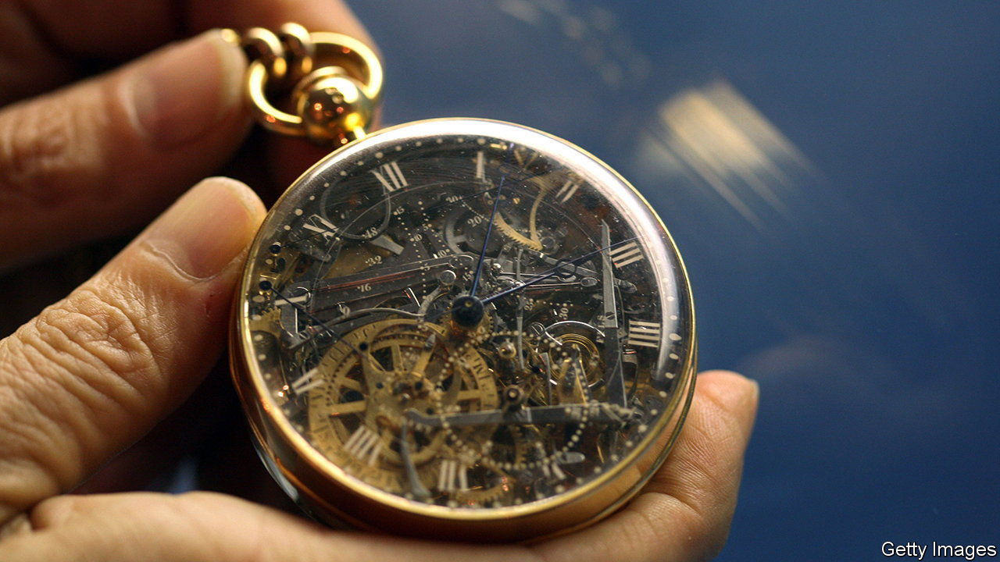

###### Pocket rockets

# The evolution of watches reflects changing relations with time 

##### In “Hands of Time”, Rebecca Struthers also shows how it has been intertwined with history 

 

> May 4th 2023 

By Rebecca Struthers.

Under fire over his pension reforms, in March President Emmanuel Macron incurred more French ire by surreptitiously slipping off a luxury watch midway through a television interview. More than two centuries ago, another watch embodied France’s power struggles. An anonymous admirer of  commissioned Breguet, the royal watchmaker, to make her a timepiece on a limitless budget, an object seen as emblematic of the ’s excesses. Breguet narrowly escaped the guillotine during the Terror, and laboured on the watch for the rest of his life. His workshop finished it four years after he died—and 34 years after its intended owner had lost her head.

The fate of Marie Antoinette’s watch is one of many gripping tales in Rebecca Struthers’s “Hands of Time”A British historian and watchmaker, she chronicles the development of timekeeping devices from ancient Egyptian water clocks to the . Denis Diderot’s 18th-century encyclopedia stated that mastery of horology required “the theory of science, the skill of handwork and the talent for design”. “Hands of Time” is duly a story of both innovation and aesthetics. Its engaging pages are peopled with engineers and artisans, as well as the kings, revolutionaries, fraudsters and explorers who helped shape the watch’s history.

Its central argument is that the changing nature of the watch has “reflected and developed our relationship with time”. In the medieval era, and for a while afterwards,  were found almost solely on church towers. Time was public, not private, and delivered from on high. As watches developed, portable timekeeping was initially a privilege of the wealthy. Ever more elaborate designs were the ultimate status signifiers. In his diary of 1665, Samuel Pepys described his new watch with childlike glee: “I cannot forbear carrying my watch in my hand…and seeing what o’clock it is one hundred times.” 

Having access to time meant being able to control it for other people, a power exploited by the 19th-century industrialists who extended working days beyond allocated hours. Yet technological developments—and forgeries—made watchmaking cheaper, so “democratising time”. By the turn of the 20th century you could buy a watch for a dollar. Timekeeping was at last within reach of ordinary folk.

The story of watches is closely intertwined with major historical events. Switzerland can partly thank fleeing French Huguenots for its watch industry. Enhancements to maritime watches enabled longitude to be measured accurately, saving countless lives at sea. But such advances in navigation were also a boon to the transatlantic slave trade and empire-builders. Male wristwatches, rather than the pocket kind, became popular during the first world war, when ready access to the time could be life-saving.

The developments in watch engineering that Ms Struthers describes in her expansive study will be less compelling for non-specialist readers than for aficionados. But lively details compensate for the drier moments. Watchmakers of yore sometimes found an extra use for their dexterity by offering dentistry as a sideline. The world’s oldest known watch was sold for £10 ($16) at a flea market in London in the 1980s; it turned out to be worth tens of millions of pounds. In exploring the author’s own watchmaking work, the book offers a glimpse of the craft through the eyes of a master. It is an ode to a traditional and (in Britain) dwindling industry.

Skilfully moving between the minuscule world of watchmaking and the sweep of history, “Hands of Time” is an enlightening study of “the closest relationship we had with a machine” before the advent of . It charts humanity’s shifting relationship with time, while showing that watches have always connoted more than time-telling—as President Macron’s faux pas proved. ■


