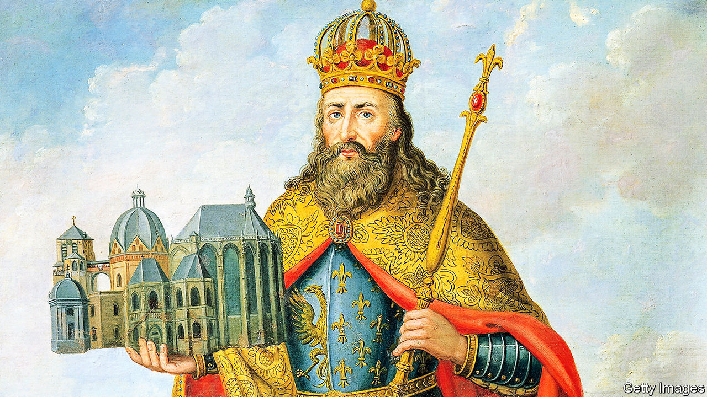

###### The emperor’s new abode

# Was Charlemagne’s base really in Italy rather than Germany? 

##### The eccentric question has a serious point: locating the heart of Europe 

 

> May 4th 2023 

An air of mystery surrounds the off-white dome, framed by slender cylindrical towers, rising from the alluvial soil that sweeps from the Chienti valley to the Adriatic. Guidebooks describe the church of San Claudio as a Romanesque abbey of the 11th century. Yet many people in and around the nearby town of Macerata—local councillors, journalists, clergy—say the building is really two centuries older. They also think it is intimately linked with Charlemagne, literally Charles the Great, often described as the “Father of Europe”.

To be precise, they believe this numinous spot was the headquarters of the conquering monarch—the place where he held court between wars, built a personal chapel and left his earthly remains. They cheekily challenge the firm consensus which ascribes that  in north-west Germany. “It is one of the many secrets of this part of the world,” says Marco Rotunno, a veteran guide to the Marche region, where the church stands.

Eccentric as this claim may sound, its ramifications are far from trivial. Over the centuries, Charlemagne has been enlisted as a figurehead of rival nations and ideologies. In the modern era he has become a symbol of peaceful European unity. It suited the founders of Europe’s post-war institutions to showcase Aachen, a city close to the intersection of Germany, France and the Benelux lands. But what if Europe’s historical heart lies south of the Alps?

Heirs and traces

Objectively as well as symbolically, Charlemagne was a pivotal figure in his continent’s history. At his death in 814, he controlled what today are France, Germany, the Low Countries and northern Italy; he had overrun central Europe as far east as Hungary. Using Christianity, Latin and literacy as instruments of soft power, he began turning these lands into a single cultural and commercial realm. On Christmas Day in the year 800, he was crowned as emperor (a sovereign of many peoples, not just one) by the pope. The ceremony in Rome was a spectacular challenge to the worldly and spiritual masters of Constantinople, until then the strongest claimants to the mantle of ancient Rome, and to the leadership of Christendom.

Nobody—not even the iconoclastic Italians—doubts Aachen’s subsequent role as capital of the , the polity Charlemagne founded. Its status was flamboyantly affirmed by another roving warrior-monarch, Frederick Barbarossa, in the mid-12th century. He established the cult of Charlemagne as a saint, whose body, in a gilt coffin, attracted awestruck pilgrims. The question, say the Italians, is what went before. The texts in Latin that relate Charlemagne’s life identify his hq as “Aquisgrana”: a reference to Aachen, conventional wisdom holds.

Not so, insisted Giovanni Carnevale, a learned and charismatic Italian priest who spent the last four decades of his long life (he died in 2021 at 96) developing an alternative theory. Drawing on Latin, French and German sources, as well as oral history and archaeology, he found scores of reasons for his claim that San Claudio was the first Aquisgrana—before the place-name, along with Charlemagne’s body and other artefacts, was moved north by Barbarossa.

The accounts in Latin present Aquisgrana as a place prone to earth tremors, where vines and olive trees were cultivated and you could go hunting by the sea. All these details fit San Claudio. A couple of other medieval churches were described by their founders as copies of “Charlemagne’s chapel”, one in the English town of Hereford, another in France near Orléans. They uncannily resemble San Claudio and bear no likeness to the octagonal chapel in Aachen.

The history buffs of the Marche are not the first to covet the legacy of Charlemagne. Various cities purport to be his birthplace. He was claimed by both sides in Franco-German contests that lasted for nearly a millennium. From the 11th century onwards, Norman-French poetry and song hymned the emperor as a Gallic hero and linked him to the cult of St Denis, the centre of which was Paris. He was invoked by French Crusaders as an anti-Muslim warrior (in truth he intervened in the internal feuds of Islamic Spain, but made no general attack on Islam). 

The Holy Roman Empire, meanwhile, was mainly a Teutonic phenomenon, and a focus of early German patriotism. Napoleon Bonaparte finally scotched that empire in 1806, while  of Charlemagne for himself. But when a united Germany was proclaimed in 1871, its leaders were also fascinated by the earlier emperor. In 1915 Kaiser Wilhelm II made a copy of a magnificent imperial crown mistakenly associated with Charlemagne and placed it in Aachen. In 1938 Adolf Hitler ceremonially brought the original crown from Vienna to Nuremberg, a royal stronghold in medieval times. American soldiers returned it to Vienna in 1946.

Even today, Charlemagne’s ghost hovers in unlikely places. The clergy and courtiers who have choreographed the , in Westminster Abbey on May 6th, were obliged to mug up on the rites used by England’s medieval kings, for which Charlemagne’s elevation in Rome was a prototype. Indeed, it is mainly thanks to the warrior-monarch that Charles was established as a royal name: in many European tongues, the word for king derives from Charles.

You might conclude that the facts of Charlemagne’s life are so vague, and so contested, that any claim on him is fair game. Certainly not, says Philip Daileader, a historian at the College of William &amp; Mary in Virginia. Although his motives remain an enigma, Charlemagne’s basic biography is better established now than at any time since the ninth century, the professor says. Florian Hartmann of Aachen University finds the Italian theory bizarre and unconvincing. In his view it relies too much on texts written for propaganda purposes. Charlemagne’s own decrees are a better source, Professor Hartmann reckons—and they put him in Germany.

Back at San Claudio, enthusiasts are unbowed. They too have been mulling Charlemagne’s coronation in Rome in 800 and his subsequent movements. A Latin text has him in Aquisgrana in March 801 and in the Italian town of Spoleto in April. “Is it really possible that he dashed over the Alps to Germany and then hastened back to Italy, all in a matter of weeks?” asks Mr Rotunno, the guide, with a smile. “But if his capital was really here…” ■


