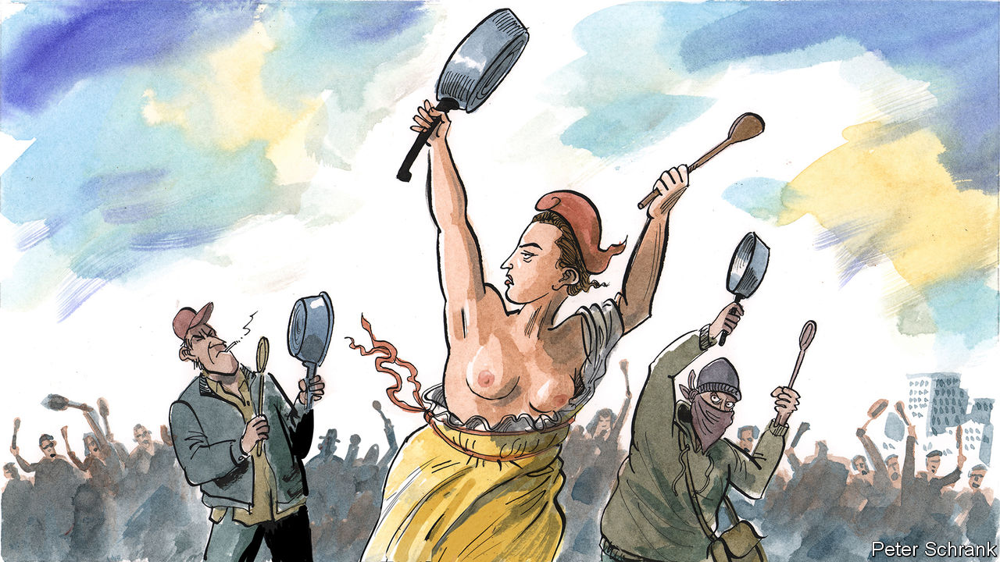

###### Charlemagne

# Emmanuel Macron hopes to reinvent himself in 100 days 

##### France’s president would also benefit from curbing some of his own instincts 

 

> May 4th 2023 

During his audacious first bid for the French presidency, in 2017, Emmanuel Macron would scold supporters at campaign rallies who jeered when he name-checked his rivals. “Don’t whistle at them; let’s beat them!” the 39-year-old pretender urged the crowds with a smile, adapting a slogan borrowed from the high priest of political positivity, America’s Barack Obama. French politics, Mr Macron argued forcefully then, was in need of benevolence and collective endeavour not obstructive division. It was time to move an irritable, rebellious country to a more stable, consensual place.

Six years later, France seems stuck in an impasse. The French are once again fired up by revolutionary rage and seem convinced that the country is run by an anti-democratic despot bent on destroying the bedrock of all that the French cherish. The opposition trades in a form of declinist . The grotesque effigies of the president’s head in a noose, or the burning of bins on the cobbled streets of Paris, glorify violent revolt. On May 1st an armour-clad policeman was set alight by a Molotov cocktail. It was the low point of the 13th one-day strike against Mr Macron’s modest decision to raise the minimum pension age from 62 years to 64, which is now law. Petrol-bombing troublemakers represent a minuscule minority. But 63% of the French want to keep up the struggle against the new law, and 72% say they are unhappy with Mr Macron as their president. 

The latest instrument of choice for protesters is more prosaic, but no less symbolic: the saucepan. A few years back the  (yellow jackets) adopted high-vis fluorescent jackets to mark the fury of those who felt invisible and ignored by the president. This time, protesters stage , or concerts of banging pots and pans, to signify discontent at his failure to listen. Saucepan-banging was popular in the 1830s among republicans contesting Louis-Philippe’s reign, and it did not end well for him. Today’s cacophony of metallic banging may not drive Mr Macron from his palace. But the message is forceful: if the president will not listen to us, then we will make sure we cannot hear what he has to say. Mr Macron has given himself 100 days to conduct a mini-tour of France, to talk to people and try to reset his presidency. The  are set on drowning out his voice. 

Take a step back, and there is something deeply strange about a society that has so much going for it working itself into such a frenzy about so little. France has a robust, redistributive welfare state, high levels of social spending, falling unemployment, long holidays, world-leading corporate brands, a healthy stockmarket, a thriving tech sector, lower inflation and stronger economic growth than Germany. Every evening, images of real war and extreme hardship on the European continent are beamed into its living rooms. Yet France has turned the raising of the pension age to 64 into a national psychodrama. Forget the coming upheaval of artificial intelligence, or quantum computing, or the worrying level of southern Europe’s water table. France is heading to the barricades to fight yesterday’s battles. And its re-elected president is portrayed, absurdly, as an autocrat for having gone ahead and done what he said during his campaign that he would.

The reasons for all this are numerous. Obstreperous opposition parties at both extremes thrive on division and fear. The weak and divided centre-right Republicans cannot decide whether their future lies in co-operating with Mr Macron or making trouble. The constitution creates excessive expectations of a single leader. Militant unions care little for the culture of consensus. Among the books prominently displayed for sale during a recent day of protest in Paris were Lenin’s “The State and Revolution” and Alan Woods’s “The Ideas of Karl Marx”.

The president also bears a big share of the blame. His original sin was a failure, after his re-election in April last year, to campaign properly for the parliamentary elections two months later. Mr Macron lost his majority, mishandled his pension reform, alienated even moderate union leaders, and found himself having to push the law through parliament without a direct vote. The advocate of consensus-building between the left and the right ended up driving a bulldozer through the centre of French politics. On April 28th Fitch, a ratings agency, downgraded France’s sovereign debt to the same level as Britain’s, citing “political deadlock and (sometimes violent) social movements”.

No sound of silence

Where does this leave Mr Macron, who has four more years in office? Guiding and nudging the prickly French out of their comfort zone is a challenge for any leader. For the president, his “100 days” is a way of buying time, giving people a chance to let off steam and countering the populist charge that he is disconnected. For those who meet him on his walkabouts, it is a chance to tell him to his face—and boy, does he get close—how angry they are. 

This period also gives Mr Macron time to work out how to govern differently. Fresh parliamentary elections would probably leave him even shorter of a majority. A new prime minister would make sense only if he or she could reboot the government. Without a formal coalition, bill-by-bill negotiation will render tricky anything but the most uncontroversial reform.

Mr Macron is a serious, intelligent, ideas-driven leader, who thinks ahead and knows where he is trying to take France. But he is also someone who reckons he knows better than everybody else, and has trouble concealing it. This makes his connection with the French tense, and his governing style solitary and abrasive. In this respect, the saucepan-banging is a broader metaphor. For there is a big difference between talking and listening, not to mention believing that your interlocutor has something useful to say. If a reinvented president is to emerge from the “100 days”, it might usefully be one who has also learned to curb his own instincts. ■


