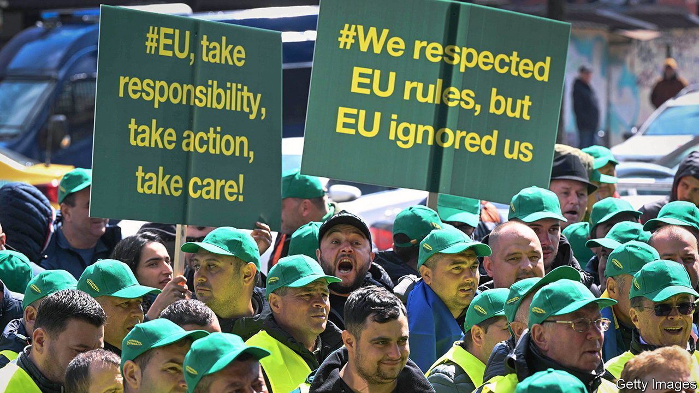
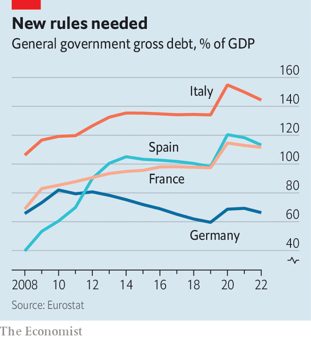

###### The reckoning

# Europe will need to fundamentally reset its fiscal policies 

##### With spending and interest rates high, a fight over the EU’s debt rule is only the start 

 

> May 4th 2023 

Fiscal rules always have exemptions. The one California passed in 1849 had an exception in case of insurrection. Many resource-rich countries’ rules can be suspended if commodity prices crash. And most guidelines have some kind of out in case of a pandemic. But in Europe exemptions have become so frequent lately that it is not clear how to reinstate the rules at all. 

 


The EU’s member states are arguing with Brussels over how to change the rules before re-applying them. Debt levels and interest rates are far higher than in 2019, when the rules last applied (see chart). But spending needs for security, defence, energy and climate protection have gone only one way. The European Commission’s latest proposal for a new set of rules was criticised by all sides, which is often a sign of a decent compromise. 

But this is a sideshow. “The risk of the current discussion on fiscal rules is that we lose sight of the bigger picture,” says Sander Tordoir of the Centre for European Reform, a think-tank. The EU is heading for a spending squeeze that requires not rule-tweaking, but a new fiscal settlement.

Start with climate. The EU’s target of cutting emissions by 55% by 2030, relative to 1990, requires additional public spending of more than 1% of GDP per year over the current decade, reckons Agora Energiewende, a think-tank. The more governments allow the EU’s carbon-permit price to rise, or impose tighter emissions regulations, the lower the public bill. But few governments are willing to be tough with voters: most would rather try to lower emissions by doling out subsidies. 

The most egregious of these, in Italy, has cost the treasury around €130bn ($144bn, or 7% of GDP) since 2020. Part of it is known as the “superbonus” scheme, which gave home-owners transferable tax credits amounting to 110% of the costs of energy-saving renovations. It was recently curtailed to a still generous 90%. More handouts are coming: Germany’s proposal to make new domestic heating systems run on 65% renewable power from 2024 has elicited fierce resistance. Kevin Kühnert, the secretary-general of the governing Social Democrats (SPD), has already hinted at further subsidies. 

Defence is the next big-ticket item. Germany has set up a €100bn fund to plug its armed forces’ most urgent gaps. Experts agree that it will not be enough. Defence spending is set to increase there from the current 1.5% of GDP in 2021 to about 2%. Within the euro zone, only Greece and the Baltic states spend more than 2% of their GDP on defence. Overall, European countries will have to spend about 0.5% of GDP more on defence in the coming years to reach NATO‘s target of 2%. 

The urgency of defence increases was prompted by Russia’s invasion of Ukraine. But that invasion entails another big bill: rebuilding Ukraine, and perhaps integrating it into the EU. The cost of reconstruction will be around €380bn over a decade, reckon the World Bank, the EU, the UN and the Ukrainian government in a joint assessment. America has shouldered by far the biggest chunk of military assistance, and will expect Europe to pay for much of the repair bill. Part will come from the private sector, but public spending on reconstruction could still amount to €30bn per year, another 0.17% of the EU’s GDP. 

Should Ukraine and its 44m citizens join the EU, the bloc’s spending mechanisms will need an comprehensive overhaul. Bulgaria, a country of just 7m, is scheduled to get €28.5bn from the EU between 2021 and 2027, about €4,150 per citizen. If Ukraine got the same amount per head, the bill would come to around €180bn, or €25bn a year (0.14% of EU GDP). Either richer countries would have to pay more, or poorer countries would get less. But the latter seems highly unlikely: in April Poland and other border countries briefly blocked shipments of cheap Ukrainian grain because their farmers were angry at the competition. 

Meanwhile the continent is getting old. Europe’s working-age population is already shrinking; the total number of people in employment could soon follow. The commission projects annual age-related spending, which includes pensions and health care, will increase by 1.4 percentage points of GDP between 2019 and 2030. That will need to come from somewhere. Taken together, climate change, defence, Ukraine and ageing could add about 3.3% of GDP in spending per year. 

There is little to offset the increased costs. A growing economy is unlikely to ease the burden. On the contrary, the party is over, as one Brussels official puts it, pointing out that the post-pandemic economic recovery is winding down. Medium-term projections put annual EU growth at below 2%. That is no surprise. A shrinking or at best stagnating workforce can only produce more with higher productivity or more capital. Most investment in renewables and energy efficiency will make the economy greener, but hardly more productive.

In the short term, most EU countries will manage. Inflation is pushing up revenues more than spending, for now. Southern Europe continues to enjoy the largesse of the EU’s pandemic-recovery fund; as with defence, most countries are struggling to spend the cash. But the plans of fiscally strong places such as the Netherlands show increasing demand for government resources. The country that once led the “frugal four” plans to stick, just about, to the EU’s old deficit limit of 3%, before looking set to breach it after 2025. Christian Lindner, Germany’s finance minister, is pushing back against spending demands from his Green and SPD coalition partners. The EU and its members will soon be forced to upend their fiscal policies. By comparison, the wrangling over fiscal rules is a walk in the park. ■


