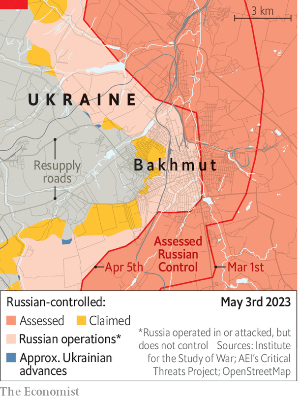

###### No Victory Day

# Russia could take Bakhmut within weeks 

##### But even if it succeeds, it would be the very essence of a Pyrrhic victory 

 

> May 3rd 2023 


VLADIMIR PUTIN likes a parade. When he invaded Ukraine on February 24th last year, he hoped his “special military operation” would bring triumph within days; some units reportedly had dress uniforms ready packed. Later he hoped  in Europe Day procession would coincide with the fall of Mariupol, a port city on the Azov Sea. But Ukraine held out for another week, and the parade in Moscow was a damp squib. This year’s parade now looks menaced; on May 3rd, Russia said it had shot down two Ukrainian drones that had targeted the Kremlin itself. (Ukraine denied responsibility.)

The parade was anyway again likely to be short of much to celebrate. This year Mr Putin’s target is much smaller than Mariupol; and it still has not been achieved. For over ten months Russia has been trying to conquer , a town in the eastern Donbas region with a pre-war population of 70,000. A surge in the fighting suggests that Russia’s generals are desperately trying to deliver it to the Kremlin by May 9th—whatever the cost. On May 1st the White House said that over 20,000 Russians had been killed since December alone. A large proportion of those is likely to have perished in or around Bakhmut, making it perhaps the costliest battle since Iran’s assault on Basra 36 years ago. Ukrainian forces, outgunned, have been retreating 50-75 metres a day, says one official. They are now confined to the city’s most westerly districts (see map). 

 


The textbooks, when they are written, will surely focus on why the town was ever fought over in the first place. Bakhmut has limited strategic significance. There are better natural defences in the hills to the west of the town. The city itself has been reduced to a pile of smouldering rubble. According to recently leaked Pentagon documents, America has since January been privately urging Ukraine’s leadership to retreat. But Bakhmut has acquired a political weight that appears to trump military necessity. Since the fighting began last July, it has become a symbol of Ukrainian defiance. The Russians desperately want to capture the town, small and ruined though it is, as a fillip for their flagging campaign: it has been the main focus of their fighting since late summer. For Ukraine, it matters for much the same reason—to deny Russia a morale-boosting victory and to wear the enemy down in the process. 

Russian forces have made their grinding advance thanks to their artillery dominance as well as the use of human waves of mobilised convicts and of elite airborne assault units, which are now deployed on the flanks of the city. On April 25th a senior figure in Ukrainian military intelligence told  that Ukraine controlled just 15% of the city, implying a rate of advance that would mean Russia could take Bakhmut within a few weeks.

Ukraine’s generals argue privately that the course of the fighting has nonetheless vindicated their decision to continue to defend Bakhmut. Some Ukrainian commanders say the losses for Russia around the town have been as high as ten to one against it. Independent observers say this is much too high. Konrad Muzyka, a Polish military expert who visited Bakhmut in March, notes that the casualty ratio has changed over time. But at a low point in January and February, when Russian forces threatened to encircle the Ukrainian deployment, the ratio probably reached parity, he says: one Ukrainian loss for every Russian one, a worrying state of affairs, given Russia’s manpower advantage. 

Things improved somewhat in March, though only after Ukraine deployed special forces to secure the northern and southern flanks. The past three weeks, which have coincided with an escalation of Russian firepower, have been especially difficult. Andrei, an artilleryman in the 93rd Brigade, one of two charged with defending Bakhmut, says that Russian forces can now clobber both remaining Ukrainian roads into the town, making resupply difficult. The north-western route in, he says, is now “impassable”. The southerly one is “under constant shelling”. 

The battle is not over yet. Ukraine has exceeded expectations in Bakhmut, hanging on long after American intelligence thought it would be suffocated. Yevgeny Prigozhin, the head of the Wagner mercenary group, which has supplied the majority of Russian cannon fodder in Bakhmut, is publicly complaining that his troops no longer have enough ammunition. Russia’s commanders may be deliberately rationing supplies. What is less clear is whether they are doing so in anticipation of a Ukrainian counter-offensive or because of infighting between Mr Prigozhin and the regular armed forces. 

Serhiy Cherevaty, a spokesman for Ukraine’s eastern command, says that Wagner remains the only real offensive force in Bakhmut. The vast majority of the 30-40 daily waves of attacks there are conducted by their units from positions already in the city, he says. Russian commanders have not hesitated to throw their troops into “meat-grinder attacks”, says Dmytro Kukharchuk, a battalion commander in the 3rd Assault Brigade deployed nearby. “If we are storming their trenches, they fire artillery practically at their own soldiers. They really don’t care about them.”

Even if Russia takes Bakhmut, it would be the very essence of a Pyrrhic victory. Bigging up the capture of a provincial town of dubious strategic value may focus attention on how little Russia has achieved in ten months of fighting. In the process it has frittered away its offensive potential, making itself more vulnerable to a counter-strike. Mr Putin’s pageant in Red Square on May 9th will only underline how little he has to show for his invasion. ■

