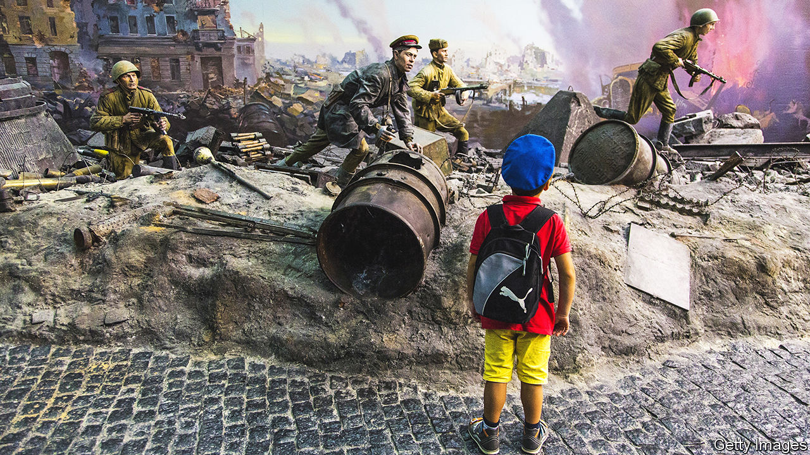

###### Producing patriotic children for Russia

# Vladimir Putin wants to militarise Russian schools 

##### By instilling patriotic values, he hopes to fend off decadent Western influences 

 

> May 4th 2023 


At the turn of the year Moscow’s Victory Museum, which glorifies Russian valour in the second world war, hosted a “historical quest” for children. A promotional video showed youngsters firing plastic rifles and lobbing pretend-grenades at an oncoming tank. The actual event was less exciting: activities included puzzles and parroting patriotic slogans. The children wore Soviet soldiers’ caps. Museum staff and chaperones had the letter Z, a symbol of support for Russia’s invasion of Ukraine, stitched onto their t-shirts.

Last year Russia’s parliament enacted plans to create a youth movement emulating the Pioneers, a communist-era organisation that used to promote Soviet ideology. The Kremlin also introduced lessons in “Russian values” into the school curriculum, to fend off Western decadence. In September basic military training, including tips on how to handle a Kalashnikov, will become mandatory for students from 16 onwards.

This patriotic push is designed to justify President Vladimir Putin’s invasion, which he casts as the defence of traditional values against the West. Children must have a positive impression of army life—after all, many of them may soon be enlisted. 

Russians seem receptive. In May last year the Levada Centre, an independent pollster, found that some 80% of them endorsed reviving the Pioneers; 87% of those aged at least 55 were keen. Though younger Russians were less eager to justify their army’s actions in Ukraine, most of them still approved.

Nonetheless, researchers at Russia’s Higher School of Economics found before the invasion that the young preferred less ideological acts of citizenship, such as local community service. The Friedrich Ebert Foundation, a German think-tank, found that young Russians doubted the state’s ability to transform their lives for the better, thanks to stagnant politics and endemic corruption.

Previous youth initiatives have been patchy. (meaning Ours), a pro-Kremlin youth movement that started in 2005 and encouraged the young to harass Mr Putin’s opponents, petered out in the early 2010s. 

More recent campaigns may be more popular, such as (Youth Army), an organisation launched by the defence ministry in 2016, which teaches kids military skills at jolly summer camps. It now claims to have 1.25m members spread widely across Russia, six times as many as ever mustered. Getting wise to the power of social media, the government pays prominent influencers to talk up the joys of membership. Whether it will help to buoy up the morale of young Russian soldiers on the Ukrainian front is another matter.■

