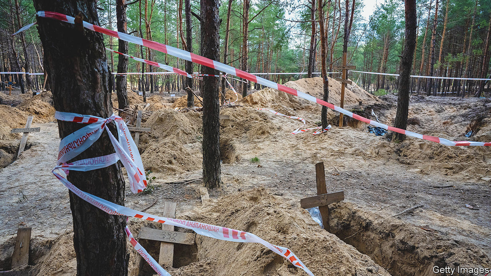
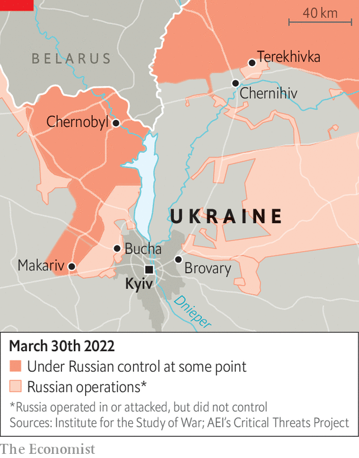
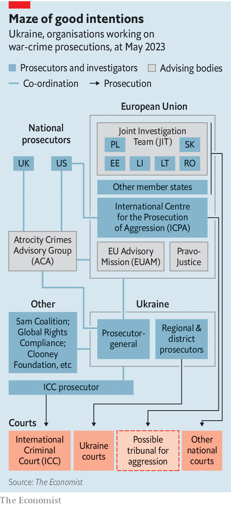

###### Atrocity exhibitions

# War-crimes prosecutions in Ukraine are a long game 

##### The West and Ukraine need to set priorities and organise better 

 

> Apr 30th 2023 


TEREKHIVKA IS A rambling farming village outside Chernihiv, full of low iron-roofed houses and telephone poles topped with stork’s nests. The village boasts a general store and a community centre, and it used to have a kiosk selling soft drinks. The kiosk has been closed since February 24th 2022, when  and occupied the area for more than a month. The Russians found a use for it, though: for several days soldiers imprisoned a civilian named Oleksandr Marusik there and tortured him, standing on his wounded leg and demanding to know where Ukrainian units were. Unable to bear the pain, Mr Marusik begged them to kill him. Eventually, they let him go.

Amidst the legion of atrocities committed by Russian forces in Ukraine, Mr Marusik’s story seems unremarkable. Russia has bombed and shelled civilian targets in Ukrainian cities, killing thousands. Its troops have tortured, sexually abused and murdered non-combatants in towns they have occupied, such as . Russia has systematically abducted . A video clip that surfaced in mid-April appeared to show Russian soldiers beheading living Ukrainian prisoners of war.

 


Ukrainian prosecutors have opened more than 80,000 war-crimes cases since the invasion, according to Andriy Kostin, the country’s prosecutor-general. Yet Mr Marusik’s case stands out in one respect: it is one of some 30 that have already led to a conviction. On February 17th a court in Chernihiv convicted a Russian soldier named Denis Kuznetsov in absentia for torturing him. 

The trial shows the efforts Ukraine is making to prosecute war crimes. But it also highlights the problems. Ukraine lacks a strategy for building cases against Russian leaders, as opposed to foot-soldiers. Its allies have provided databases and training, but deployed few investigators of their own. A blizzard of international aid initiatives defy co-ordination. If Ukraine and its allies hope to render judgment on those people responsible for Russia’s war crimes, they have work to do.

Serhiy Khamaiko, the prosecutor who tried Mr Marusik’s case, says he picked it for a simple reason: he had the evidence. Ukrainian security services had mobile-phone data that placed Mr Kuznetsov, then 20, at the kiosk. Mr Marusik picked Mr Kuznetsov out of a photo line-up, having seen his face when not blindfolded, and recognised his voice on intercepted phone calls. The court sentenced the Russian to 12 years in prison under Article 438 of Ukraine’s criminal code, which deals with violation of the laws and customs of war.

But the Ukrainian authorities have no idea where Mr Kuznetsov is. His court-appointed defence lawyer could not contact him. Mr Kuznetsov, if he is alive, may not know he has even been charged: prosecutors are required only to publish a notice in the official government courier. What, then, does his sentence mean? “Everybody asks me that,” sighs Mr Khamaiko. Russia may undergo a regime change some day, he argues, and the verdict gives a sense of justice to the victim.

At tribunals such as those for the wars in Sierra Leone and the former Yugoslavia, prosecutors learned how to slowly build cases against the senior leaders who organised the violence. In Ukraine that has yet to happen, says Wayne Jordash, an international lawyer in Kyiv. Mr Jordash runs Global Rights Compliance, a legal practice that supports Ukrainian investigators and prosecutors. “There’s a focus on direct perpetrator cases, which look like ordinary crimes—the torture in the basement, the rape of the woman,” says Mr Jordash. Because the numbers are overwhelming and technical expertise scarce, prosecutors “are only just beginning to focus on how you take those cases upwards”.

 


Some problems are rooted in law. Ukraine’s criminal code lacks the concept of command responsibility, which is used to charge senior commanders with war crimes even if they did not explicitly order each one. Also, Ukrainian prosecutors have little discretion: they are required to launch an investigation within 24 hours after being notified of a crime. That leads to a proliferation of minor cases.

Prosecutors’ careers prosper when they win lots of trials, an incentive to pursue quick charges against soldiers rather than long investigations of their commanders. A number of Russian POWs have pleaded guilty, only to be traded back in prisoner exchanges. Trials in absentia are risky: in 2015 the European Court of Human Rights struck down a conviction in Croatia (calling many others into question) because the country’s process for appeals for those tried in absentia was judged to be flawed.

Ukrainian courts cannot accept evidence directly from outside investigators, so international experts act only as advisers. Many advocates think this insufficient. “It’s not enough to send us hundreds of international consultants,” says Oleksandra Matviichuk, a human-rights lawyer whose Centre for Civil Liberties was awarded a Nobel Peace Prize in 2022. Ukraine lacks “working hands on the ground”, she adds. Some Ukrainian NGOs, including Ms Matviichuk’s group, call for setting up hybrid courts that could accept foreign investigators and prosecutors.

War-crimes efforts involving foreign countries and courts are almost indescribably complex. “The space has become overcrowded,” says Nadia Volkova of the Ukrainian Legal Advisory Group, an NGO. Ukraine has granted jurisdiction to the International Criminal Court in The Hague. (In March that court issued an arrest warrant for Vladimir Putin himself, along with his minister of children’s welfare, over Russia’s mass abductions of children.) Meanwhile, six eastern European countries—Estonia, Latvia, Lithuania, Poland, Romania and Slovakia—have pooled their war-crimes efforts with Ukraine’s in a Joint Investigation Team. 

The EU has created a database for war-crimes evidence. It also wants to host a new tribunal to try Russia on the charge of aggression, which the ICC probably cannot pursue against countries that reject its jurisdiction. America, Britain and individual EU countries periodically send Ukraine forensic and legal experts, and collect testimony from Ukrainian refugees. Some may pursue war-crimes charges under universal-jurisdiction laws. The Atrocity Crimes Advisory Group (ACA), an initiative between America, Britain and the EU, is supposed to co-ordinate those countries’ efforts with Ukrainian prosecutors. Unsurprisingly, it is finding that hard to do.

Many of these issues may be teething problems. But Ukraine’s situation is not like that at the Nuremberg war-crimes trials, where conquering powers imposed justice on a defeated nation. It is also unlike those in Cambodia, Sierra Leone or the former Yugoslavia, where civil wars gave way to tribunals sponsored by the international community.

Rather, for now, in Ukraine the overwhelming majority of war-crimes cases will be prosecuted in national courts. The invaded country will pass judgment on the invader’s soldiers, who may be in Russia and untouchable for many years to come. Klaus Hoffmann, a German prosecutor who works with the ACA, notes that the London declaration on the punishment of war crimes was issued in 1942 when the Nazi leadership was still out of reach. Justice, Mr Hoffmann, says, will come after the fighting is over. ■

