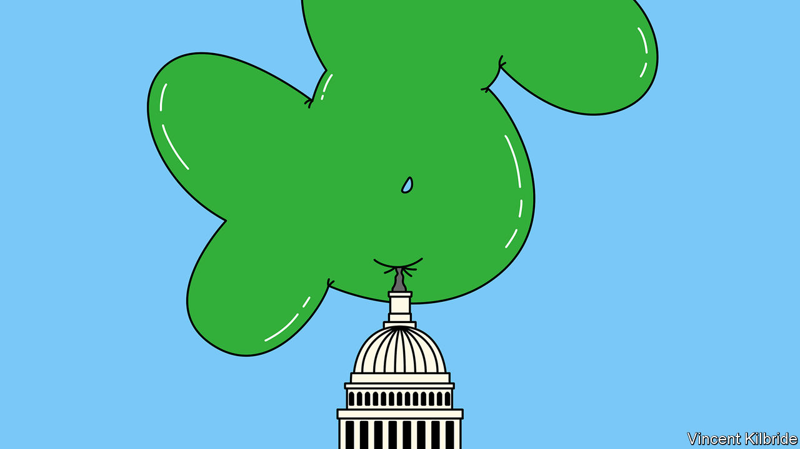
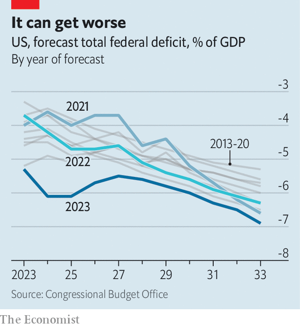
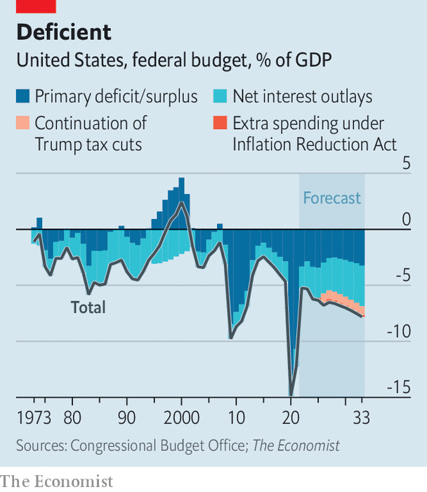

###### In God we bust

# America faces a debt nightmare 

##### It is not just about gridlock in Washington 

 

> May 3rd 2023 

On a wall in Manhattan, not far from Times Square, America’s debt clock ticks higher, from $3trn when it was inaugurated in 1989 to more than $31trn today. After climbing for so many years with no obvious economic fallout, it is easy to ignore, not least because it was moved from its location on a busy street corner to a quiet passageway. But its relentless climb is suddenly a . That is because its numbers are now butting up against America’s debt ceiling—a  as manufactured as the clock itself, though one that presents a far graver danger.

The debt ceiling is the amount Congress has authorised America’s government to borrow in order to meet its basic obligations, from providing medical insurance to paying military salaries. The current ceiling for gross debt is $31.4trn (117% of gdp), and America is careening towards it. On May 1st Janet Yellen, the treasury secretary, warned that the government was set to exhaust its cash reserves and run out of budgetary gimmicks as soon as June 1st. 

At this point, America would face either a sovereign default or swingeing cuts to state spending. Either outcome would be devastating for global markets. A default would undermine faith in the world’s most important financial system; big budget cuts could trigger a deep recession. Even if Congress manages to raise the debt ceiling before anything so dire happens, its flirtation with disaster serves as a warning about the deterioration of America’s fiscal health and the difficulty of recovering it.

The debt ceiling is a political creation devoid of any fundamental economic meaning. No other country binds its hands in such a crude manner. However, this means it needs a political solution, which cannot be taken for granted given present gridlock. Investors have started to turn queasy amid the uncertainty about whether Democrats and Republicans will be able to work together. Yields on Treasury bills maturing in early June rose by a percentage point after Ms Yellen’s warning, an indication that few want to hold government paper that may get caught in the crossfire.

A bill proposed by Kevin McCarthy, Republican Speaker of the House of Representatives, would push the ceiling into 2024, while slashing trillions of dollars in spending over the next decade and gutting plans to combat climate change. The bill passed the Republican-controlled House on April 27th but is a non-starter for Democrats, meaning it will not clear the Senate.

Separately, a gambit by Democrats in the House, known as a discharge petition, could enable a simple increase of the ceiling. But it would require five Republicans to break ranks with Mr McCarthy and side with the Democrats, which few are likely to do heading into an election year.

Still, the betting is that America’s politicians will somehow find a way through the impasse, as they have done in the past. President Joe Biden has invited leaders from both parties to a meeting in the White House on May 9th, at which negotiations are likely to get under way—something Mr Biden had hoped to avoid, preferring a “clean” bill to raise the ceiling. 

 


If and when this happens, America’s budgetary gymnastics will fade from view, much like the debt clock itself. That, however, will be a shame, for the country’s finances are on increasingly precarious ground. The core measure of vulnerability is not, in the first instance, America’s debt level but rather its ballooning fiscal deficit.

Over the past half-century the federal deficit in America has averaged about 3.5% of gdp a year. In the near future such a level—once seen by fiscal hawks as evidence of profligacy—may come to be viewed as a relic of a more prudent time. In its latest update in February, the Congressional Budget Office (cbo), a non-partisan body, projected that America’s deficit would average 6.1% over the next decade.

This is probably an underestimate. The cbo does not include recessions in its projections. Even without the scale of spending unleashed when covid-19 struck, recessions lead to higher deficits as tax revenues fall and automatic stabilisers such as unemployment insurance rise.

Like many analysts, the cbo is also struggling to put a price tag on the Biden administration’s vast new industrial policy. It at first thought spending on subsidies for things like electric vehicles and renewable energy would cost about $400bn over the next decade. But because so many of the subsidies come in the form of uncapped tax credits, Goldman Sachs, a bank, reckons the bill may be closer to $1.2trn.

What’s more, the cbo only offers projections based on current laws. As the political landscape changes, so do laws—with a disconcerting tendency for deficits to drift wider. In 2017 Donald Trump passed a series of tax cuts that are due to expire in 2025. In making its projections the cbo is required by statute to assume that they will expire as scheduled. Yet few politicians want to raise taxes. Mr Biden is also vying to implement a student-loan forgiveness plan that would add to the deficit.

When factoring in just a portion of these variables—the higher spending on industrial policy plus the continuation of Mr Trump’s tax cuts—the deficit would average 7% over the next decade and hit nearly 8% by the early 2030s. Year after year, such expansive borrowing would lead to much bigger national debt. On the cbo’s trendline the federal debt would roughly double to nearly 250% of gdp by mid-century. Well before that time the debt clock in New York, which currently runs to 14 digits, would need to add a 15th as national debt passes $100trn.

There is no ironclad threshold beyond which deficits or debt are a problem. Rather, they can be seen as corrosive, threatening to visit progressively more harm on the economy. When debts are large to begin with, higher interest rates—on full display over the past year—are harder to digest. The main reason the cbo recently revised up its deficit estimates for the 2020s is higher financing costs for the government. At the start of 2022 it had forecast rates on three-month bills to average 2% over the next three years; now it expects 3.3%. Whereas interest outlays amounted to less than half of defence spending over the past five decades, the cbo now projects they will be a third higher than such spending by 2033. The guns-or-butter dilemma risks becoming a bonds-not-guns straitjacket.

Rates may come down in future. They may also stay high for a while yet. And in the higher-rate world that America now inhabits, large deficits can lead to pathologies. To fund so much borrowing, the government must attract a greater share of savings from the private sector. This leaves less capital for corporate spending, reducing the ability of firms to invest. With less new capital at their disposal, workers become less productive and growth slower.

At the same time, the government’s need to attract savings from investors at home and abroad can place upward pressure on interest rates. The risk that investors, especially foreigners, decide to shift money elsewhere would add to America’s fiscal vulnerability. That, in turn, would constrain the state’s ability to deploy stimulus in the face of cyclical slowdowns.

The result would be an economy both poorer and more volatile than it would have been in a universe where deficits were kept under control. In short, fiscal incontinence is something best avoided.

 


How to avoid this sorry fate? The economic prescription is straightforward; the politics of delivering it are anything but. Even before the interest-rate shock, it was easy to predict that deficits would increase over time. The biggest share of federal spending is mandatory expenditures on social security, health insurance and the like, which are prescribed by laws and not subject to the vagaries of the annual budget-setting process. Already big, they will bulge as the population ages. Annual spending on income support for the elderly will be as much as all spending on education, the environment, national defence, science and transportation by 2033.

The government estimates that trust funds which help bankroll both social security and health programmes will be insolvent by the early 2030s. At that moment America would face a basic choice between slashing benefits and raising taxes. A similar calculation will apply to all other aspects of the federal budget: some combination of reducing expenditures and raising revenues is the only way to prevent a crippling rise in the federal deficit.

They ought to know

In reporting this article, your correspondent spoke to three former cbo bosses. As economists who have spent more time than just about anyone in America thinking about its fiscal picture, they are uniformly worried about the risks of rising deficits and the lack of appetite for fixes.

“The average American has gone through the 21st century with presidents who said we didn’t have a problem. So why should anyone bother now with hard reforms?” says Douglas Holtz-Eakin, who led the institution under George W. Bush. “There’s going to be a generation of voters that can’t get anything they want, because all the money has been spoken for.”

Doug Elmendorf, the cbo’s boss under Barack Obama, says Republicans have learned that it is toxic to cut entitlements, while Democrats have learned to steer clear of tax rises. “Both those positions are obviously politically popular, but they take off the table the biggest pieces of the federal budget,” he says. “So it’s increasingly hard for either party to develop a plan that puts fiscal policy on a sustainable path, much less agree on a set of policies.”

Keith Hall, boss from late in Mr Obama’s time through much of Mr Trump’s, thinks it will take a fiscal crisis to force action. “But then we’re looking at really draconian cuts that give us a bad recession, simply because they waited too long,” he says. “Policymakers, Congress and the president, they just don’t take it seriously.”

For all their concern about the fiscal outlook, the former cbo directors are, like most sane individuals, also unanimous in the view that a failure to lift the debt ceiling now, therefore opening the door to default, is a horrific idea. The mere threat of doing so risks further impairing the government’s finances by driving up borrowing costs and weighing down economic growth. America requires a serious political debate and bipartisan agreement to put its budget on sounder footing. Alas, its leaders are inclined neither to seriousness nor to agreement. ■


