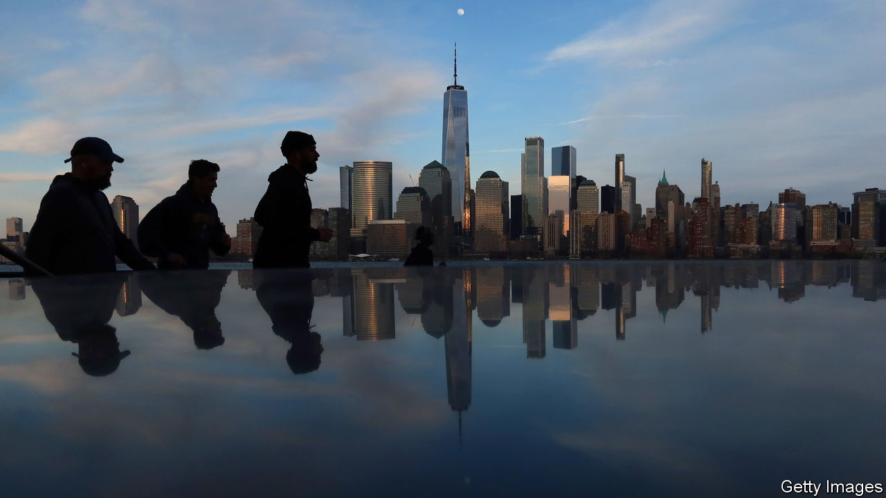
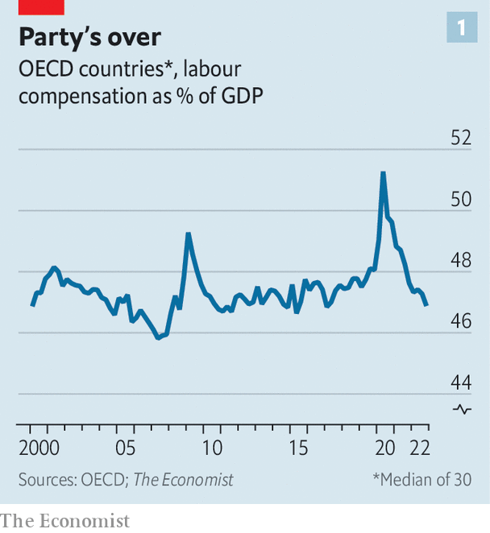
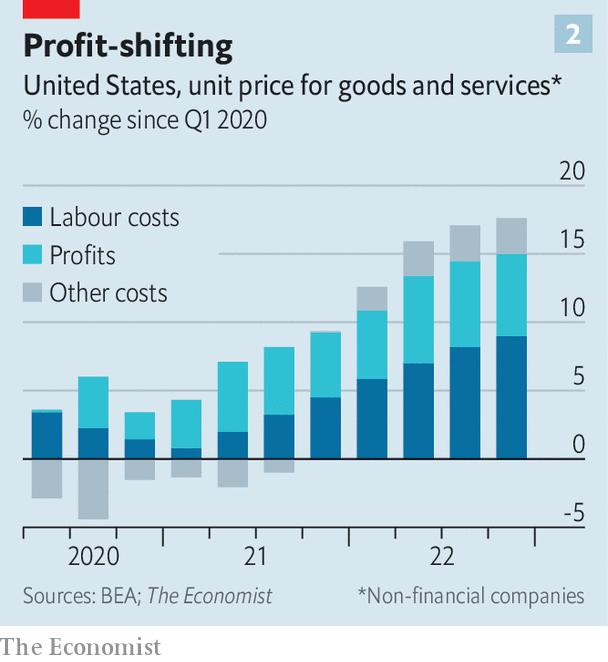

###### Capital v labour

# Are greedy corporations causing inflation? 

##### That is the popular narrative. Yet there is reason to doubt it 

 

> Apr 30th 2023 

In the three years before covid-19, rich-world consumer prices rose by a total of 6%. In the three years since they have risen by close to 20%. People are looking for a villain—and firms often top the list. According to a recent survey by Morning Consult, a pollster, a third of Americans believe that “companies’ attempts to maximise profits” have contributed “the most” to , more than any other factor by far. 

It is not just the public who blame fat cats. “Recent inflation has been driven by an unusual expansion of profit margins,” Paul Donovan of ubs, a bank, has argued. A study by America’s Bureau of Labour Statistics (bls) suggests “dealer mark-up” has raised the price of . Central bankers are getting in on the act, too. Last month Fabio Panetta of the European Central Bank said “there could be an increase in inflation due to increasing profits.” Last year , formerly of the Federal Reserve, now a White House official, said that “reductions in mark-ups could also make an important contribution to reduced pricing pressures”. 

The problem is that, at an aggregate level, evidence for head-honcho greed is thin on the ground. What seems to be happening is that families and firms are sharing the spoils of the post-pandemic economy. This makes sense. Arguments for “greedflation” rest on unsure theoretical ground. Firms did not suddenly become avaricious. Red-hot demand, linked in part to massive stimulus programmes in 2020-21, is the true source of price pressure—and can sometimes result in margins expanding. 

 


The theory also fails on its own terms. To believe that corporations are making out like bandits is to believe they are winning the fundamental battle in economics. Output must flow either to owners of capital—in the form of profits, dividends and rents—or to labour, as pay and perks. Economists refer to this as the “capital” or “labour” share of gdp. When one group wins, by definition the other must lose. 

We have estimated the labour share across the oecd, a group of mostly rich countries. For much of the pandemic this was above its average during the preceding decade, suggesting that labour had the upper hand (see chart 1). In 2020 companies continued to pay people’s wages—helped by stimulus programmes—even as gdp dropped. In 2021 and 2022 strong demand for labour allowed many existing workers to demand more pay. It also pulled new people into the workforce. Across the oecd the share of working-age folk in a job is at an all-time high of 70%. 

 


Another way of assessing the balance of power is to look at “unit prices”. The second chart shows recent changes in the price of an average American good or service, split into the relative contributions of profits and labour costs. Corporations had the early spoils, but since 2021 workers have fought back. A calculation for the euro area published in a recent paper by Goldman Sachs, a bank, also suggests a relatively even match-up. If you are fuming at paying $10 for a coffee, blame the barista serving it to you as much as the owner. 

Recent months have been tougher for companies. In the first quarter of this year profit margins at those in the s&amp;p 500 index of big American firms are expected to sharply drop, perhaps because consumer tolerance for higher prices has worn thin. Workers, though, seem to be holding their own. The oecd’s headline rate of inflation is now decisively declining, even as there is little evidence of slowing wage growth. The latest monthly data from the bls show that, after falling for much of 2021 and 2022, American hourly real pay is rising once again. David has not defeated Goliath, but he is putting up a good fight. ■


