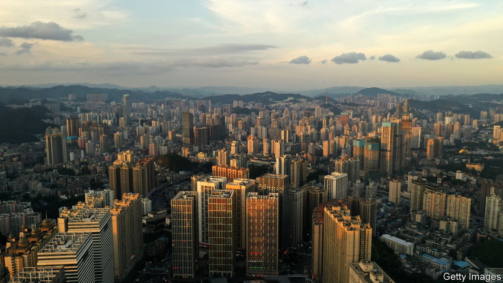

###### Borrowing problems

# China’s local-debt crisis is about to get nasty 

##### Worries from a far-flung province 

 

> May 4th 2023 

Locals in guiyang have a keen sense of the distance between them and everywhere else. Over cold rice noodles bathed in chilli paste and vinegar, an elderly resident of the city in south-west China lists a number of recent economic achievements of his home town—namely, the shortening of travel times to other places. Chengdu, a megacity in nearby Sichuan, is now just three hours away by high-speed rail. Chongqing, another metropolis, can be reached in just over two. China’s Herculean construction of uber-fast trainlines has even brought Hong Kong, the southern financial centre, within a seven-hour ride. These travel times are rattled off with considerable pride. Not long ago they would have taken three to four times as long. 

Yet this progress has been costly, and is proving to be unsustainable. Over the past decade Guizhou, the region in which Guiyang sits, has accrued enormous debts through its building efforts—ones which it can no longer repay. Many of the region’s roads and bridges went untravelled over the past three years as covid-19 stopped people moving about. A local bridge-builder was recently forced to extend maturities on its bonds by up to 20 years. The region is also known for its shantytowns. Guiyang is scattered with skyscrapers and green hills poking out from between them, as well as old, crumbling buildings. The government has spent well beyond its means in renovating such dilapidated residences. One shanty renovation in Guiyang, called Huaguoyuan, is among the world’s largest housing projects. The property developer has already defaulted.

Guizhou is a far-off region to many Chinese people in wealthy eastern areas. But its debt problems will set the tone for the rest of the country in the coming months. The province will probably be the first to receive a central-government bail-out. Indeed, local officials are already asking for help. On April 11th a government think-tank based in Guiyang said that the province does not have the ability to resolve its debts by itself and was seeking advice from the central government. 

An expensive helicopter

This has kicked off a national debate about the moral hazard of providing such a rescue. Guizhou’s debts are a small part of the $23trn Goldman Sachs, a bank, estimates to be burdening local officials across the country. Editorials in Chinese media have called for strict “debt discipline” and warn of the huge cost to the central government should it implicitly guarantee local debts.

The pressure on Guizhou’s officials is immense. The province is said to owe about 2.6trn yuan ($380bn, or 130% of local gdp) in various forms including bonds and opaque debts owed by local-government-financing vehicles (lgfvs), which are run like private firms but ultimately backed by the local state. The interest rate on these debts has surpassed the province’s gdp growth rate, note analysts at Natixis, a French bank. Interest payments make up more than 8% of the province’s fiscal expenditure, compared with a national average of 6%. Some cities in the province are already spending most of their funds merely to pay off debt. In Guiyang annual interest payments equal 56% of yearly revenues, according to an estimate from Rhodium, a research firm. 

There is little hope of bringing in more revenue to meet the costs. The area has always been an economic backwater: the local topography is one of endless misty hills that for millennia made travel hard and villages poor. Guizhou’s economy is reliant on the connectivity brought by its new roads and tunnels. Many locals are farmers. The region does not have much manufacturing, and has just one important corporation of which to speak: Moutai, a state-owned firewater-maker, which is, admittedly, one of the country’s most valuable firms. Meanwhile, funding costs for the local government are now the second-highest in the country, after the north-western province of Qinghai. They continue to rise as firms struggle with payments. The region’s lgfvs have already experienced more than 20 defaults on trust loans and other hidden debts since the start of 2022, many more than in other provinces.

As problems have intensified in recent weeks, economists and investors have warned that the central government has few palatable options. An investment manager says the debt-heavy growth model of the past two decades has been unable to buy prosperity in China’s poorest regions—and will inevitably lead to crises in such places. Guizhou is at a “breaking point”, he says, and the central government must come to the aid of it and other weak links. Zhou Hao of Guotai Junan, a Chinese investment bank, says the central government will not wait around for a high-profile default in Guizhou, owing to the turmoil that such an event would cause in China’s bond markets, where funding could quickly dry up. “Guizhou going bust will create too many side issues,” he says.

The makings of an official bail-out are now coming together. On April 24th Cinda, one of China’s largest state-owned asset managers, said that it was sending a team of 50 experts to Guizhou to survey the situation. Centrally controlled firms such as Cinda could be used to inject liquidity into troubled lgfvs. They could also swallow up some debts in exchange for equity. Policy banks may also take a bigger role. Some have already been called in to help pay back a few of the province’s lgfv debts. Some of these piecemeal measures are buying time, but much bigger action could be required soon. It is a situation as bracing as a shot of Moutai. ■


