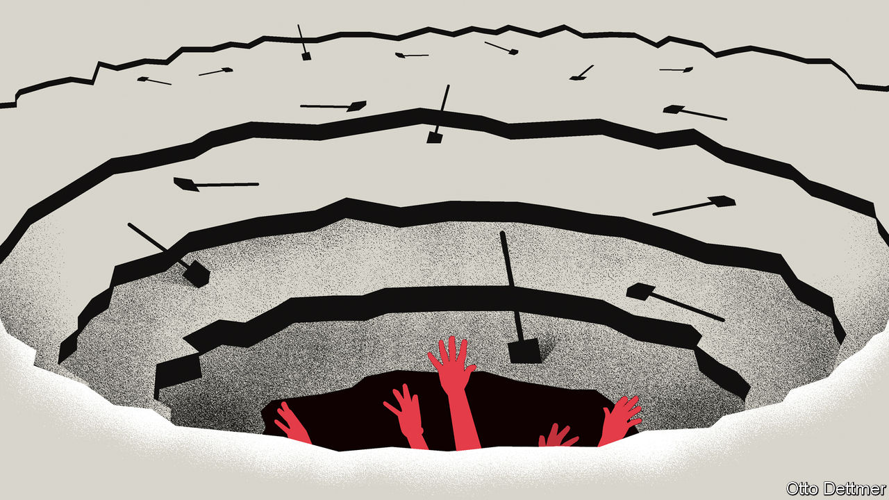

###### Free exchange

# How Japanese policymakers ended up in a very deep hole 

##### Ueda Kazuo, their new leader, must stop digging 

 

> May 4th 2023 

Investors betting on tighter monetary policy from the Bank of Japan (boj) have experienced very few victories over the past three or so decades of ultra-low interest rates. The first decision by the boj’s new governor, Ueda Kazuo, proved to be no exception. The central bank’s flagship policy of yield-curve control, which caps ten-year government-bond yields at 0.5% with aggressive bond-buying, was left unchanged on April 28th. Instead, the boj’s policymakers announced a review of their monetary policy. The exercise is expected to last a year, possibly longer. 

There is a bleak comedy in seeing speculators nursing burned fingers once again. But the policy review may transpire to be more meaningful than the bureaucratic exercise it appears at first glance. The report will assess decisions made by the boj since the Japanese economy entered a period of deflation in the 1990s. 

The starting point must be the grim reality in which the central bank finds itself. Yield-curve control, which began in 2016, was a concession to the fact that the boj’s enormous asset-purchases were causing problems in the functioning of the country’s bond market, and that little additional stimulus was possible. The boj’s problem is now drastically different: Japanese inflation is at its highest since the early 1980s, but even a modest increase in rates could be disastrous for the economy. After decades of attempts to stimulate a stagnant economy, the country’s central bank is in a nasty bind, unable to move much in any direction.

To understand why, it helps to return to the source of the problem. In the late 1980s Japan had a colossal asset bubble, primarily in stock and property prices. Six of the world’s ten most valuable companies called the country home. The bubble was popped deliberately with interest-rate rises in 1989, which prompted stock prices to fall immediately, and land prices to grind ever-lower throughout the 1990s. Since then, Japan has been trapped in what Richard Koo of the Nomura Research Institute, linked to the bank of the same name, referred to as a “balance-sheet recession”. Firms and households concentrate on paying down debts, rather than investing and consuming, which crimps economic growth.

As a result of decades of thrift, Japan’s residents have far more financial assets than debt, and do not look enormously vulnerable to a rise in rates. Instead of piling savings into stocks, households instead prefer bank deposits, in which they now hold an impressive ¥1.1 quadrillion ($8trn), the equivalent of almost 200% of Japan’s gdp. Non-financial companies hold another ¥561trn.

Around the world, households are usually squeezed by higher rates. Japan’s might prove beneficiaries, at least in the short-term. Marcel Thieliant of Capital Economics, a research firm, notes that households’ net interest income would rise by ¥4.7trn, or 1.5% of their annual disposable income, with every percentage-point increase in Japanese interest rates. Combined with a stronger currency, which would make imports to the country cheaper, it seems probable that households would rather enjoy a rate rise.

The pain would be felt elsewhere, however. The first sufferer would be an institution that has become far more indebted as the private sector has saved: the central government. In last year’s budget, about 8% of spending was allocated to interest payments, even at an average interest rate on government bonds of 0.8%. A percentage-point rate rise across the board would mean more than doubling the share of spending, as bonds are rolled over.

The impact would drip through over years, although not as slowly as once would have been the case. The fact that the boj now owns more than half the Japanese bond market, and even more of those of longer maturities, has sped the pace at which higher rates would affect the fiscal arithmetic. When the boj buys a bond, it creates a reserve asset that pays its benchmark rate. If rates rise, the boj immediately owes more on these reserves. It would shoulder losses for which the government would have to pay. 

The second part of the economy that would immediately feel the pain of a rate rise is the banking system. Higher rates would cause large unrealised losses on the assets of smaller financial institutions. The Japan Centre for Economic Research, a consultancy, suggests that, if long-term interest rates were to rise by a percentage point, the economic value of regional banks (their worth according to expected cash flows from assets and liabilities) would drop by the equivalent of 60% of their capital. 

I wouldn’t start from here

Crushing demand by dramatically weakening some of Japan’s most vulnerable lenders would, in time, work as a method of limiting the most recent burst of inflation, even if it is hardly the ideal way to achieve such a goal. Yet solving the long-term problem of deficient demand is now harder, too. Despite the huge increase in government debt over the past three decades, fiscal stimulus has come in fits and starts; enough to prevent total economic collapse, but not to ignite stronger growth. For years, a concerted effort to raise consumer spending through much more aggressive government spending was the clear Keynesian prescription for Japan. The rise in government-bond yields complicates the picture.

It sounds a little bit strange to say that Japan is still recovering from a crisis that began around the same time as the Berlin Wall was collapsing, but the country’s economy has never experienced a concerted recovery from the asset-bubble implosion. In 1990 Japan‘s gdp per head was about 18% below the level in America. In 2021, by the same measure, Japan’s economic output per person was 39% below America’s.

Thus the third-biggest economy in the world remains in a nasty situation, which its policymakers have played a part in maintaining. Mr Ueda, an outsider to the boj from academia, has a chance to convey that plainly. The review should be a cry for help. Admitting to a problem is the first step towards finding a solution, especially when any solution will be unpleasant. ■


