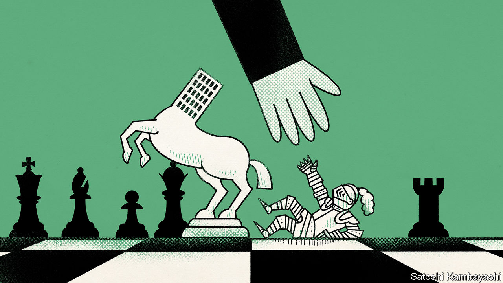

###### Buttonwood

# What the First Republic deal means for America’s banks 

##### Regulators had to make it sweet enough for JPMorgan Chase to bite 

 

> May 3rd 2023 

“Life isn’t knights on horseback,” Logan Roy, boss of Waystar Royco, a media conglomerate, and lead character of “Succession”, a television drama, tells his son Kendall. He is warning his offspring that life is not about heroes. “It’s a number on a piece of paper. It’s a fight for a knife in the mud.” 

As usual, the old bastard was right. Almost everything in finance can be reduced to a deal between two parties: a number on a piece of paper. Every time someone buys a share they are cutting a deal in which they swap cash for a slice of a company; a loan is a deal in which one party pays cash now in exchange for a stream of the stuff through time. Private-equity investing is the art of a good deal; so is buying property. Sometimes one person gets a good deal, another a bad one—but not all deals are zero-sum. A borrower and lender can both walk away happily from a paid-off mortgage. 

A healthy financial system, then, is rife with deals. A sickly one is not. When the system is consumed by uncertainty or fear, it is just about impossible to get to a good deal. That another bank was willing and able to , which was seized by the Federal Deposit Insurance Corporation (fdic) on May 1st, is therefore something of a relief. After a flurry of dealmaking early in the global financial crisis of 2007-09, there was too much uncertainty and fear for more to be done. And there was no deal to be cut for the entirety of Silicon Valley Bank (svb) in March. When your columnist recently asked a bank boss why he did not submit a bid for svb, he quipped back: “Other than the $20bn hole in its balance-sheet?” 

The deal for First Republic includes three main parts: a payment of $10.6bn in cash by JPMorgan Chase to the fdic; a promise to pay $50bn more, plus interest at a fixed rate, over the next five years; and a credit guarantee for loans JPMorgan is assuming. It was structured in this manner to raise the sum JPMorgan was willing to pay, and thus to reduce the burden on the fdic, as is the regulator’s goal.

At first glance, the guarantee and loan appear a little strange. First Republic’s problem was not, after all, that it offered bad mortgages to risky borrowers. Its problem was that it offered 30-year mortgages at a 1% interest rate to rich people, reportedly including Mark Zuckerberg—and that rates have jumped since, reducing the value of the loans. Yet the credit guarantee serves a purpose. It makes it easier for JPMorgan to meet regulatory capital requirements, one of which assigns risk-weights to assets. Loans with a guarantee attract a lower weight. 

The funding line also looks a little needless. JPMorgan has plenty of excess funding. It has more than $500bn in cash parked in deposits with the Federal Reserve and other banks. But to help fund the $180bn or so in assets JPMorgan is acquiring, the bank will take on $90bn in new deposits, $30bn in loans from the Federal Home Loan Bank, plus the $50bn loan from the fdic. In theory, JPMorgan could simply pay the fdic $60.6bn, rather than $10.6bn, in cash now and forgo the loan. The problem is that banks also have to meet liquidity-coverage ratios (a measure of the cash or cash-like assets a bank has on hand to meet an estimate of outflows in a stress scenario). Depleting even large cash buffers at the same time as acquiring new liabilities would ding the firm on this measure. On a call with analysts Jeremy Barnum, JPMorgan’s chief financial officer, described the loan as helping the bank both better match assets with liabilities as well as manage “liquidity consumption”. 

All of which is to say the deal was made just sweet enough for JPMorgan to bite. It did not harm the acquirer, and the acquirer did not have to raise new equity. Banks that bought assets from svb also did so without raising fresh capital. This makes sense: problems faced by banks become more acute when they take actions that might spark runs. Indeed, the collapse of svb followed an equity-issuance announcement. Crafting a deal that leaves an acquirer materially worse off might spark a similar situation. Such a scenario is hard to imagine at JPMorgan; it is not so elsewhere.

Still, a deal that leaves an acquirer strong and minimises regulatory costs leaves nothing for shareholders or bondholders of the old bank. That is probably what they deserve, given they invested in an insolvent institution. But it is also why investors in other banks now fear they will meet a similar fate. The share and bond prices of other smaller regional banks have plunged. If this spooks depositors, more deals will be needed.■


