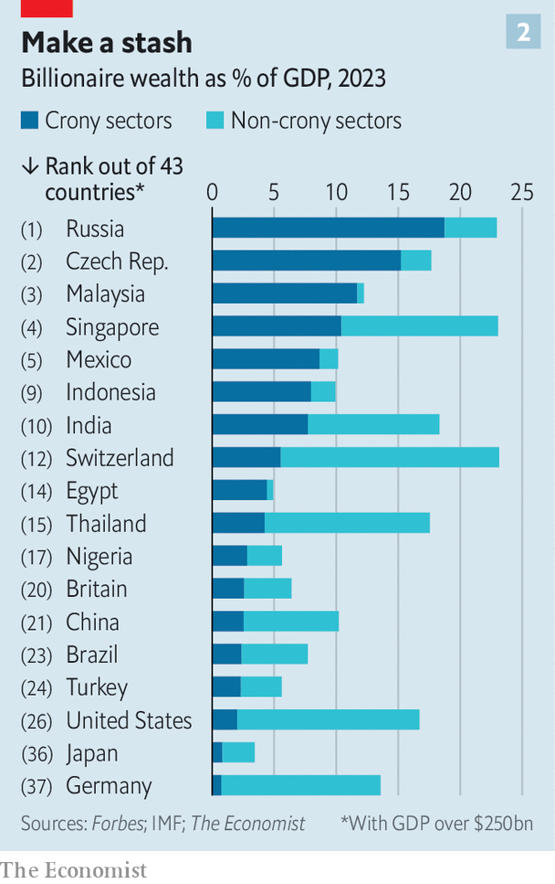

###### Which billionaires lost out?

# The 2023 crony-capitalism index 

##### War, tech woes and cock-ups have pummelled certain plutocrats 

 

> May 2nd 2023 

Over the past 20 years, Britain’s capital was so welcoming to oligarchs that it became known as . Many bought mansions from Highgate to Hyde Park; a couple bought into football clubs. After  in February last year, 48 oligarchs were placed under Western sanctions. The immense wealth of many of Vladimir Putin’s associates highlights the problem of crony capitalism and why more should be done to combat it. 

 


According to the latest instalment of our crony-capitalism index, which first estimated how much plutocrats profit from rent-seeking industries almost a decade ago, crony capitalists’ wealth has risen from $315bn, or 1% of global gdp, 25 years ago to $3trn or nearly 3% of global gdp now (see chart 1). Some 65% of the increase has come from America, China, India and Russia. Overall 40% of crony-capitalist wealth derives from autocratic countries and amounts to 9% of their gdp. There are hundreds of billionaires around the world whose riches are largely believed to derive from sectors which often feature chummy dealings with the state. 

The way we estimate all this is to start with data from  The magazine has published an annual stock-take of the world’s wealthy for nearly four decades. In 1998 it reckoned that there were 209 billionaires with a total worth of $1trn, equivalent to 3% of global gdp. This year the publication details 2,640 billionaires worth $12trn or 12% of gdp. Most of those listed do not operate in rent-seeking sectors. Adjusting for rising prices—$1bn in 1998 is now equivalent to $3.3bn—there are 877 billionaires (at 1998 prices) with a collective worth of $9trn.

We classify the source of wealth into rent-seeking and non-rent-seeking sectors. An economic rent is the surplus remaining once capital and labour have been paid which, with perfect competition, tends towards zero. Rent-seeking is common in sectors close to the state, including banking, construction, property and natural resources. It can sometimes be possible for rent-seekers to inflate their earnings by gaining favourable access to land, licences and resources. They may form cartels to limit competition or lobby the government for cosy regulations. They may bend rules, but do not typically break them. 

 


Russia is, once again, the most crony-capitalist country in our index (see chart 2). Billionaire wealth from crony sectors amounts to 19% of gdp. The effects of the Ukrainian war are clear, however. Crony wealth declined from $456bn in 2021 to $387bn this year. Only one-fifth of Russian billionaires’ wealth is derived from non-crony sectors, which shows just how distorted the economy is.

In March last year, the g7, the eu and Australia launched the Russian Elites, Proxies and Oligarchs (repo) Task Force to “isolate and exert unprecedented pressure on sanctioned Russian individuals”. A year later it announced that it had blocked or frozen $58bn of assets. But repo admits that in some cases oligarchs have found it easy to evade sanctions by using shell companies, passing assets to family members or investing in property. Wealth is increasingly stored in manicured lawns and marble columns. 

Pressure on the oligarchs comes from Russia, too. In March Mr Putin chastised them for becoming “dependent on foreign authorities” by hiding their assets offshore. Mr Putin is a hypocrite. By one estimate he has stolen more than $100bn from Russia—which has helped pay for a compound on the Black Sea estimated to cost $1.4bn and a $700m yacht impounded by the Italian authorities last year. But he is not on the  billionaires’ list.

Our index illuminates other trends among the mega-wealthy. Many of America’s 735 billionaires have been hit by the crash in tech stocks last year; three-fifths of global tech-billionaire wealth originates there. The country’s nasdaq composite, a tech-tilted index, lost about a third of its value between November 2021 and December 2022. We reckon American tech billionaires saw their riches decline by 18%.

Overall crony-sector wealth amounts to around 2% of gdp in America, whereas non-crony-sector wealth is 15%. But tech exhibits some crony characteristics. America’s 20 biggest tech companies raked in half of all the industry’s sales in 2017, making it the country’s most concentrated sector. Tech firms are among the biggest lobbyists in Washington, with eight firms collectively spending $100m last year. Reclassify tech as a crony industry in our index and America’s crony wealth increases to 6% of gdp.

Meanwhile, Chinese billionaires continue to struggle with the vagaries of their government. Since Xi Jinping launched a crackdown on private capital, crony wealth has fallen sharply, from a peak of 4.4% of gdp in 2018 to 2.5% now. Tycoons of all stripes operate only with the consent of the state. In 1998 there were just eight billionaires in the country (including Hong Kong and Macau), with a total worth of $50bn. Now its 562 billionaires command $2trn. 

By our measure crony capitalists account for about one-quarter of that total. A recent working paper published by the Stone Centre on Socio-Economic Inequality, part of the City University of New York, finds that between 83% and 91% of corrupt senior officials were in the top 1% of the urban income distribution because of their illegal incomes. Without that money, just 6% would be in that bracket. 

Since Mr Xi came to power in 2012 over 1.5m people have been punished in an ongoing anti-corruption drive. High-profile tycoons also face more scrutiny. When Jack Ma, a co-founder of the tech giant Alibaba, disappeared in late 2020 after criticising the authorities, he was worth nearly $50bn. He recently re-emerged worth half of what he had been. Bao Fan, a billionaire banker, was whisked away in February to help with an investigation. He has not been seen since. 

Official talk of “common prosperity” has created a cottage industry for getting money out of China. Singapore is a prime destination for it. In 2019 the country had just 33 Chinese family offices—firms which manage a family’s assets. There were perhaps 750 by the end of 2022.

India’s leader, Narendra Modi, has favourites among the country’s corporate captains. Over the past decade, wealth from crony-capitalist sectors has risen from 5% to nearly 8% of its gdp. Gautam Adani, the owner of the conglomerate of the same name, was briefly the world’s third-richest person in September. But in January his company was accused of fraud and stockmarket manipulation by Hindenburg Research, an American short-seller. It denies all accusations. His wealth has fallen from $90bn to $47bn. 

Don’t take a slice of my pie

What happens when cronyism gets completely out of control? If elites so enrich themselves that they impoverish a country, a “kleptocracy” forms, declared Stanislav Andreski, a Polish sociologist. He warned against such regimes and their effects in the late 1960s. It has taken more than 50 years for Western countries to heed him. 

Identifying kleptocracy is more art than science. Our findings correlate only somewhat to indices of democracy and corruption. And in any case, at what level does corruption destroy the functions of the state? usaid, America’s agency for international development, issued an 84-page “dekleptification” guide last year. After studying 13 countries including Brazil, Malaysia and Ukraine, it recommends breaking up corrupt monopolies and digitising ownership registries, among other important measures.

America is also trying to whip up international fervour for a crackdown. In March it hosted its second “summit for democracy”. Seventy-four countries representing two-thirds of global gdp declared that, among other things, they would work to “prevent and combat corruption”. Russia and China were understandably missing. Brazil, Indonesia and South Africa were among those less understandably so. 

At the summit Janet Yellen, America’s treasury secretary, pointed out that “kleptocrats launder kickbacks through anonymous purchases of foreign real estate”. So starting next year America will require firms formed or operating in the country to reveal their real, or “beneficial”, owners. Another 36 countries have signed up to America’s declaration to make concealing identity more difficult. But transparency is not a silver bullet. Last year a new law in Britain required foreign businesses that own property assets to register themselves and disclose their true owners. A report in February by an anti-corruption watchdog found that the owners of 52,000 of the 92,000 properties subject to the new rule remained undisclosed. Shady owners skirt rules and registries often lack the resources to police them. 

America also frets about “golden” visas, which sell citizenship for a chunk of cash. Five Caribbean tax havens sell passports which provide visa-free travel to around 150 countries for $100,000-150,000 each. Britain’s tier-one visa scheme, launched in 2008, gave permanent residency within five years to foreigners who could prove they had £1m ($1.25m) to invest in British bonds or shares. It closed a week before the war in Ukraine started because of fears about Russian money (talk about closing the stable door once the thoroughbred has bolted). Of the 13,777 visas issued, a fifth went to Russians (including ten to oligarchs now under sanctions), a third to Chinese.

Back in London, a warning lies in Highgate cemetery. There you can find the grave of Alexander Litvinenko, not far from oligarch mansions (and also Karl Marx’s tomb). He was murdered in 2006 by Russian agents with a dose of polonium-210 after making lurid allegations about Mr Putin’s circle. Litvinenko is buried in a specially sealed lead-lined casket to prevent radiation leaking out. Now Western authorities need to prevent hazardous assets seeping into their countries. ■

