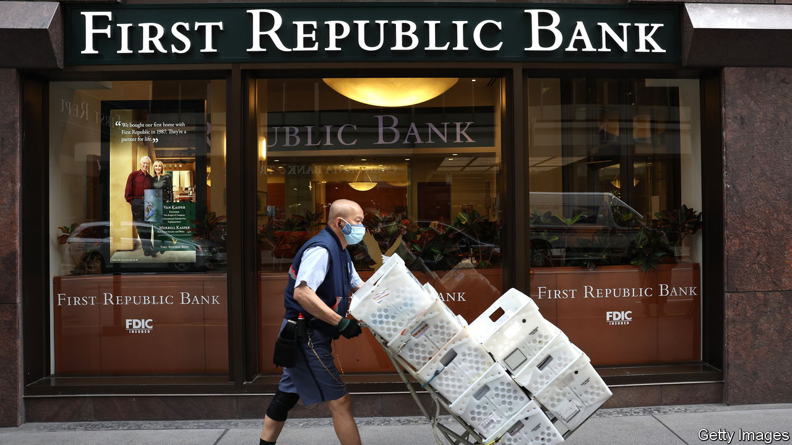

###### Rebuilding the buffers

# How to shore up America’s banks after First Republic’s demise 

##### One route to a safer system is consolidation; another is taxpayer stakes in the sector 

 

> May 3rd 2023 

WHEN A deeply insolvent bank fails and its depositors are made whole somebody has to bear the losses. In the case of , the bulk of which was taken over by JPMorgan Chase on May 1st, the Federal Deposit Insurance Corporation (FDIC) . It expects to lose about $13bn as a result of what is the second-biggest retail-bank failure in America’s history. Yet customers with bank balances above the notional deposit-insurance limit of $250,000 have escaped unharmed, just as they did after the failure of Silicon Valley Bank (SVB) kicked off America’s banking crisis in March.

A full depositor bail-out was inevitable given that policymakers had promised, after SVB’s failure, that all America’s deposits were safe. But it is striking that neither their reassurances nor $93bn of unusually generous emergency loans from the Fed could keep First Republic alive. Even on charitable terms emergency loans were a more expensive source of financing than the deposits the bank had lost, while rising interest rates had reduced the value of its fixed-rate loans and bonds. Having lost $107bn or 90% of its uninsured deposits, excluding a last-minute infusion from other banks, California’s regulators reckoned it had become “structurally unprofitable”.

Many banks would be in the same dire predicament if they faced a similar run. By one estimate 1,040 banks with over $3.5trn of assets would be insolvent if they lost 90% of their uninsured deposits. Other researchers reckon that if banks were forced to account for the effect of higher interest rates on the value of their assets, about half would fall beneath the minimum levels of capital set by regulators. The demise of First Republic, despite frantic attempts to save it, explains why on May 2nd regional bank shares fell by 5.5%.

Some say the solution is for the Fed to slash the interest rate on its emergency loans to less than its policy rate of interest. Yet the Fed has already broken every part of the old rule (first outlined by Walter Bagehot) that in a crisis it should lend only to solvent firms, against good collateral, and at a penalty rate of interest (ie, at a reasonable premium to the policy rate). The more generous the lending schemes become, the bigger the implicit subsidy to banks’ existing shareholders. Instead of receiving handouts, they should be first in line to bear losses.

Others want more deposits to be explicitly insured—something that the FDIC itself floated on May 1st. That might stop runs but it would encourage damaged banks to gamble for resurrection by taking bigger risks with depositors’ money. Their customers, protected by the full force of the law, would not object.

What banks really need is thicker capital buffers. Regulators in America must urgently fix the rules that allow small banks to operate with thin safety cushions, and should determine the size of the capital shortfall by stress-testing the whole system for risks from rising interest rates, as is already the norm in Europe. Then they must draw up a plan to plug the hole.

One route to a safer system is consolidation. The takeover of failing banks does not always require taxpayer support, because suitors can view their customer relationships and branch networks as valuable. America’s biggest-ever retail-bank failure, that of Washington Mutual in 2008, was resolved via takeover with neither the FDIC nor uninsured depositors suffering losses. The buyer—once again, the mighty —subsequently raised capital in the markets.

Plumping up the cushion

But there are likely to be more failures that require a hole to be plugged. The government should craft deals from which taxpayers might benefit as the sector recovers, for example by taking equity stakes in joint ventures with acquiring banks. Far better to wipe out today’s shareholders and provide fresh capital than to prop up insolvent institutions with backdoor subsidies. ■


