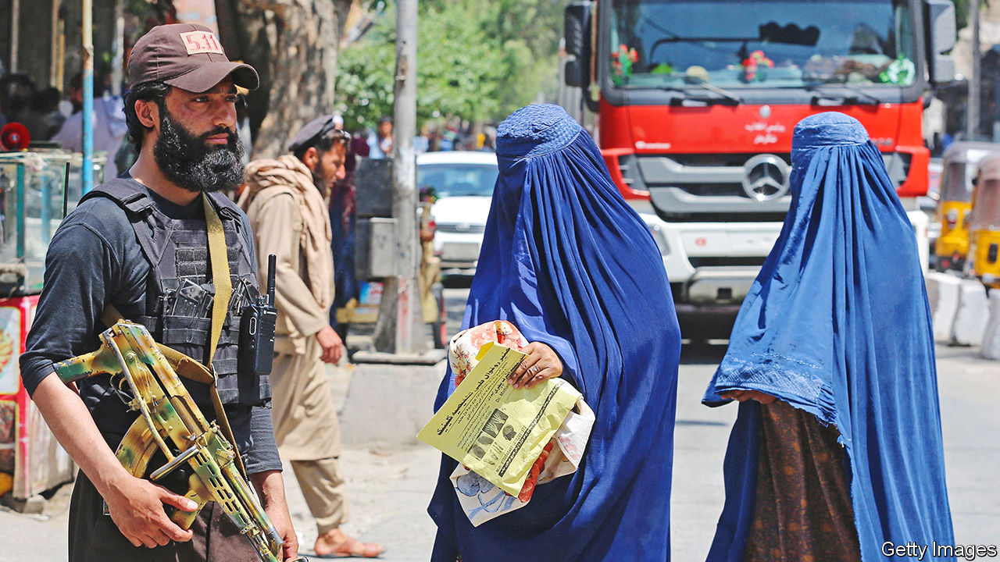

###### A new Afghanistan policy

# Time to engage (very carefully) with the Taliban 

##### Isolating the mullahs is not working. The West needs a more constructive approach 

 

> May 4th 2023 

For two decades, America and its NATO allies squandered vast amounts of blood and treasure on a wildly optimistic state-building project in Afghanistan. It ended 20 months ago, when the Taliban’s black-turbaned fighters swept back into Kabul, while American diplomats frantically burned their files and NATO troops held back a tide of terrified Afghans at the airport.

 damaged its credibility as a superpower that sticks by its allies. Some of that credibility has been won back in Ukraine. But Western policy towards Afghanistan remains incoherent and ineffectual, as we report in a detailed look at life under .

America and its allies have isolated the country. They have largely shut off the aid that once provided 75% of Afghanistan’s budget, and withheld $9.5bn of its sovereign reserves. And yet the persistence of jihadist terrorism and humanitarian crises in Afghanistan makes the country hard to ignore. It harbours remnants of al-Qaeda and a local chapter of Islamic State that is setting off blasts in Kabul and is eager to do so abroad. Its loss of Western support has triggered an economic crunch that threatens millions with starvation. 

The West is grappling with these twin crises from a distance. America is doing counter-terrorism by drone—including a strike in Kabul last year that killed al-Qaeda’s leader. Outsiders are dispensing aid through UN agencies and NGOs.

The Taliban deserve their pariah status. Their supreme leader, Hibatullah Akhundzada, has banned girls from school and women from most workplaces. Yet isolating the Taliban will not help Afghan women. It will not topple or even destabilise the regime, which is in firm control. It will only boost its hardliners.

Confirmed in their hatred of the West, the hardliners are succouring some of the terrorists on their turf. America’s ability to zap these jihadists from afar will atrophy as its local knowledge fades. Afghanistan’s threat to the world is thus increasing. Meanwhile, disengagement makes it harder to alleviate mass suffering. This year, the UN has raised only 9% of the $4.6bn in emergency aid it says hungry Afghans need.

The Taliban’s assault on women’s freedom and dignity makes close engagement with them impossible. Yet it is worth trying some more modest and selective steps. America should press banks to end the informal ban on dealing with Afghanistan that is throttling its economy. It should release an experimental portion of the sovereign reserves (some suggest $100m a month) to the technocrats running the country’s central bank. Western donors should explore funding, through the uN, some of the abandoned infrastructure projects that could make the country less aid-dependent. In time, they could upgrade the diplomatic outreach that America and others are already quietly pursuing.

No one is optimistic that the Taliban can be incentivised to behave better. But modest measures of this kind would explore the possibility. Notwithstanding Mr Akhundzada, the mullahs are more mixed than in the past. Most Taliban ministers oppose the female education ban. In some ways, their performance in governing Afghanistan is better than that of the corrupt Western-backed governments they replaced (partly because those governments were besieged by the Taliban). It is not clear engagement would bolster the pragmatists among them, but in theory it might.

Engaging with the Taliban in any way seems unconscionable to many. That is understandable, but wrong. There is no good option in Afghan policymaking. But with realism and a strong diplomatic stomach, the country could be made slightly less awful for its people and less of a headache for the world. ■

