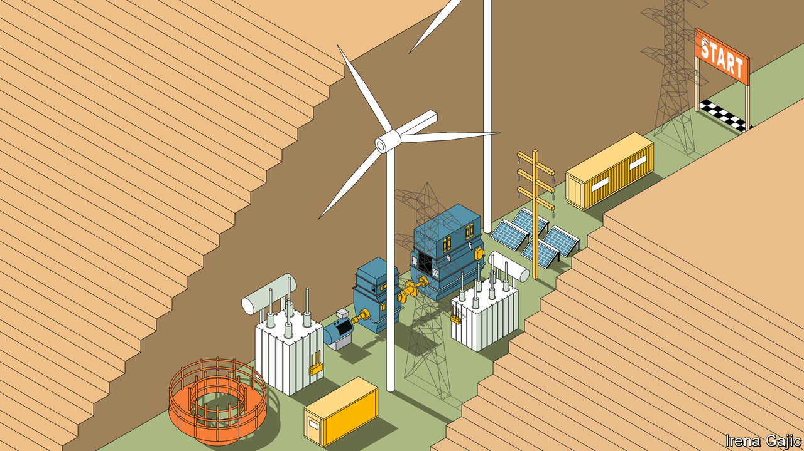
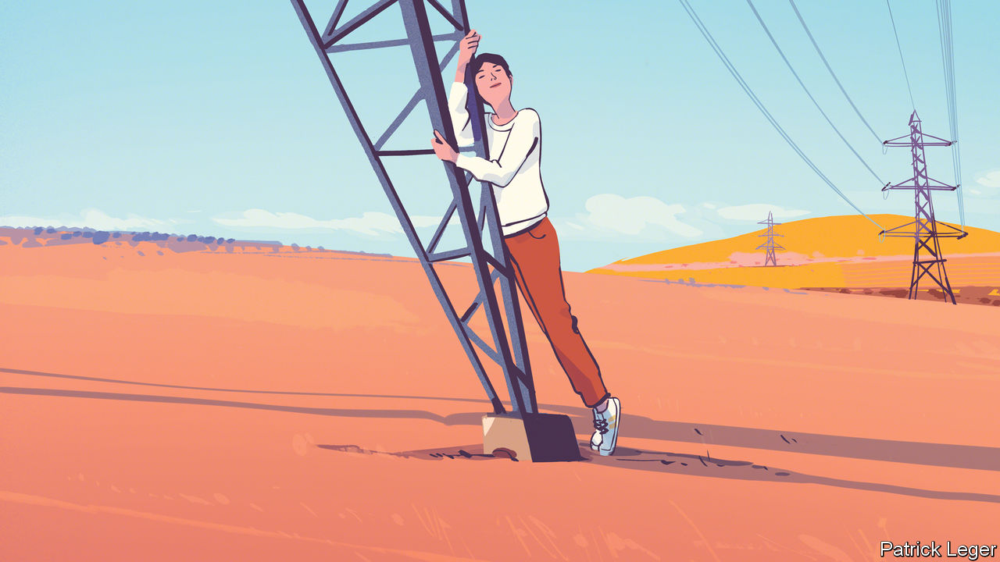

###### On greening electricity pylons, Englishness, banking, our banana index, jerks at work, cider

# Letters to the editor 

##### A selection of correspondence 

 

> May 4th 2023 


Powering green energy

I enjoyed your  on the challenge of greening power grids (April 8th). I would stress the merits of direct-drive wind-turbine technology. The advantage of direct-drive or full-power conversion is that its output can be artificially shaped to whatever is needed by the grid. Providing ancillary services is easy, cheap and mostly software generated, meaning it can be customised. In fact, wind turbines have been offering reactive power injection (for voltage control), inertia emulation (for frequency stability) and several other ancillary services for 20 years.

Unfortunately, most grid operators, a rather conservative bunch, do not use wind turbines to their full potential, and have no market mechanisms to remunerate ancillary services. ERCOT in Texas is one of a few exceptions. The toolbox exists but will remain underused until this is tackled.

Nicolas Bourbonniere


The optimism surrounding the potential for “power-to-gas” ignores the significant energy-efficient losses from the chemical and thermodynamic process involved. The round-trip efficiency of going from electricity to hydrogen and back again is anywhere between 18-46%. We may yet decide that this is the path we want to take to tackle renewable-power intermittency, but these fundamental inefficiencies will seriously challenge the business cases of renewable-asset developers and hydrogen producers. 

The conviction that it is best to produce hydrogen strictly on the grid doesn’t reconcile with the current regulatory landscape, or the assumptions necessary to rely on expanded grid infrastructure. The EU and Britain have proposed regulation that prohibits or severely restricts the use of grid electricity to make hydrogen. Instead, a new layer of hydrogen infrastructure is foreseen, complementary to but not embedded within, the current electricity grid. Pipelines will transport hydrogen from where it is cheapest to produce (near renewable sources) to where it is needed (industrial centres). 

Lily Bailey


 


Your leader assembled qualitative bricks without the quantitative mortar of choosing what’s worth building (”, April 8th). How much electricity the world will need in the coming decades is uncertain by at least threefold. We’ll need more to electrify transport and industrial heat. But we’ll need less if we use electricity, materials, products, mobility, and other services far more productively. 

Three-fourths of America’s electricity could be saved by efficiency techniques available a decade ago, at one-tenth the cost of buying average retail electricity. Global electricity can probably be used five times more efficiently by 2060, profitably, at a pace within the International Energy Agency’s forecast range.

Whether we’ll need more or less electricity than now, and how much, depends on whether efficient and timely use of electricity is competed or compared with increased supply and delivery. If it is, grid additions can be far fewer and smaller. And the slow and risky approval processes for new powerlines can often be avoided by reconductoring existing lines with new wires that can carry three to four times more power on the same pylons, and quickly repay their cost from reduced power losses. 

Amory Lovins

Adjunct professor of civil and environmental engineering

Stanford University


The cost of upgrading the world’s power grids is given as $30trn until 2050. You contrast this with a more decentralised grid where roof-top solar and battery storage at the edges of the grid provide power, but say the economic case for this has yet to be made. The market is moving in that direction. Sekisui Heim is a big Japanese housebuilder that sells a majority of its homes with 75% energy sufficiency. Combined with charging for electric vehicles this decarbonises most consumption. The market and consumers might just overtake the grid upgrade in the blind spot.

Felix Miller


We should spread the love and hug both trees and pylons. I know  wants to hug both. I read between the lines of your report, from the celebrated Amazonian trees that exhale life-giving moisture, right down to the biomass which caused your correspondent and Drax’s turbine hall to hum and throb with such obvious pleasure. However, the 50 shades of grey and 12.1m tonnes of carbon dioxide puffed out through Drax’s smokestacks in 2022 came from pellets that were derived from 12.9m tonnes of freshly cut, water-puffing, carbon capturing, wildlife-sheltering trees. That is almost equal to more than Britain’s entire annual wood production. By repurposing old coal-power plants to burn forests we are screwing our future.

Lucie Wuethrich

Biofuelwatch


 


English exceptionalism

’s column on a lack of English national identity (April 22nd) used surveys where people identify whether they are English or British. The feeling of “Englishness” runs deeper than such labelling. Bagehot pointed to George Orwell’s “England your England” to support his thesis. Written in 1941 during the Blitz the essay argues that England could never be a fascist state. It also paints a picture, still valid today, of an English exceptionalism that is an inverted version of American exceptionalism. This is a proudly, quirkily self-deprecating, collective view of being English that has built into it, among other things, the idea that “foreign” begins on the other side of the English Channel. It may help explain why being in the EU was like an organ transplant that couldn’t quite take. 

So English nationalism, although maybe not quite the right term, is alive and well and exists deep in the English psyche without the need to be overly concerned with labels or to celebrate St George’s Day or any of the other official markers of Englishness.

Alan Phillips


Oh, the horrible English. The dreadful and awful English. Yes, the English truly are the worst of the worst. Just ask any Oxbridge academic or student, or any card-carrying reader of the , or anyone from Ireland, Scotland or Wales. They will tell you that the English should be ashamed of themselves and their history, intertwined with the present-day suffering of everyone non-English. They will say that English patriotism (and only English patriotism) is problematic. Is any other nationality criticised and despised as much as the English? Is it possible to hear any straightforward, unambiguous praise for the English without even the slightest caveat? 

I do not celebrate St George’s Day, cheer the England football team or even feel particularly proud to be English, but I do not criticise those who do, and I don’t criticise other nationalities for having pride in their own nationality. Why should I be apologetic for a long-gone past that had absolutely nothing to do with me?

Stefan Badham


If modern geography was the only criterion to identify historical characters, as Bagehot did by saying that “St George was Turkish”, then it follows that Diocletian was a Croat and Mustafa Kemal, aka Ataturk, was Greek. There was not a single Turk in Cappadocia in the 3rd century when George of Lydda was born, and there would not be any in Asia Minor until around the 11th century.

Avedis Hadjian


 


Narrow banking

Regulators and central banks, as you correctly noted, have attempted to stop the banking system from taking steps towards narrow banking, where “deposits are fully backed by only the safest assets” (, April 15th). However, today’s brokerages offer a backdoor to narrow banking. Savvy depositors can buy short-dated US Treasury money-market mutual funds which carry no credit risk. These funds offer higher interest rates and tax advantages relative to a typical bank deposit. Brokerages offer banking-like conveniences through their mobile apps and no-load, no-fee access to such funds. Making depositors aware of these services would mark a significant step towards narrow banking.

Dinkar Jain

Faculty

Anderson School of Management

University of California Los Angeles

George Pennacchi 

Professor of finance

University of Illinois Urbana-Champaign

Banana drama

I’m bananas for your banana index (, April 15th). We can see that, even with its nutritional value, beef is still climate unfriendly compared with a banana. Chicken is less polluting than bananas on a protein basis, and so on. Humans hate complexity: the index makes it simpler for us to shop wisely. 

Jacob Troyer


Your new banana index is nuts. Almonds are rated as good for the climate, but in truth it takes three gallons of water to grow one nut. 

Percy Grainger


From Wisconsin, where there’s plenty of fresh water, I enjoy calling my sister in southern California, which is often subject to water rationing, with the following message: stock-up on deodorant because you can’t shower for a week; I’m having 25 California almonds with my granola.

Kyle McCoy


 


The jerk hierarchy

There is a practical problem with implementing a no-jerks policy at work (, April 1st). Jerkery is mostly invisible to the jerks’ bosses, the very people who have the power to weed them out. Jerks typically will not behave like jerks around management, quite the opposite. Jerks make the lives of those below them in the corporate hierarchy miserable, rather than those above.

Fergus McKay


It will put hairs on your chest

I came of age in the west country of England drinking strong scrumpy cider (“”, April 1st). When it’s made at home it’s fermented bone dry, with all the sugar turning to alcohol, resulting in a bitter but beautiful drink. It has a high alcohol content. I remember making it once with an old chap from Gloucestershire. On taking a big slug he said, wincing: “Hell’s bells, that’s two-man cider. You’d need one on each arm holding me down to get a pint in me.”

Matt Ford


