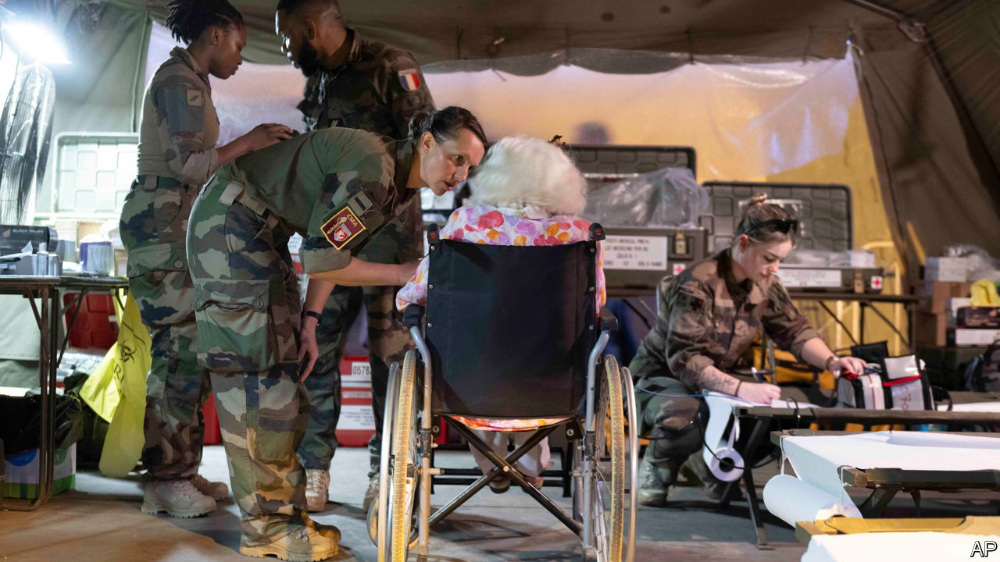

###### Macron’s mission

# France moved quickly to evacuate civilians from Sudan 

##### The mission highlights the strategic value of its Djibouti base 

 

> May 4th 2023 

Night had fallen in Paris on April 22nd when the call came through to the French president, Emmanuel Macron, from his military adviser asking for permission to evacuate civilians from Khartoum. It was a , in which special forces would secure a Sudanese air base in a war zone. 

That evening French military aircraft and commandos were the first to fly in from Djibouti to the air strip at Wadi Seidna, north of Khartoum. In the early hours of April 23rd, the French and other allies began their airlifts. By April 27th the French had evacuated 936 people, the nationals of over 50 countries.

In recent years France has been losing influence in Africa in the face of powerful anti-French campaigns and the spread of Russia’s Wagner Group. Last year France pulled 2,400 troops out of Mali, where it had been running a counter-terrorism operation, after the military junta hired Wagner mercenaries. This year its forces were told to quit Burkina Faso, too. 

Mr Macron is now reviewing France’s military presence on the continent and has predicted a “visible decrease” in its footprint. Some bases may become training centres; others may be jointly run by the host countries’ armed forces. 

However, Djibouti, where France keeps 1,500 soldiers at a permanent base, is a special case. Mr Macron has no intention of pulling out, says an adviser. The facility there is considered critical to France’s Indo-Pacific defence posture. For the French, the successful Khartoum evacuation, which relied on Djibouti, confirms more strongly than ever the value of keeping forces on the ground there, whatever their president may decide about bases elsewhere in Africa. ■

