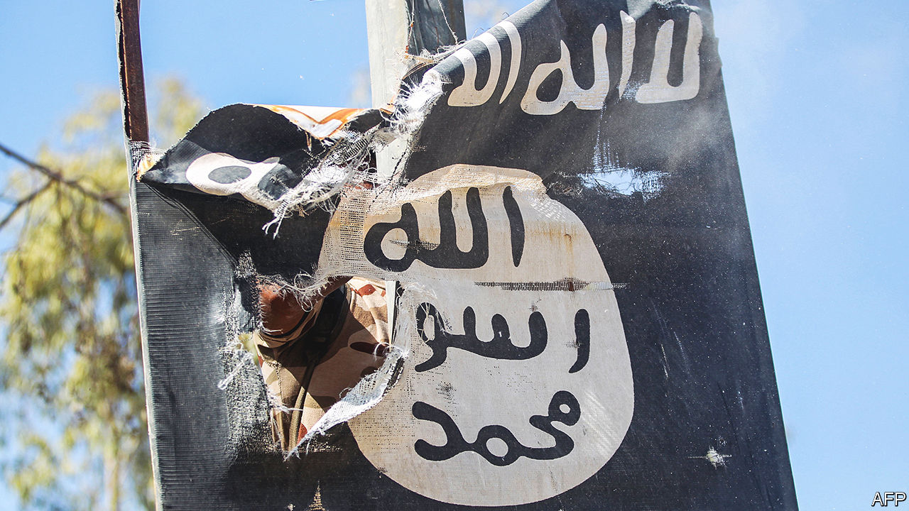

###### A name to die for

# Leaders of Islamic State have a short life-expectancy 

##### The organisation is diminished but not defeated 

 

> May 4th 2023 

Two things can be said with some confidence about the next leader of Islamic State (IS), the jihadist terror group that once controlled swathes of Iraq and Syria. He is likely to be called al-Qurayshi—and is unlikely to live to a great age. On April 30th Turkey’s president, Recep Tayyip Erdogan, announced that in an operation the day before, run by his country’s intelligence agency, the latest leader of is, Abu Hussein al-Qurayshi, had been “neutralised”. 

The raid apparently took place in the northern Syrian town of Jindires, close to the Turkish border, some 46km from Aleppo. For Mr Erdogan, who faces a tight election next week, it was an opportunity to remind voters of his strongman credentials. He vowed that Turkey would continue its “struggle with terrorist organisations without any discrimination”.

The latest al-Qurayshi took over as leader of is in November last year, a few weeks after the death of his predecessor. Abu al-Hassan al-Hashemi al-Qurayshi had been killed in Syria’s southern province of Deraa by a faction of the Free Syrian Army, a loose coalition of moderate rebel forces opposed to the regime of Syria’s president, Bashar al-Assad. He, in turn, had succeeded Abu Ibrahim al-Hashimi al-Qurayshi. This one, holed up in the rebel-held Syrian province of Idlib, had blown up himself and his family when cornered in a firefight with American special forces in February last year. 

Al-Qurayshi is a  that all three short-lived is leaders have adopted since the death of its first and most notorious caliph, Abu Bakr al-Baghdadi, in 2019. It suggests descent from the Quraysh, the leading tribe in Mecca during the lifetime of the Prophet Muhammad. It is unclear how much authority the name confers over what is now a much looser-knit, cell-based group after its ejection from its strongholds in Syria and Iraq. Since any known is commanders are prime targets, operational security is a priority for them; hence they keep the lowest of profiles.

is is much diminished from its glory days when it controlled about a third of Syria and 40% of Iraq. But it still has influence among insurgent groups in parts of west Africa, which continue to perpetrate violence across the region, and it has a spectacularly nasty branch in Afghanistan. It is also still a threat in Syria. Western intelligence agencies think the organisation can call on 6,000-10,000 fighters in Iraq and Syria and has many more followers. 

Quite apart from the routine roadside bombings, ambushes and hit-and-run attacks, a particular concern is stopping is from trying to liberate the 10,000 or so militants held in prisons and detention camps in north-east Syria. These are guarded by the mainly Kurdish Syrian Democratic Forces. In January last year, is fighters attacked Ghuwayran prison in that area in an attempt to free 3,000 of their comrades, many of them foreigners whom their own countries do not want back. The ten-day battle left more than 500 people dead, about three-quarters of them is prisoners, and required American and British special forces and air power to intervene before the Kurds could regain control. ■

