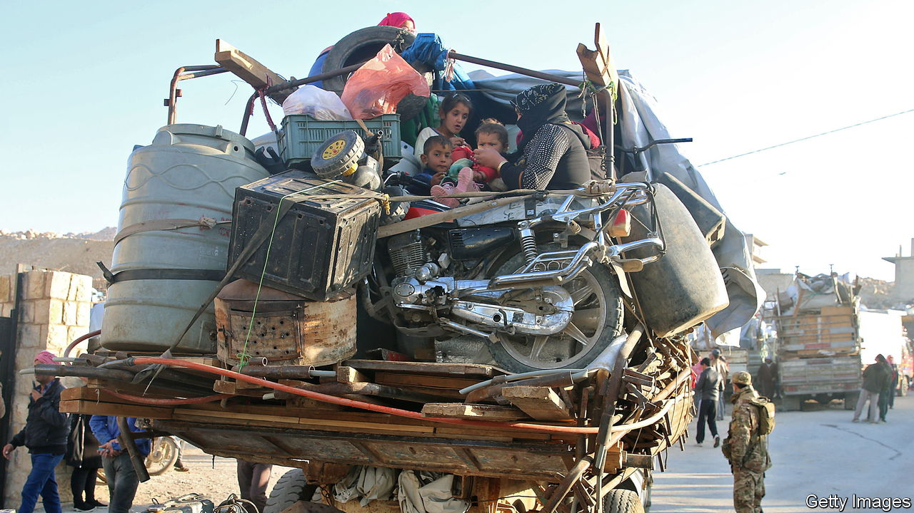
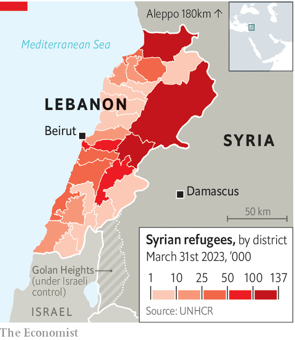

###### Syrians unwanted in Lebanon

# Lebanon’s government is squeezing out Syrian refugees 

##### Feuding politicians are searching for scapegoats 

 

> May 4th 2023 

The army vehicles drew up outside Umm Mohammad’s home in Lebanon’s foothills just before dawn. Soldiers searched the house before checking the Syrian family’s papers. Three of her sons’ residence permits had lapsed because the authorities are not renewing them these days. The young men were taken to the border and handed over to the Syrian army. They ended up in Aleppo. The older two were given ten days to report for army duty.

Relief workers have counted more than 60 such raids since the middle of April. There were just 11 during the whole of last year. The expulsions—which Amnesty International says are a violation of international law—are part of a wider crackdown by the Lebanese government on Syrian refugees. Last week it directed local security forces to “apply the law”. Parties across the political spectrum have backed the government’s efforts, as have local television stations. Syrians in Lebanon have faced a torrent of abuse on social media.

 


Refugees began arriving in Lebanon in 2011 after the outbreak of the Syrian civil war. Exact numbers are unknown; the government ordered unhcr, the un refugee agency, to stop registering them in 2015. The official figure is 1.5m; the reality may be closer to 2m, in a country with a population of 5m. The government has refused to house Syrians in formal camps so they are scattered around the country (see map), many in squalid informal settlements. 

Syrians in Lebanon have experienced attacks, rhetorical and physical, before. But the latest campaign has been prompted in part by Lebanon’s economic crisis—and is all the more furious as a result. The Lebanese pound has lost more than 98% of its value against the dollar since 2019. Annual inflation is running at over 250%. Most Lebanese struggle to pay their bills.

The refugees are a convenient scapegoat. Locals blame them for crime waves and stealing jobs. Some Lebanese claim that Syrians are living comfortably off un and ngo handouts (in dollars) while they starve. The international community has been accused of paying refugees to stay in Lebanon to prevent them from going to Europe. “It’s a conspiracy against Lebanon,” fumed Michel Aoun, a former president, last week.

Blaming Syrians for the country’s woes suits feuding Lebanese politicians, as it diverts attention away from their own shortcomings. They have so far failed even to agree on a successor to Mr Aoun, who stood down last October. Pushing through reforms agreed with the imf, which would unleash billions of dollars in aid, looks far beyond them. Lebanese have gone from being angry with their own politicians “to finding something else to be angry about”, says an aid official.

Syrians are more deserving of pity than anger. A large majority cannot make ends meet. Few receive the maximum benefits, which for a family of five or more are the equivalent of $80 (£64) per month. The unhcr says this does not come close to covering a family’s basic needs. They even have to pay rent for tents in remote areas. At a donors’ conference in Brussels in mid-June, the un will ask for $4bn for Lebanon. More of the money will go to Lebanese than Syrians. 

It is true that Syrians have created pressures in Lebanon. Some have lots of children. Others get mixed up in crime. Some cross back into Syria then return to claim benefits from the un. But if Lebanon gets too heavy-handed with Syrian refugees it could forfeit the support of international donors. And a sudden exit of refugees would have some costs for the economy: many do jobs in construction and agriculture that some Lebanese workers shun. 

The un and others would favour a safe, voluntary and monitored return of the refugees. For now that seems unlikely so most will stay. But their lives may become increasingly uncomfortable. ■

