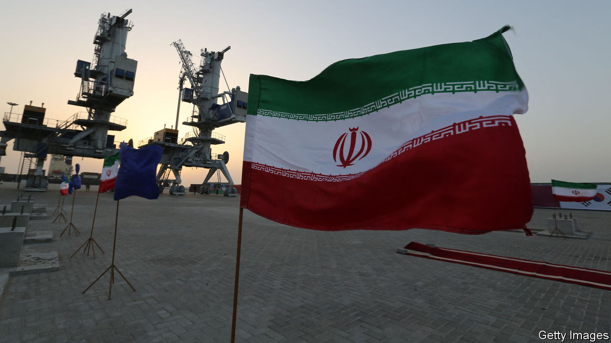

###### From the Baltic to the Caspian and onwards

# Russia and Iran are upgrading their transport links 

##### The much-sanctioned pair are jointly seeking ways to avoid isolation 

 

> May 4th 2023 

Ever since a French diplomat and developer, Ferdinand de Lesseps, sliced the Suez canal through Egypt in 1869, linking east and west, many Middle Eastern countries have tried to follow suit. Israel has recently broached cutting a canal from the Mediterranean to the Red Sea, or a rail link from its port at Haifa via Jordan and on to the Gulf. A former Iraqi transport minister tirelessly promotes a scheme to carve a canal from Iraq’s southern port of Basra all the way to Turkey. The most serious venture, though, is a Russo-Iranian one to link the Caspian sea to the Indian Ocean. 

After decades of feasibility studies, a joint fear of isolation by Western powers is driving Russia and Iran to build a sanctions-proof corridor. Since the West tightened sanctions on Russia after it invaded Ukraine, the ostracised pair have opened a roundabout rail-link via Kazakhstan and Turkmenistan. Russia is upgrading its own ports with Iranian investment. An Iranian shipping company on the Caspian is boosting Iran’s fleet of freighters. Russia is helping build a 164km railway through Iran to its border with Azerbaijan on the Caspian shore. Once this is complete it will provide a sanctions-defying rail link that runs from the Baltic down to Bandar Abbas on Iran’s Persian Gulf. 

Annual Russian-Iranian trade has already leapt by 20% in a year to nearly $5bn, says Emil Avdaliani, a Georgian think-tanker. Russian pundits predict that trade with Iran could surpass that with Turkey, worth $30bn. Last month Russia supplied refined oils (petrol and diesel) to Iran by rail, some of it for transporting onward. It recently shipped 12m tonnes of grain through Iran to India. Other projects include upgrading Russia’s canals between the Don and Volga rivers that link the Black Sea to the Caspian. Another rail link, to Iran’s south-eastern port of Chabahar, could speed up Russian exports to India even more. 

Russia once shied away from investing in Iranian infrastructure for fear of Western sanctions. But the war in Ukraine has made it cast such caution aside. It has encouraged Iran to send it military drones for hammering Ukraine. Last year Russia was Iran’s biggest foreign investor, far ahead of China. To evade Western sanctions, the pair have unveiled a finance-messaging system as an alternative to SWIFT. And both countries voice simultaneous grandiloquence in challenging a wicked world order.■

