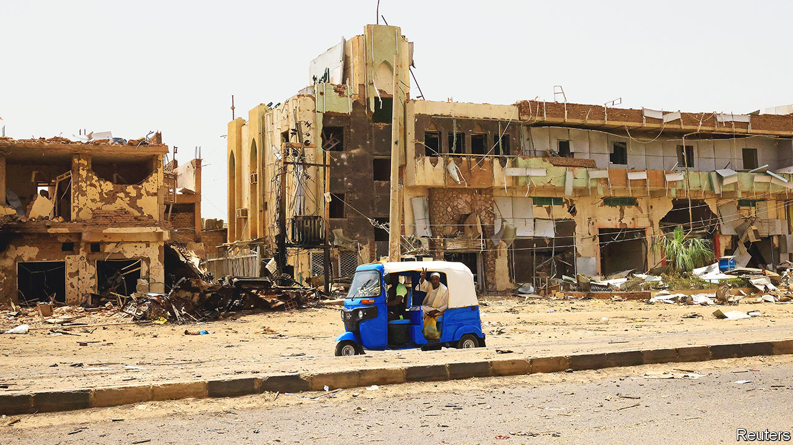
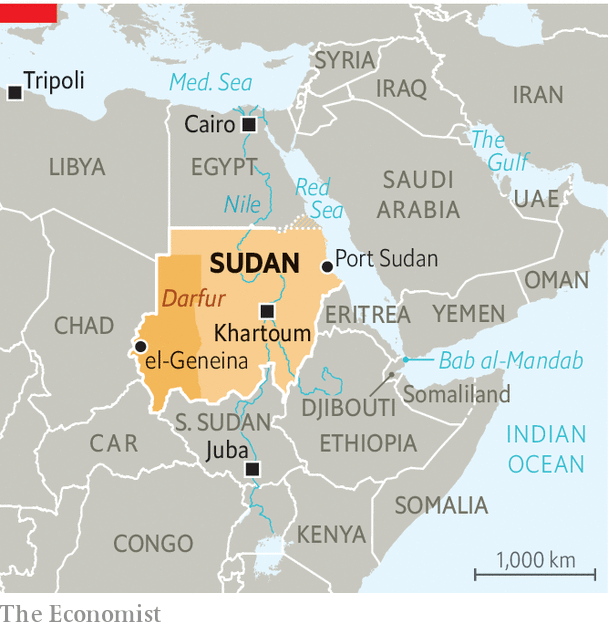

###### Strategic struggle

# Sudan’s war is home-grown, but risks drawing in outsiders 

##### The Horn of Africa sits astride key trade routes 

 

> May 3rd 2023 

Four days after war began in Khartoum, Sudan’s capital, armed men stormed the home of Muhammad. Ordering the businessman (whose name we have changed for his safety) and his family to leave, the soldiers mounted anti-aircraft guns on the roof of the apartment. Muhammad’s family moved in with relatives in a quieter neighbourhood. But that, too, was soon unsafe as the fighting spread, leaving the streets strewn with bodies.

The battle may have started as a narrow power struggle between the official army, known as the Sudanese Armed Forces (saf), and the Rapid Support Forces (rsf), a militia-turned-paramilitary organisation. But the longer it continues, the greater the risk that it may draw in outsiders because of Sudan’s geopolitical importance. 

Sudan sits astride the Nile, Egypt’s lifeline. It also has ports close to the Horn of Africa, which controls the southern chokepoint of the Red Sea and is not far from the Persian Gulf. These arteries of the world economy are watched over by America, China and France, which all have  in Djibouti. “The Horn is highly strategic, and a microcosm of other international disputes,” says Comfort Ero, the president of the International Crisis Group, a think-tank focused on conflict. It is a place where “the West meets the East, where the Gulf meets Europe.” 

For now the two sides seem evenly matched. The SAF is commanded by General Abdel Fattah al-Burhan, who seized and then consolidated power as de facto leader of Sudan in coups in 2019 and 2021. It started the conflict with considerable conventional military power, including tanks and fighter jets. Though the RSF is ostensibly the underdog, its commander, Muhammad Hamdan Dagalo (better known as Hemedti), has substantial private wealth, because the RSF is said to control elements of Sudan’s gold trade. He also leads tens of thousands of loyal troops. 

It was these assets that enabled Mr Dagalo to vie with General Burhan for control of the transition that followed the overthrow of the brutal Islamist regime under the former dictator, Omar al-Bashir, in 2019, and later saw him become the country’s vice-president. Guns and money may also have helped him to emerge in recent years as a semi-autonomous figure on the international stage, cutting deals with foreign powers. The RSF is not simply an “insurgent militia”, notes Sharath Srinivasan, a Sudan expert at Cambridge University. “It’s a state actor.” 

After nearly three weeks of fighting in Khartoum and elsewhere, in particular in West Darfur, neither side has a decisive advantage. The RSF lacks tanks and air power but is compensating by digging into residential neighbourhoods in the capital. There its men are raping women and forcing them to cook for them, according to a Sudanese woman, whose four female cousins escaped through an air-vent after the rsf had occupied their home. 

Civilians in Khartoum also have to contend with air strikes by the saf. On May 1st three women selling tea opposite a hospital were killed by a bomb blast. According to the UN, more than 500 civilians have already been killed and many more injured in the fighting (the true figure is likely to be much higher). As many as 800,000 refugees are expected to cross Sudan’s borders in the coming weeks and months. 

The rsf, whose troops are also better paid and have more recent combat experience that those of the saf, has managed to secure key parts of the capital including the international airport and the country’s largest oil refinery. It also appears to control the presidential palace and the state broadcaster. “For the past two weeks they were roaming around like they owned the place,” says Waleed Adem, a resident of a RSF-controlled district of east Khartoum. 

The RSF also dominates Mr Dagalo’s home region of Darfur and controls two of the region’s three air bases. Bloody clashes in el-Geneina, which began when Arab tribal militias affiliated to the RSF attacked non-Arabs in the town, may have subsided. 

The army remains in charge pretty much everywhere else. Thousands of Sudanese and foreign citizens have been evacuated from the Red Sea city of Port Sudan, in the country’s troubled east, which was secured by the saf early in the war. The countryside around Khartoum is also more or less peaceful. “It’s business as usual,” reports a university professor who recently fled the city with his family. 

Though the rsf is waging a guerrilla campaign of raids on army units and facilities in the capital, the SAF’s control of the skies is taking a toll. “We hit all their supply stores around Khartoum,” says a mid-ranking soldier in the SAF. Several convoys of RSF reinforcements from Darfur have reportedly been destroyed by air strikes. 

The question is whether either side can quickly break the deadlock. The SAF has decades of experience fighting insurgencies in distant regions, but never before in the capital. It cannot simply bomb its way to victory there as it has tried to do elsewhere. “Khartoum is going to be a bit of a meat-grinder for a while,” predicts a Western security analyst. He adds that internal divisions within the SAF’s leadership may be hampering its ability to press home its sizeable advantage in heavy weapons. 

The RSF, too, finds itself in a quandary. It will struggle to supply and rearm its forces as the fighting continues. Even in the unlikely event of a victory, Mr Dagalo will struggle to lead Sudan. He is loathed in Khartoum by residents who hold him responsible for the massacre of hundreds of protesters in 2019 perpetrated by forces from the rsf, the police and the intelligence service. His troops’ current conduct has only alienated them more. “The people have the army’s back,” says Mr Adem. 

 


The prospects for a protracted war depend on how Sudan’s neighbouring countries react. Because of its size as well as its strategic location on the Red Sea, Sudan has long been seen as strategically valuable within the region as well as by China, Russia and the West. It overlooks the shipping lanes leading to the Bab al-Mandab strait, through which around 10% of the world’s sea trade passes (see map). 

The Gulf countries, in particular the United Arab Emirates (UAE) and Saudi Arabia, have economic interests at risk. In December an Emirati firm signed a $6bn deal to develop a port and economic zone on Sudan’s Red Sea coast. The Saudis and the Emiratis supported General Burhan and Mr Dagalo after the joint coup, handing out some $3bn in emergency aid. Neither country has an obvious interest in fuelling the conflict. Saudi Arabia has already evacuated thousands of Sudanese fleeing via Port Sudan. Much as Europe does, it fears a sudden influx of refugees. 

Complicating matters, though, is the Emiratis’ murky relationship with Mr Dagalo, who received cash and arms in return for sending his RSF to aid their war in Yemen in 2017. He has since cultivated ties in both Abu Dhabi and Dubai, the UAE’s two main statelets. Still, the Emiratis do not have “any particular affection for Hemedti”, says Harry Verhoeven of Columbia University. Since the war began there has been no evidence that the uae has continued to supply his forces. So the Gulf countries may be “hanging back and hedging their bets to see which way the cards fall”, suggests Ms Ero. 

Less clear is the approach of Russia, whose murky mercenary outfit, the Wagner Group, is said to be involved in gold mining in Sudan and reportedly arming the RSF. The Kremlin’s main aim is to “thwart a democratic transition in Sudan”, says Samuel Ramani, the author of “Russia in Africa”. This is because its ambition to build a naval base on the Red Sea is better served by a military government in Khartoum than the embryonic democratic one that was aborted by the junta’s coups. 

The civil war in Sudan is not yet a proxy one like those in Libya, Syria and Yemen. But the country shares long and porous borders with conflict-racked neighbours, including the Central African Republic, Chad, Libya and South Sudan. Each has its own bewildering array of militias and rebel groups, many with ethnic or business ties to the RSF or to its rivals. Some may watch for a chance to profit from Sudan’s chaos. “The longer the conflict continues, the more external actors will meddle,” warns Suliman Baldo, who heads the Sudan Transparency and Policy Tracker, a conflict-monitoring group.

Another potential meddler is Issaias Afwerki, Eritrea’s president, who has sought ties with Mr Dagalo and has a history of backing Sudanese rebels. Another is Khalifa Haftar, a Libyan warlord with links to the Wagner Group, who is said to have already sent fuel and arms to the RSF.

Mr Dagalo’s rsf and Mr Haftar’s Libyan National Army (LNA), which controls much of eastern Libya, have worked together in the past. In 2019 RSF troops were sent to support the LNA, which was also backed by the UAE, in its assault on Tripoli, Libya’s capital. Two days before Sudan’s civil war erupted, Mr Haftar’s eldest son arrived in Khartoum for talks with Mr Dagalo.

Whatever support Mr Haftar may offer, the RSF may be limited by the Libyan warlord’s need to keep in with Egypt, another of his foreign sponsors. Long Sudan’s most influential neighbour, Egypt is a staunch backer of the SAF under General Burhan. It views Sudan as vital to its national security and is loth to see either a civilian government or Mr Dagalo in charge. 

Early in the war an Egyptian jet was reported to have struck an RSF ammunition dump. On May 1st Mr Dagalo accused Egypt’s air force of hitting targets in Khartoum. Though the extent of its military involvement is unknown, Egypt is likely to step up its support for the SAF if it is flagging. “Egypt is the most serious factor,” says Magdi el-Gizouli of the Rift Valley Institute. “The Egyptian goal now is to save central power in Sudan as they know it.”

A wider conflagration may still be avoided. Despite ethnic clashes in Darfur, the conflict has so far been generally limited to fighting between the two armed factions. On May 2nd both sides agreed to a seven-day ceasefire starting on May 4th that was brokered by South Sudan’s president. Peace talks could begin soon. 

All the while, a humanitarian disaster is mounting. Food and water supplies in Khartoum are dwindling. Almost no hospitals in the capital are functioning. Pregnant women have died on route to give birth. “If there is no ceasefire,” warns Mohamed Lemine, who heads the UN’s sexual and reproductive health agency in Sudan, “everything will collapse.” ■

