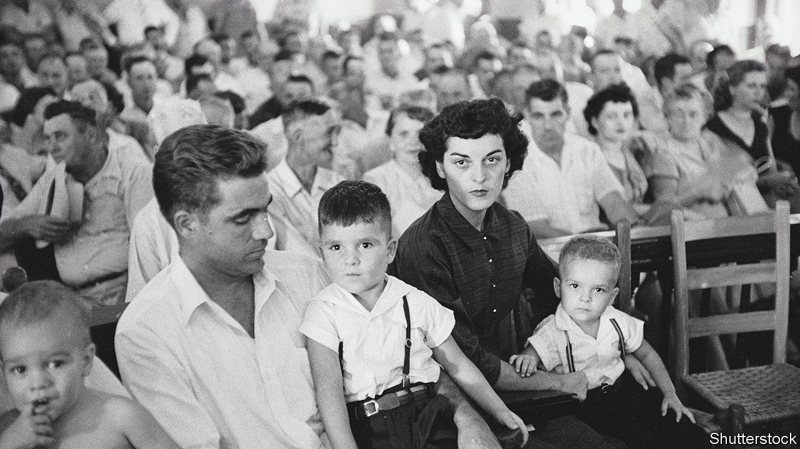

###### A whistle in the dark

# Carolyn Bryant’s was the testimony that doomed Emmett Till 

##### The keeper of the general store in Money, Mississippi died on April 25th, aged 88 

 

> May 4th 2023 

Least said, soonest mended. So Carolyn Bryant initially decided when, she claimed, a black teenager was rude to her in her general store in Money, Mississippi. It was August 24th 1955, around 8pm, a slow night, hot, with locusts buzzing and her sister-in-law Juanita cooking dinner and baby-sitting in the back. A few of the boy’s cousins, locals, had come in before him; they knew the necessary “Yes Ma’am”, “No, Ma’am” and never to crowd a white customer. This black boy, though, had a northern brogue. Allegedly he touched her hand as she served him and made remarks, including “Bye, Baby!” as his friends quickly pulled him out. Then he whistled at her. This astonished her, and naturally she went to get the pistol from the car, but they’d all gone. It lasted only a couple of minutes, and she and Juanita thought it was not worth mentioning to their husbands. They would only take it badly. 

It was flattering of course to be considered pretty, as she knew she was. She had won the high-school beauty-queen pageant not once, but twice. But to be thought pretty by a black man was a complete no-no. That very notion made any white Mississippi male madder than anything. Her Roy was an ex-soldier, and his fuse was short. She had to elope at 16 because, in the family’s thinking, he was a bad boy, but she’d always gone for that kind. He was rough and drank too much, but by 1955 she had two precious sons with him, so she was happy. They were together for 20 years more before at last she divorced him. 

They lived, all four of them, in two small rooms behind the store. Bryant’s Grocery and Meat Market was one of only three businesses in Money, not counting the gas station and the cotton gin. Most of the tiny population were black sharecroppers and field workers whose shacks lay along the farm roads. Almost all the goods were sold on credit. A line of heavy farm-workers’ gloves was strung across the plate-glass windows, and round a board on the porch her customers liked to play chequers with bottle-caps. 

She felt she got on with black people. Of course she and Roy in no way socialised with them. She had grown up on a plantation near Cruger where her father managed the workers with brisk efficiency. They had a hired help, Annie, whose warm hugs could take all pain away, but naturally Annie did not go with them on family outings. Occasionally she played with black children, and even ate their green mush and cornbread with her fingers, like them. Black church services sounded fun, with all that stomping and those Praise the Lords. But she would never dream of setting foot in one. Whites like her went to the Methodists. 

When it came to the “insulting” black boy, however, the matter could not be kept quiet for long. Roy and his half-brother, J.W. Milam, found out where he was staying, with his great-uncle Mose Wright, and abducted him at gunpoint in the small hours. His name was Emmett Till, visiting from Chicago where the rules were different. He was taken to Milam’s tool house, beaten and pistol-whipped, then shot through the head, with his body dumped in the Tallahatchie river. He was found some days later, bloated, decomposing, and with a 75lb cotton-gin fan fastened with barbed wire round his neck. His mother insisted that the horror was photographed for America and the world to see. From that picture, in large part, the civil-rights movement sprang. 

What part did Carolyn play in all this? Perhaps the obvious one of telling Roy, but not necessarily. Several witnesses at the murder trial said she went along to Mose Wright’s cabin that night to identify the boy; they heard a woman’s voice in the car. It wasn’t hers, she said. In fact, according to her, when they brought the boy to the store she said he was not the right one, and begged Roy and J.W. to “take him back where you got him”. Roy said he would, but he lied to her. Nothing Emmett Till had done, she said, could possibly justify what followed. A boyfriend had once shown her a “hanging tree”, with the old frayed rope half-swallowed by new bark. She thought it looked great for climbing. Only after that did she imagine that the tree was trying to hide the shame of its past. 

Her role in the murder trial, which drew global attention, was equally confused. She felt bad about the killing, but she was now kept more or less in purdah by Roy’s family and his defence team. In this cocoon she revised her “memories” of that August night in the store. In her evidence on the stand, Emmett Till had not only taken her hand. He had placed his hands on her hips and said, “What’s wrong, baby? Can’t you take it?” He also told her, in words she wouldn’t repeat, that he had been with white women before. 

His friends, watching from outside, had seen none of this. But her honour had really been at risk, she insisted, so Roy had to avenge her. In court she played the part, demure in her cotton dresses as she sat with Roy and the boys in their Sunday-best starched shirts, a living tableau of white Mississippi under threat.

In about an hour both Roy and J.W. were acquitted by the all-white jury. The next year, knowing they could not be tried again, they admitted their guilt in a paid article for  magazine. They were ostracised for it, and their businesses, including the store, went bankrupt, but they never recanted. Nor did she, though the case was several times reopened. In 2008 a historian, Tim Tyson, interviewed her for his book, “The Blood of Emmett Till”, and said she had admitted that the sexual threats were false. She denied ever saying that. Instead, in a memoir made public in 2022, her story of the incident went on growing. Emmett Till was now tall, large, and looked in his early 20s. She was in the store alone. His grip on her hand was strong, stronger on her hips, and she struggled to shake him off. He told her he had fucked white women. She felt she might explode for fear of what he might do to her. 

He had become the stock black menace, she the stock white victim. But the world had moved on. The more she purported to remember, the less could be shown to be true. Truth seemed to shrink to the one thing both she and Emmett’s friends remembered: the sound of a cheeky wolf-whistle in the sweat-dripping Mississippi night. ■

