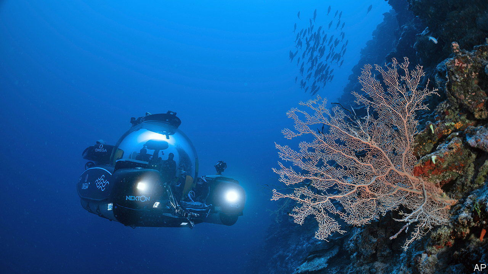

###### Exploring the blue planet

# Much of the Earth remains unexplored 

##### A new ocean census aims to change that 

 

> May 3rd 2023 

“Earth” has always been an odd choice of name for the third planet from the Sun. After all, an alien examining it through a telescope would note that two-thirds of its surface is covered not by earth at all, but by . 

Because humans are land-lubbing animals, most of the Earth remains under-explored. Marine biologists think the oceans might host more than 2m species of marine animals, of which they have so far catalogued perhaps a tenth.  are fond of pointing out that scientists have mapped nearly all of the Martian surface, but less than a quarter of the seabed. 

A new initiative hopes to change this. Launched in London on April 27th, Ocean Census aims to discover 100,000 new species of marine animal over the coming decade. It is backed by Nekton, a British marine-research institute, and the Nippon Foundation, Japan’s biggest charitable foundation. Its first ship, the Norwegian icebreaker , set sail on April 29th, bound for the Barents Sea. 

The initiative is happening now for two reasons. One is that, the longer scientists wait, the less there will be to catalogue. Climate change is heating the oceans, as well as making them more acidic as carbon dioxide dissolves into the water. Already around half the world’s coral reefs—thought to be home to around 25% of all ocean species—have been lost. Oliver Steeds, Nekton’s founder and chief executive, says that one of Ocean Census’s priorities will be cataloguing species thought to be in the greatest danger from climate change. Otherwise, he says, the risk is of “the forest burning down and not knowing what was there before [it] was lost”.

The second reason is technological. Marine biologists find about 2,000 new species a year, a rate hardly changed since Darwin’s day. Ocean Census is betting it can go faster. “Cyber taxonomy”, for instance, involves feeding DNA sequences from animals into computers, which can quickly decide whether it is a new species. The ability to describe new creatures, as well as simply cataloguing them, has also improved. Fancy cameras on remote-operated vehicles, for instance, allow scientists to make laser scans of deep-sea creatures such as jellyfish without removing them from their habitat. Just as the immense pressures of the deep sea are fatal for humans, taking such a jellyfish to the surface for examination reduces it to gooey slime. 

Ocean Census is not the first attempt to conduct a systematic survey of life in the oceans. The Census of Marine Life was a ten-year effort, begun in 2000, to seek out new species. The Global Ocean Sampling Expedition, which ran from 2004 to 2006, aimed to catalogue microbial life in the sea by sampling waters from across the world. (It was funded by Craig Venter, a biologist-cum-entrepreneur, and carried out on his personal yacht.) 

Exactly what the new effort might turn up, of course, is impossible to predict. But history suggests it will be fruitful. Half a century ago scientists discovered hot vents on the sea bed that were home to organisms living happily in conditions that, until then, had been thought inimical to life. These days, such vents are one plausible candidate for the origin of all life on Earth. 

There are more practical benefits, too. Many drugs, for example, come originally from biological compounds. An ocean full of uncatalogued life will almost certainly prove a rich seam from which to mine more. One type of marine snail, , was recently discovered to produce a painkilling compound 1,000 times more potent than morphine. 

To help make use of its data, Ocean Census plans to make it freely available to scientists and the public, who will be able to scour it for anything useful or surprising. The point of exploration, after all, is that you never know what you might find. ■


