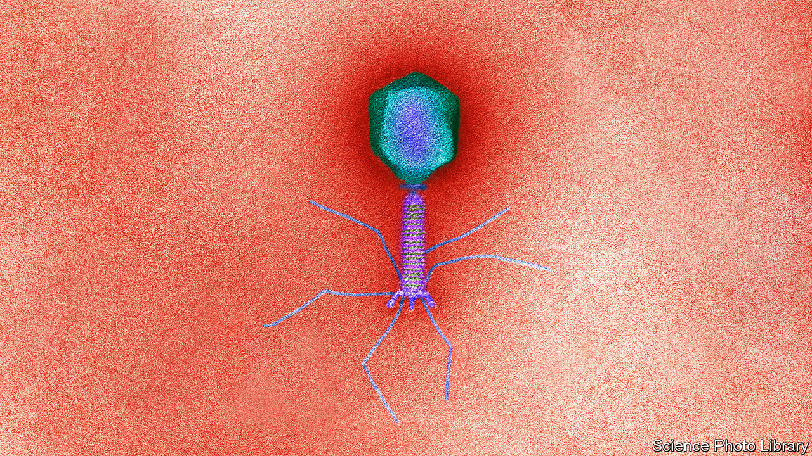
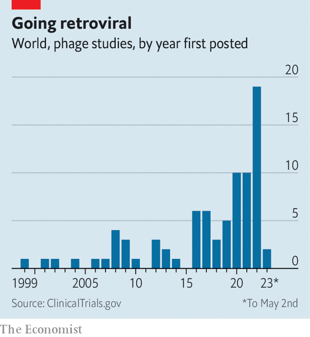

###### The antibiotics crisis

# Western firms are becoming interested in a Soviet medicine 

##### “Phage therapy” aims to use viruses to cure bacterial infections 

 

> May 3rd 2023 

It was on the golf course that Barry Rud first noticed something was seriously wrong. A trim 60-year-old who played hockey as a young man, he found himself unable to take more than a few steps without gasping for breath. His doctors said he had caught a strain of , one of the growing number of  that have evolved resistance to many common . 

Mr Rud’s experience illustrates a growing problem—and one possible solution to it. Antibiotics are among medicine’s most spectacular achievements. A class of “silver bullet” drugs that destroy disease-causing bacteria while sparing the patient’s own cells, they have defanged all sorts of once-feared illnesses, from cholera to syphilis. They have drastically reduced the risks of surgery (patients often died from infections caught on the surgeon’s table) and chemotherapy, which destroys the patient’s immune system.

But their magic is waning. Repeated exposure to a lethal threat has led bacteria to evolve resistance to many existing antibiotics, blunting their efficacy. At the same time, much of the pharmaceutical industry has lost interest in finding new ones. It has been almost 40 years since a new class of antibiotics has been made available to patients. Some infections, including gonorrhoea and tuberculosis, are once again becoming difficult to treat. One estimate, published in the  in 2022, reckons antibiotic resistance directly caused 1.2m deaths in 2019, and was indirectly implicated in 3.8m more. 

With antibiotics unable to cure his illness, Mr Rud took a chance. He travelled to the Eliava Institute in Tbilisi, Georgia, one of a handful of institutions specialising in the study of bacteriophages. These are viruses that infect and kill bacteria. The Eliava Institute uses them as living antibiotics, hoping to cure a human’s disease by causing one in the bacteria making him sick. 

“Phages” are little known outside the former countries of the Soviet Union, which did the most to develop the idea. In Georgia they have been part of the local pharmacopoeia for decades. (Indeed, 2023 marks the Eliava’s centenary.) Little vials containing stale-tasting liquid full of anti-bacterial viruses can be bought at pharmacies across Tbilisi. Now, as worries about antibiotic resistance build, Western firms are taking a second look.

Set phages to kill

Despite their name, bacteriophages infect, rather than eat, their prey. Owing to the profusion of bacterial life, phages are the most abundant biological entities on the planet. Most resemble a cross between a Moon lander and spider. An icosahedral head (think of a 20-sided die) holds their genome, and is attached to a tail of proteins that culminates in a spray of fibres. When the fibres encounter a suitable receptor on a bacterial cell wall, they bind the phage to its victim, driving its tail through the cell’s membrane and allowing its genome to enter its new host.

One of two possible fates awaits the unfortunate bacterium. “Lysogenic” phages weave their own genomes into that of their host, leaving it alive with its new cargo of viral DNA. If the phage is “lytic”, though, it hijacks its host’s cellular machinery to assemble copies of itself. These proliferate until they burst out, killing the bacterium in the process. It is the latter sort of phage that is of interest to doctors. 

As living antibiotics, phages have several advantages, at least on paper. Since they can make more of themselves, initial dosages can be relatively small. Unlike chemical antibiotics, they can evolve as readily as their prey, potentially blunting a bacterium’s ability to develop resistance. And the myriad differences between human cells and bacterial ones means they are unlikely to do any damage to the patient.

A century ago, phages were the most promising tool in the antibacterial arsenal. Felix d’Herelle, a microbiologist at the Pasteur Institute in Paris, used them to treat the first patient in 1919, after downing a dose himself to ensure they had no harmful effects. One of his colleagues was a young Georgian scientist named George Eliava, who returned home to found the institute that now bears his name.

But with the discovery of penicillin, the first antibiotic, in 1928, phages fell from favour. Production of penicillin surged during the second world war, crowding the phages out. That has left a shortage of good-quality trial data on their use in humans. (The first and so far only clinical trial on phages in Britain ended in 2009, concluding they were both safe and effective against an ear infection). What data exist indicate that phages are not harmful to humans. Four reviews of the available literature, all published since 2020, suggest very low rates of adverse affects (the figure for antibiotics, phage researchers are quick to point out, can be as high as 20%). 

How well phages actually do at curing infections, though, is another question. Although encouraging anecdotal evidence has been trickling in for decades, regulators need big, formal clinical trials. A report published last year by the Antibacterial Resistance Leadership Group, a gathering of experts, concluded that the lack of data meant phages were not ready for clinical use. “We have a lot of catching up to do,” says Steffanie Strathdee, a director of the Centre for Innovative Phage Applications and Therapeutics at the University of California, San Diego. 

That uncertainty has not stopped a wave of medical tourism to the Eliava Foundation’s Phage Therapy Centre. It treats more than 500 foreign patients a year. Most, like Mr Rud, are charged €3,900 ($4,300) for two weeks of on-site treatment and months’ worth of bottled phage to take home. Patients from more than 80 countries have visited the clinic.

Treatment involves three steps. The first is to figure out exactly which bacterium is responsible for the disease. Proper identification is crucial, as some phages are so target-specific that they may have different effects on two bacteria from within the same species. Second, a phage has to be found that can successfully attack the bacterium in question. This can sometimes be done simply by looking in existing phage libraries, of which the Eliava has one of the world’s largest. 

Sometimes, though, its researchers must go hunting for something suitable. The core principle is to look for a phage in the same place as one would find the bacteria it infects. In practice this often involves a lot of laborious sifting through human sewage and hospital waste, as these are reliable sources of resistant bacteria. (So are urban rivers such as the Mtkvari, which runs by the Eliava’s grounds.)

Finally, the phages must be encouraged to grow, and the resulting solution purified. Although the number of laboratories that can replicate parts of this process is on the rise, Vakho Pavlenishvili, the Eliava Foundation’s head of phage production, says it remains the only place capable of handling the entire process from bacterial analysis through to phage prescription.

 


But expertise is spreading. More clinical trials of phage therapy have begun around the world in the past three years than in the preceding two decades (see chart). In 2022 Technophage, a Portuguese company, completed a trial of a phage cocktail designed for patients with diabetic foot ulcers. It hopes to begin the next round of trials sometime later this year. BiomX, an Israeli firm, is testing a phage cocktail of its own on , a common cause of hospital-acquired infections. Adaptive Phage Therapeutics, an American firm, has three trials in the works: one on cystic-fibrosis patients with opportunistic infections, one for infections in prosthetic joints, and, like Technophage, one on diabetic foot ulcers.

One problem facing would-be phage therapists is that, as natural entities, phages cannot be patented. One solution is to tinker with a phage’s genome, since edited genomes are eligible for protection. A Danish company called SniprBiome hopes to produce tweaked phages capable of tackling  infections. It has completed initial trials in humans, and hopes to discuss bigger ones with regulators later this year. 

Even if the phages themselves cannot be patented, other things made from them can. Dressings or implants coated in phages are one example. Adaptive Phage Therapeutics has patented parts of its phage library and its high-speed manufacturing process. The firm hopes to be able to go from the identification of a bacterium to regulatory approval of a phage to kill it within six months. The same process could take 15 years for a new antibiotic, says Greg Merril, its founder. 

Regulators are adapting, too. In America the Food and Drug Administration has allowed companies to accelerate their early-stage clinical trials. In 2018 regulators in Belgium adopted new rules known as the Magistral pathway, which allow pharmacies to sell phages to patients who have a prescription. The researchers who lobbied for the new rules hope to see similar changes across the rest of the EU. “I find [British regulators] to be incredibly engaged and interested,” says Martha Clokie, a researcher at the University of Leicester. She is part of a collaboration that hopes to bring high-quality phage manufacturing to Britain, and to build up a national phage library to go with it.

And phages could find uses outside medicine, too. They have been used to treat rot in cabbages for almost a century. Trials have begun on potatoes, corn, citrus fruit and grapevines. Animal farming consumes huge quantities of antibiotics, prescribing them to cattle and pigs to encourage growth. That makes the industry a big driver of antibiotic resistance. ACD Pharma, a Norwegian firm, has spent 15 years researching the potential application of phages to fish-farming. It launched a product to tackle a single bacterium in salmon in 2018. In 2022 sales rose by 1,000%. The firm is trying to adapt its product to tackle other types of bacteria, too.

Make it so

For now, though, all these remain hopes rather than certainties. There are plenty of questions left to answer. Some are big and conceptual. Since phages are foreign bodies, for instance, they are likely to spur a patient’s immune system to produce antibodies to neutralise them. That could be a problem, especially with repeat prescriptions, as a body primed to repel a phage is one in which its effectiveness will be limited. Whether phages can be tweaked to overcome such defences remains to be seen. Others are humdrum but essential: doctors will need to work out ideal doses, the best administration mechanisms, and which sorts of patients might be best suited to the treatment. 

Not even the most dedicated advocates of phages think they will replace antibiotics. But they hope they might serve as a treatment for infections for which nothing else works, or as a supplement to conventional antibiotics in order to strengthen their effects. For that to happen, though, will require building the infrastructure to explore the idea properly. For now, the facilities to do that simply do not exist. “We can receive a thousand patients,” says Dr Sturua, back at the Eliava Institute. “But we can’t receive a million.” ■


