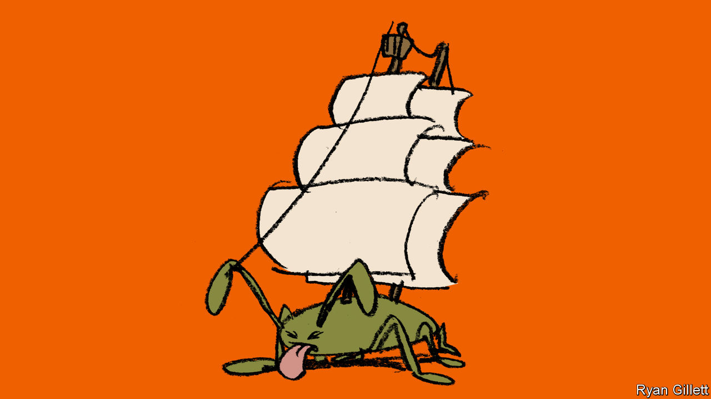

###### Tides of filth

# What shipwrecked insects reveal about life at sea in the 17th century 

##### It was even more unpleasant than we thought 

 

> May 3rd 2023 

A great deal of romance attaches these days to the “Age of Sail”, the period between the 15th and 19th centuries when wooden sailing ships reached their technological apogee. Historians, however, have a less rosy view. The journals and logs that have survived from the era do not paint an especially pretty picture of conditions aboard. 

A new paper offers insight from an unexpected source. Written by Eva Panagiotakopulu, an entomologist at the University of Edinburgh, and Ana Catarina Garcia, an archaeologist at Nova University in Lisbon, and published in , the paper examines two shipwrecks off the Azores, both of which date to about 1650. The first, known as Angra C, is thought to be a Dutch ship; the second, Angra D, was Spanish. 

Expeditions to both wrecks have recovered everything from ropes, tools and buckets to wheat grains and decking planks—as well as the remains of various species of insects. The researchers were interested in how sailing ships ferried invasive species from one continent to another. But their findings also shed light on the unpleasant realities of life at sea in the 17th century. 

Among the preserved insect parts were wings from the American cockroach, . (Despite its name, it is not originally from America.) Aside from its distinct lack of charisma, this species lives off waste and spreads serious diseases including salmonella. More than 30 individual flies from a species called  were also identified. It is often found living in rotten food, and is also fond of sewage. 

 is another fly known as the “cheese skipper”. It lays its eggs on cheeses, dried meats and smoked fish. It also has an appetite for rotting human flesh, and gets its name because its larvae readily “skip” from corpses to food. The researchers also dug up the remains of widely known as the “urine fly” because its larvae thrive in urine-soaked wood. 

One ocean-goer’s journal from the 1600s notes that “Most people did not take the trouble to go above to relieve themselves.” Whether this was really common practice has been debated. Drs Garcia and Panagiotakopulu’s stomach-turning findings suggest it was. But that is a detail likely to be left out of the next “Pirates of the Caribbean” film. ■


