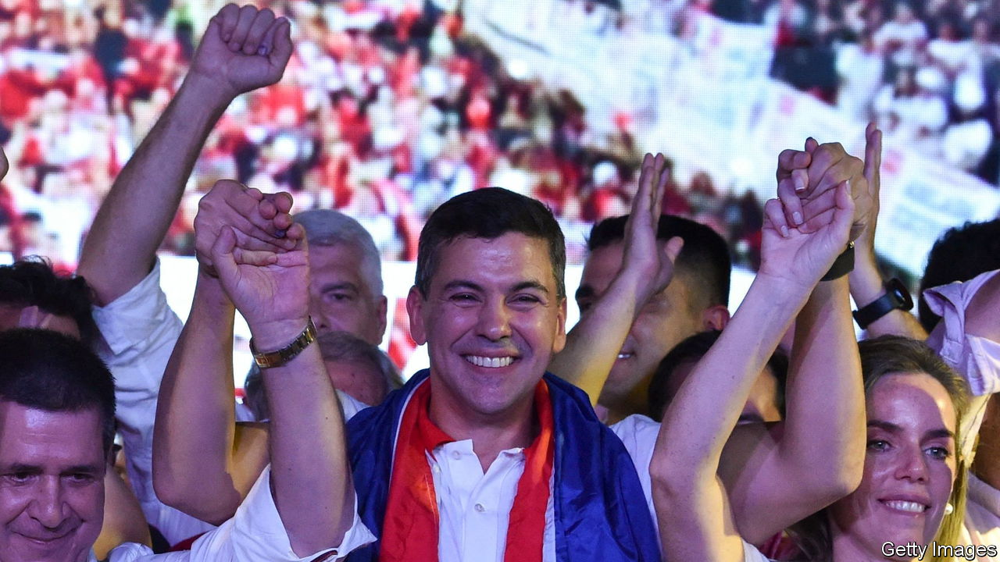

###### Stability amid chaos

# Santiago Peña, a former economist, is Paraguay’s next president 

##### But a nationalist firebrand got 23% of the vote 

 

> May 4th 2023 

Pundits predicted a tight race. In the end, it wasn’t even close. Santiago Peña, a 44-year-old former finance minister and economist at the IMF, took nearly 43% of votes in Paraguay’s presidential election on April 30th. Mr Peña hails from the conservative Colorado Party that currently governs the country. By the time his five-year term, which begins on August 15th, is over, the Colorados will have held power for 75 out of the last 80 years.

Mr Peña’s plans, though vague, clearly resonated with voters. “He says he’s going to support young people who want to get on, that want to fulfil their dreams,” says Gabriel González, a 28-year-old builder heading into a polling station in Remansito, a suburb of Asunción, the capital. Advisers to Mr Peña say that a full manifesto will be drawn up soon. Paraguay’s ultra-low tax rates and stable macroeconomic policies will probably remain unchanged. 

The distant runner-up was Efraín Alegre, a lawyer and former congressman. He headed an ungainly and reluctant coalition. Mr Alegre had lots of ideas, including locking up crooked politicians in a new jail in the mosquito-infested outback. Others would be banished farther afield. Mr Alegre suggested he would extradite Horacio Cartes—Paraguay’s president between 2013 and 2018 and the leader of the Colorado Party—to the United States. In January the US government accused Mr Cartes of involvement in “rampant corruption” and barred American firms from doing business with him. No extradition request or formal charges have been made. Mr Cartes denies all of the allegations. 

The biggest upset was Paraguayo Cubas, who got 23% of the vote and split the opposition. A nationalist, anti-corruption firebrand, Mr Cubas was expelled from his senate seat in 2019 after brawling with his colleagues. Before that, “Payo”, as he is known, was infamous for attacking a judge with his belt before defecating in the judge’s office. He said he would shut down Congress, rule with the army and put dishonest officials before firing squads. His movement, National Crusade, saw five senators elected, including one who is currently in jail. Mr Cubas’s supporters took to the streets after the election result was announced, letting off fireworks outside the electoral authority, egged on by their leader, who called on them to “die if necessary”. Meanwhile the Colorado Party lives on. ■

