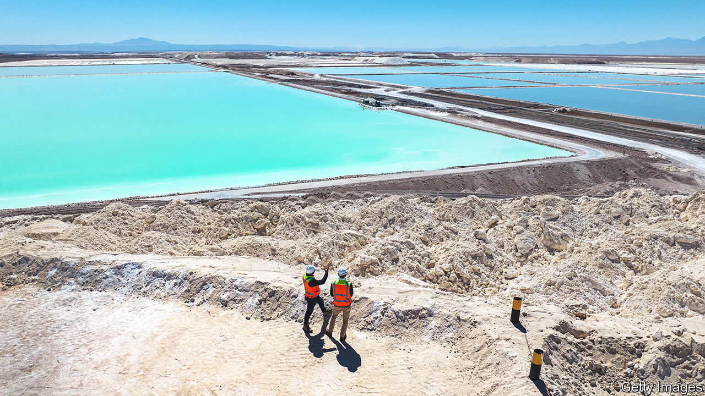
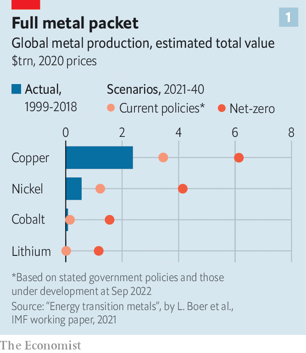
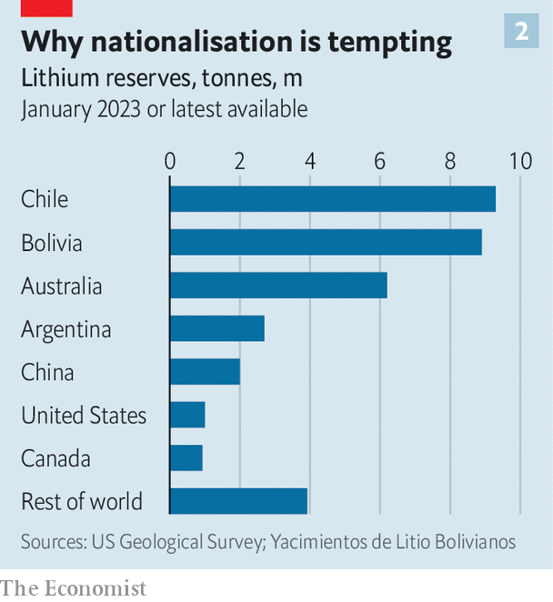

###### Wrangling over white gold

# The green revolution will stall without Latin America’s lithium 

##### But politicians such as Gabriel Boric, Chile’s president, want to nationalise it 

 

> May 2nd 2023 

Over half of , a metal used in batteries for , can be found in Latin America. The region also has two-fifths of the world’s copper and a quarter of its nickel. Recently delegations from the United States and the European Union have flocked there partly to secure resources that will be needed in the energy transition, and to diversify their supply away from China. In March John Kerry, President Joe Biden’s climate tsar, visited the continent. German officials have scheduled at least three high-level meetings in South America this year. Ursula von der Leyen, the president of the European Commission, looks set to visit in the coming months. 

But even as the outside world spies resources in Latin America, governments there are taking back control. On April 21st Gabriel Boric, Chile’s left-wing president, announced plans to create a state-owned company to produce lithium. If the legislation is passed later this year, private companies will have to form joint ventures in which the state firm has a majority stake. 

Mr Boric is not alone in his penchant for green-resource nationalism. On May 1st Mexico’s Senate approved changes to the mining code which will reduce the length of concessions for private companies from 50 years to 30. Andrés López Manuel Obrador, Mexico’s populist president, also signed a decree in February to fast-track the nationalisation of the country’s lithium reserves. The governments of Argentina, Bolivia, Brazil and Chile are discussing creating a lithium OPEC to control global prices. In Bolivia the lithium industry is almost entirely run by the state. 

Latin America is part of a global trend. Partly in response to higher commodity prices, several countries have taken greater control of their resources. Indonesia, the world’s biggest nickel producer, recently banned exports of nickel ore and is promising to do the same with bauxite, the ore for aluminium. Governments in the Democratic Republic of Congo, Kyrgyzstan and Madagascar are also dabbling with increased state intervention.

Yet Latin America stands out for the speed with which countries are wielding state control. The Resource Nationalism Index, a ranking produced by Verisk Maplecroft, a consultancy, monitors royalty increases, demands for locally produced goods and expropriation of assets. In the latest ranking from this year, Mexico jumped to third place, from 98th in 2018. Argentina is in 19th place, from 41st. Chile ranks 70th, up from 89th in 2018.

 


Much of this is due to the fact that a wave of recently elected left-wing governments are now in power in the region. They want to do things differently from the past, when wealth from raw materials ended up abroad or lining the pockets of crony-capitalists. The new left has three goals. The first is to increase the state’s revenues and economic clout. If forecasts are right, then the green transition could be continent-changing. An IMF working paper reckons that in order for the world to reach net-zero emissions by 2050, revenues for lithium, copper, cobalt and nickel producers could rise four-fold. The cumulative value of global production could be $13trn between 2021 and 2040 (see chart 1). That bonanza is about the same as the forecast value of global oil production over the same period.

 


Latin America controls many of these vital resources (see chart 2). Mexico is the world’s biggest producer of silver, which is used in wind turbines and solar panels. Brazil sits on roughly a fifth of the world’s known reserves of nickel, graphite, manganese and rare-earth metals, which are used in green technologies. Chile and Peru alone produce almost 40% of the world’s copper. 

Chile is one of the places that is most likely to benefit from the windfall. Already mining, mostly of copper, represented 15% of GDP and 62% of its exports in 2021. Codelco, the state copper-mining company, provides over three times the tax revenue of private companies per unit of production, according to CENDA, a Chilean think-tank. Mr Boric hopes the state lithium firm can do the same. Tangible signs of this jackpot are already visible. Last year SQM, one of only two companies that currently mine lithium in Chile, paid more than $5bn in revenue to the treasury, making it the country’s biggest corporate tax contributor. Chile’s lithium production quadrupled between 2009 and 2022. 

Other countries can smell the money. Argentina is expecting investments in lithium worth $4.2bn, or 0.7% of GDP, over the next five years. Exports of the metal surged last year, from $200m to $700m (or from 7% of all mining exports in 2021 to 18%). Nickel production in Brazil increased by almost a tenth between 2021 and 2022. Last year Vale, a Brazilian mining firm, signed a long-term agreement to supply nickel to Tesla, the world’s biggest maker of electric vehicles, though the value of the deal was not disclosed. On April 10th Brazil’s regulator gave Sigma Lithium, a startup, approval to start mining lithium from hard rock in the state of Minas Gerais. Its project is valued at over $5bn. 

A second reason why Latin America’s politicians are ramping up resource nationalism is that they hope to create more jobs and opportunities for business. Until now the region has failed to produce higher-value goods because of a poorly skilled labour force, low investment in research and development (R&amp;D) and an unpredictable regulatory environment. Chile, Mexico, Colombia and Argentina spent an average of 0.3% of GDP on R&amp;D in 2020 compared with 2.7% in the OECD, a club of mostly rich countries. The share of workers who receive some form of skills training is only 15% compared with 56% across the OECD. 

Many politicians think natural resources should be used as inputs into local manufacturing rather than be exported as raw materials. On the same day he announced his lithium plans, Mr Boric proclaimed: “This is the best chance that we have to transition to a sustainable and developed economy. We don’t have the luxury to waste it.” Western governments are courting this desire. In January Olaf Scholz, Germany’s chancellor, said while in Buenos Aires that German companies would be “real partners” to South America, asking: “Can one not move the processing of these materials, which creates thousands of jobs, to those countries where these materials come from?”

Finally, a sense of social justice is fuelling these politicians’ plans. Many hope that their policies will not only increase revenue, but reduce conflict. Since 2000 over a third of all conflicts related to extractive projects globally have taken place in South America, according to the Environmental Justice Atlas, a research project at the Autonomous University of Barcelona. Mexico’s mining law would make companies give 5% of their revenues to the indigenous communities in which they mine. Mr Boric’s proposal would make companies use extraction techniques that require less water in order to minimise drought, which has been a source of anger among locals and indigenous groups.

But resource nationalism carries huge risks. Nationalisation has a bad track record in the region. Pemex, Mexico’s state oil firm, is the world’s most indebted oil company. Venezuela’s state oil giant, PDVSA, is synonymous with the country’s collapse. Petrobras, Brazil’s public oil company, was at the heart of the region’s largest corruption scandal, known as “Lava Jato”. 

And state firms may lack access to the cutting-edge technology that multinational companies typically excel at. For example, LitioMx, Mexico’s new state lithium firm, is unlikely to prosper on its own. To date, Mexico has been unable to produce lithium at commercial scale, partly because its deposits are harder to extract, as they are in clay rather than brine. Digging them up will require technology, know-how and investment, which many analysts believe LitioMx lacks. 

How has the wave of resource nationalism affected investment? In some places where property rights have been thrown down a mine-shaft, capital flows have dropped. Bolivia has the world’s second-largest lithium reserves, according to its government statistics. But it has yet to pump any out of the ground at scale. In 2019 the government issued a decree overturning a lithium project which involved investment worth $1.3bn by ACI Systems, a German company, after local protesters demanded higher royalties. 

Yet even in Bolivia some firms are prepared to face unstable policies in return for access to scarce minerals. In January Bolivia awarded a Chinese consortium a $1bn contract to develop its industry. Chinese firms are active elsewhere. On April 21st BYD, a big electric-vehicle maker, announced plans to open a lithium-processing plant with Chile’s government. Gotion, a Chinese battery-producer, has promised to produce batteries in Argentina. 

Often their interests go beyond minerals to other parts of the green supply chain. On April 27th China Energy, a renewable giant, promised $10bn worth of investments in renewables in Brazil, particularly in green hydrogen. Jörg Husar of the International Energy Agency reckons Latin America has the largest share of global projects to export green hydrogen. 

Resource curse or purse?

For as long as appetite remains insatiable for green resources Latin America will have enough leverage to impose conditions on private firms without strangling investment flows. Yet the big question is whether its slice of the cake ends up being smaller than it might have been. Chile offers a cautionary tale. The government already plays a large role in the production of lithium, which is deemed a strategic resource. Royalties go up to 40% (compared with 3% in neighbouring Argentina), and companies are required to sell up to 25% of output locally at below-market prices to producers who promise to develop the domestic lithium value chain. As a result, Chile is losing market share. Production is forecast to grow by three-fifths by 2026. By comparison, Australia is expected to double production over the same period. ■


