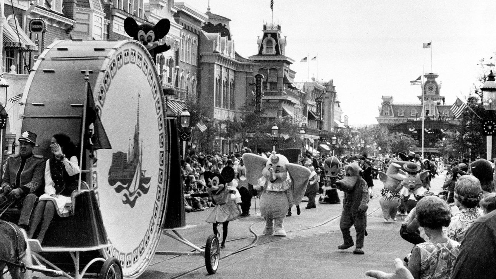

###### The Economist explains

# What is the special district at the heart of Disney’s feud with Ron DeSantis? 

##### The Reedy Creek Improvement District, set up in 1967, is an American curiosity—and made Disney World possible 

 

> May 1st 2023 

THE WORLD’S biggest amusement park was not built in a day. In 1958 planning began for an “eastern Disneyland” to complement the park in Los Angeles; Walt Disney World, in Orlando, Florida, opened its doors more than a decade later, in 1971. In the intervening years Disney executives and Florida’s officials developed an arrangement that gave Disney near-total control over the roads, public utilities, zoning and building codes, and more on the land on and around which Disney World was built. It also had the power to raise its own municipal debt, of which it has around $1bn today. “Nobody has ever seen anything like it, before or since,” Ron DeSantis, Florida’s Republican governor, recently wrote. 

Mr DeSantis,  about Disney’s criticism of a Florida law that bans discussion in schools of gender and sexual identity, is . For more than a year he has promised to end Disney’s “corporate kingdom”, whose administrative name is the Reedy Creek Improvement District. In February he worked with Florida’s state legislature to amend Reedy Creek’s charter, replace its governing board with his allies, and rename the area to the Central Florida Tourism Oversight District. On April 26th, after the new board voided two contracts that would have extended Disney’s autonomy, the company sued Mr DeSantis and the board to get its contracts reinstated. What is Reedy Creek, and why does it matter so much to Disney?

America has many forms of government. Alongside federal and state laws, there are broadly five types of local government. Three—cities, counties and towns—are common in other countries. School districts, which oversee primary and secondary schools, are a curious fourth. The fifth, special districts, are more curious still. They take control of one or more functions generally executed by a municipality, such as fire protection or water services, and may be independent or sponsored by a local government. These are in fact the most common single form of local government. There were nearly 39,000 in America at the last census count in 2017. 

Special districts are neither rare nor new in Florida, which created its first in 1845, the same year it became a state. But at least two things distinguish Reedy Creek from others, says David Schleicher of Yale Law School. One is its permanence. Many districts are temporary, but Reedy Creek was meant to endure. Before Mr DeSantis got involved, it had been governed by a five-member board of property-owners, elected by residents who owned at least a half-acre of property each. Disney, the majority landowner, gives five-acre plots to the board members it wants elected. The contest is never close: Disney owns two-thirds of the district’s property. The other is its scope; many special districts are formed to handle “really one-off, weirdo things”, such as mosquito control, says Mr Schleicher. Florida’s first special district was set up to control drainage. But Reedy Creek has broad powers, including rights to operate an airport, police services and a nuclear power plant. (It does not exercise these.)

Disney had by 1965 purchased more than 25,000 acres in central Florida. The area, nearly double the size of Manhattan, was 65 miles from the nearest beach. Citrus trees outnumbered citizens. Walt Disney had some ambitious ideas for his “Florida project”. One was the Experimental Prototype Community of Tomorrow (EPCOT), a planned residential community that would be free from the ills he saw plaguing America’s cities, “starting from scratch on virgin land”. Reedy Creek’s charter, created in 1967, describes as “new and experimental” the transport, energy and other facilities Disney was empowered to develop. (The Epcot Centre ended up as a futuristic theme park rather than a pioneering city.) Walt Disney was also irritated by the ugly motels that had sprung up around Disneyland in Los Angeles. Reedy Creek left Disney unencumbered and in control.

The benefits have flown both ways. In the 1960s Florida lawmakers drafting Reedy Creek’s charter emphasised the state’s need for tourists. Disney World attracted 59m visitors in 2019, before the pandemic hit. It employs 75,000 people and is the state’s largest taxpayer. According to a study in 2019 by Oxford Economics, a consultancy, Orlando-area tourism yielded $75.2bn in “economic impact”—a measurement that includes direct and indirect spending—for central Florida. That figure includes spending at other parks, like Universal Studios and SeaWorld, but Disney, as the first to gamble on the area, can take much of the credit.

The legal path forward for Reedy Creek could be as windy as the political one for Mr DeSantis, who is expected to run in America’s presidential election in 2024. Disney’s suit alleges that the governor is punishing it for speaking out, thereby violating its First Amendment right to freedom of speech. Mr DeSantis’s board is set to counter-sue. Their relationship was not always so strained: Mr DeSantis got married at Disney World. “My only condition,” he recently revealed, “was that no Disney characters could be part of our wedding.” ■

