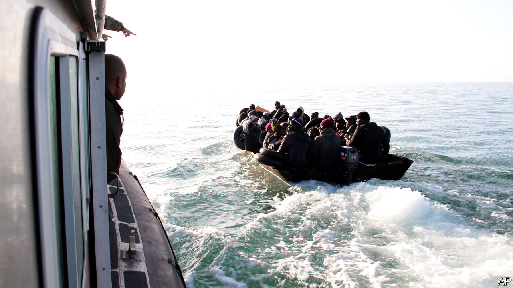
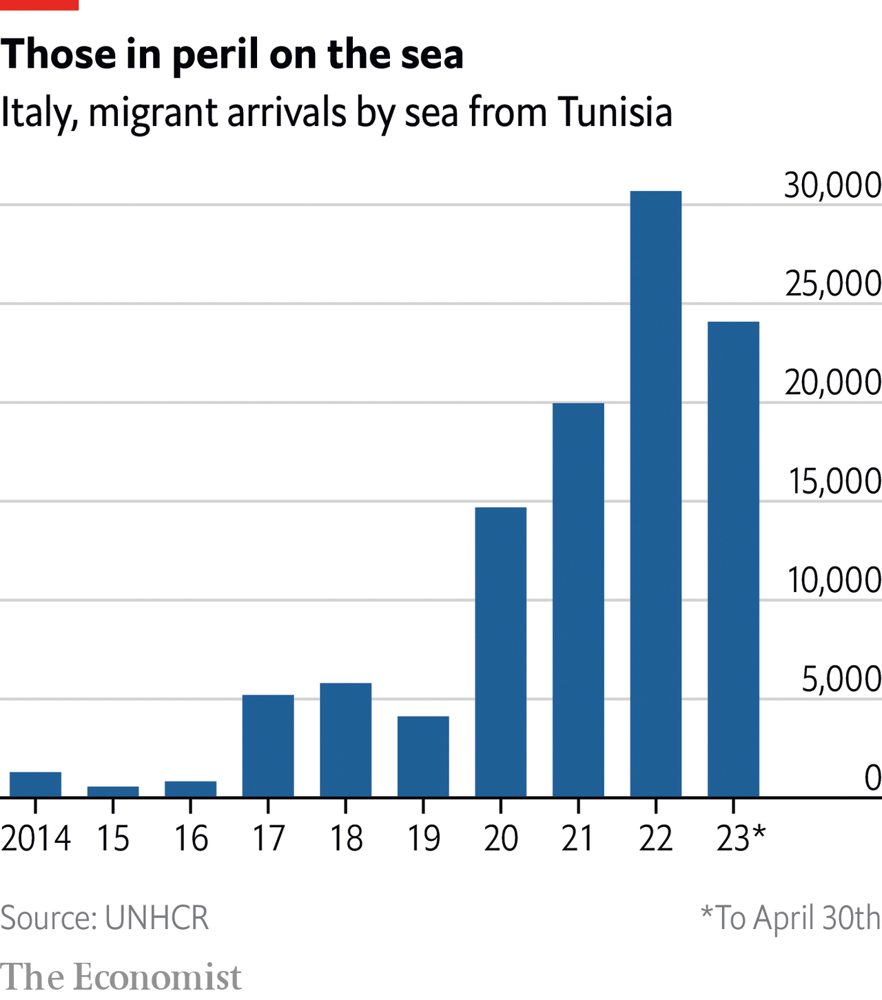

###### The Economist explains

# Why are migrants to Europe fleeing from and through Tunisia? 

##### An ailing economy and the toughening of border measures elsewhere along the coast are to blame 

 

> May 3rd 2023 

BETWEEN APRIL 19th and 24th Tunisia’s coastguard recovered 70 bodies from the Mediterranean sea. Less than a week earlier, 25 migrants died in the country’s waters. After a period of decline between 2016 and 2019, the number of people travelling from north African countries to Italy or Malta is on the rise again. A growing proportion depart from Tunisia. Between January and April this year some 24,000 people migrated by sea from Tunisia to Italy, many in makeshift boats. That is already close to the figure for the whole of 2022, which was just over 30,000 (see chart). Why is there a surge of migrants leaving from Tunisia?

 


People have  through and from north Africa to escape persecution and poverty. Most aim to reach Italy; a smaller group head for Malta. Previously, Libya was the most common departure point. In 2016 180,000 people arrived in Italy from that country, which was then relatively easy to enter and leave. In the following year more than 90% of the migrants who came by sea had departed from Libya. 

But those huge numbers prompted European governments to try to close the route. In 2017, as part of a wider EU strategy, Italy agreed to invest in Libya if the country stepped up its border control. As part of the deal, Italy’s government began , which is in fact mostly made up of militias independent of the government. Since then the number of people reaching Italy from Libya has fallen by 55%. The coastguard intercepts tens of thousands each year. 

Those returned to shore also face mistreatment by the Libyan authorities. Some have reported torture and rape in detention centres. Migrants began to look for other routes. By 2020 the share of sea-borne migrants to Italy who had embarked in Libya had fallen to less than 40%; Tunisia had become the main point of departure. 

But Tunisia is not just a transit country; a growing minority of those leaving its shores are Tunisian nationals. In 2016 Tunisians accounted for less than 4% of arrivals in Italy; by 2022 they were 18%, the second largest single group by nationality. The economy has been weak since 2015. Annual inflation hit 10% at the end of 2022; unemployment has been at around 15% or higher for more than a decade. The pandemic dealt a heavy economic blow, too. As lockdowns crippled the country’s tourism sector, GDP shrank by 8.8%. 

The political situation remains a push factor, too. Kais Saied, the country’s current strongman, silences dissent and arrests opposition figures. A  by Mr Saied in February alarmed many, particularly among migrants from the rest of Africa living in Tunisia, who have started to leave in recent months. In what appeared to be an attempt to distract Tunisians from the country’s problems, the president accused migrants from sub-Saharan Africa of bringing “violence, crimes and unacceptable practices”. Many Tunisians objected to his remarks; but some agreed with them and acted on them. Attacks on black migrants rose in the months that followed. 

On April 11th Italy’s right-wing government declared a state of emergency in response to the crisis which will make it easier for the country to repatriate migrants. Mr Saied is not doing much to allay Europe’s concerns: he recently rejected a proposed bailout from the IMF, arguing that meddling by foreign “diktats” would lead to more poverty in Tunisia. Italian officials have since suggested that the IMF bypass the president (which would be unprecedented and will not happen). The EU has proposed a series of measures to strengthen Tunisia’s border control, like those it has implemented in co-operation with Libya’s coastguard. Such measures may increase the number of interceptions on Tunisia’s coast, but they won’t stop people from trying to flee: desperate migrants will continue to find a way.■

