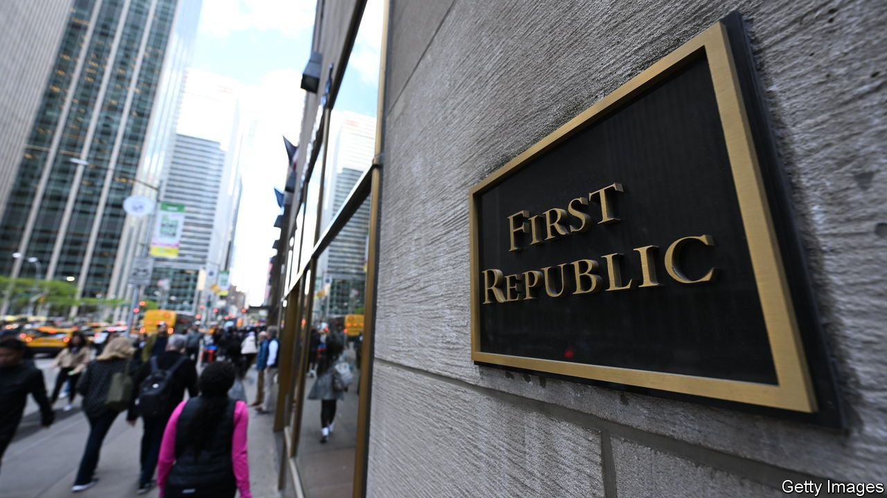
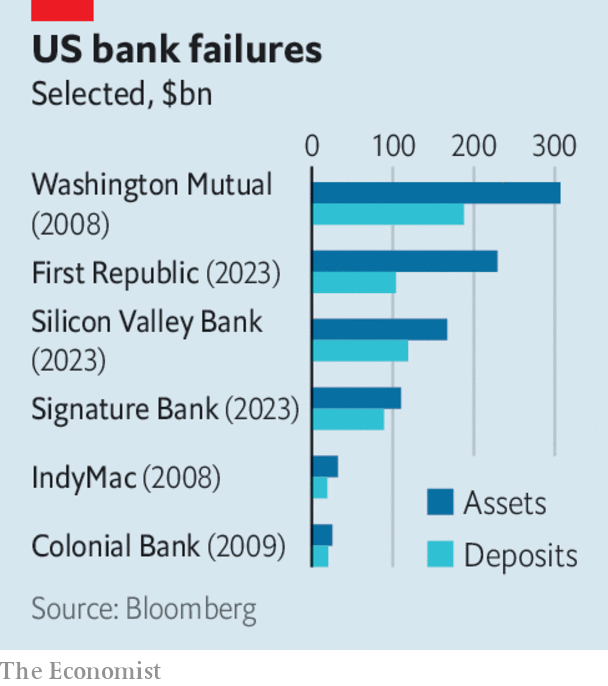

###### The world this week

# Business 

#####  

 

> May 4th 2023 

 


In an attempt to stave off more banking turmoil, regulators in California took control of , a regional lender based in San Francisco, and placed it into federal receivership. Much of the bank was then sold to JPMorgan Chase following a bidding auction. It is America’s second-biggest banking failure ever. The rescue didn’t do much to placate fears about the health of other midsized regional banks. The share price of Pacific Western Bank slumped after the lender was reported to be exploring its strategic options. 

The Federal Reserve issued a stinging report into the collapse of  in March. It blamed SVB’s management as well as itself for not appreciating “the seriousness of critical deficiencies” at the bank, and said that legislation passed in Congress in 2018 had lowered supervisory standards. It called for stronger regulations. The report also noted that social media is a factor that “may have fundamentally changed the speed of bank runs”. 

The Fed lifted its benchmark  by another quarter of a percentage point, to a range of between 5% and 5.25%. It was the tenth consecutive increase, though markets interpreted a slight change in the central bank’s guidance to think it may be the last in this particular cycle. 

The  increased its deposit rate by a quarter of a point, to 3.25%. Consumer-price inflation in the euro zone rose slightly in April to 7% at an annual rate. The currency bloc’s economy grew by 1.3% in the first quarter, year on year, a slower pace than in the previous three quarters by that measure. 

The surprised markets when it raised its rate by a quarter of a point, to 3.85%. The bank had left the rate on hold in April, suggesting that a rapid run of increases was over. 

The disruptive potential of  came into sharp focus when Chegg, a provider of online study aids, said that the use of ChatGPT by students was starting to affect revenues. Although the chief executive tried to assure investors that this “is not a sky-is-falling thing” and the effects are “just on the margin”, Chegg’s share price swooned, dragging down the stock of other online education companies. 

The big picture

The Writers Guild of America called its first strike for 15 years, in a dispute over pay with studios such as Apple, Disney and Netflix. The   say the studios are creating “a gig economy” in the industry, for example by moving to “day rates” in comedy variety. It also wants to restrict the use of AI in creating scripts. The last stoppage by Hollywood’s script writers lasted 100 days. 

, one of the pioneers of AI, resigned from Google in order to speak his mind about the technology. Mr Hinton, 75, said AI was developing too rapidly and the idea that it would outsmart people was no longer “30 to 50 years” away. Humans are “biological systems and these are digital systems”, he warned, as he called for more safety protocols for AI.

Big  made record profits last year on the back of soaring oil prices. With oil now much less dear, profits are expected to decline, though there wasn’t much evidence of that in the first quarter. BP reported an underlying profit of $5bn, higher than expected but below the $6.2bn it made in the same quarter last year. Shell’s adjusted profit of $9.6bn was an improvement on its performance a year ago, as was Chevron’s net profit of $6.6bn. ExxonMobil’s net income doubled, to $11.4bn. 

, a British chip designer that is being spun off by SoftBank, filed papers for an IPO later this year. It is expected to list its shares on the Nasdaq stock exchange and could raise up to $10bn, which would make it one of the largest IPOs in America in the past decade.

Go First, a discount airline in India, entered bankruptcy protection, blaming the grounding of half its fleet on problems with Pratt &amp; Whitney engines, an issue that is affecting other . This came soon after news that domestic air travel in India had hit a record high as 456,000 passengers flew in a single day. More than 37.5m people travelled by domestic airlines in the first quarter, up by half compared with a year earlier. 

At the departure gate

Alan Joyce, one of the more combative figures in the airline industry, is retiring as chief executive of . His replacement will be Vanessa Hudson, the chief financial officer. Last year the term “Joyced” was coined to reflect passengers’ frustration with “the flying kangaroo” over an increase in cancelled flights and lost luggage.

A group of investors filed a lawsuit against , alleging that it knew about Kanye West’s “extreme behaviour” for years before severing ties with the singer. Adidas stopped selling Kanye West branded sportswear in 2022 because of his anti-Semitic remarks and will take a hit from lost sales. The complaint claims staff knew about his anti-Semitism; he allegedly said he wanted to name an album after Hitler. Adidas responded by promising to defend itself against the “unfounded claims”.

