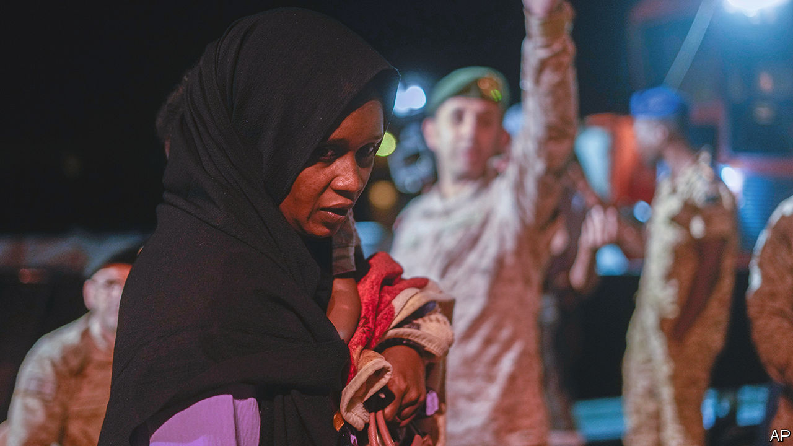
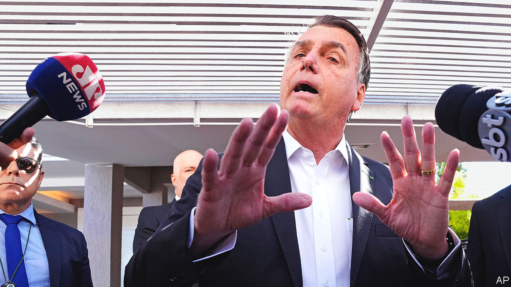

###### The world this week

# Politics 

#####  

 

> May 4th 2023 

The UN warned that 800,000 people could flee fighting in  between the national army and a rival paramilitary force. More than 500 civilians have died in the conflict, which has seen heavy combat in the capital, Khartoum. The UN also sought assurances from the warring factions that humanitarian aid would be delivered unhindered, after six lorries carrying supplies to Darfur, a region in the west of Sudan, were looted. 

A jihadist attack on an army post in  killed 33 soldiers amid deteriorating security in the Sahelian country. By some estimates government forces control only about 40% of its territory.

A popular opposition MP in , Job Sikhala, was jailed for obstructing justice, which prevents him from running in an election that is due to take place in July or August. Activists and lawyers accuse the government of using the justice system to suppress the opposition and rig the elections. 

 militants in Gaza fired over 100 rockets and mortars into  after the death of a hunger-striking Palestinian prisoner detained on terrorism charges in Israel. In response Israeli forces struck sites said to be linked to Hamas, the Palestinian militant group that runs Gaza. Local officials say one Palestinian was killed. The two sides agreed to a ceasefire.

Recep Tayyip Erdogan, the president of Turkey, announced that Turkish forces had “neutralised” Abu Hussein al-Qurayshi, the leader of , a jihadist terror group, in a raid in Syria. Al-Qurayshi took over IS last November after his predecessor was killed by forces opposed to Bashar al-Assad, Syria’s president.

Ebrahim Raisi, the president of , visited Damascus. Iran has been a close ally of  throughout the country’s civil war but it was the first such visit since 2010.

Joe Biden summoned the leaders of Congress to the White House for a meeting on May 9th to discuss raising the limit on the . The Treasury is now warning that it may be unable to pay the government’s bills by as early as June 1st unless the debt ceiling is raised. 

The Pentagon said that 1,500 troops would be sent to the  in anticipation of a surge in illegal crossings when Title 42 ends on May 11th. Title 42 is a pandemic-era measure that allows for the swift removal of migrants. The troops will not take part in border-enforcement activities but will help secure entry points and holding facilities. 

A court in New Jersey held that insurers must cover the losses from a  that hit Merck, a drugs company, in 2017. America blamed the cyber-attack on Russia. The insurers argued that this made it an act of war, and thus excluded it from recompenses for damages. Not so, said the court: to count as war the incident would have to involve military action. Insurance firms have seen their costs soar in recent years from having to fork out for such attacks. 

Putin’s bloody war 

The Biden administration estimated that  armed forces have suffered 100,000 casualties in  over the past five months, including 20,000 deaths. Around half were mercenaries fighting with the Wagner Group, many of whom were convicts who had been released from prison and sent to the front. Russia had made some small gains in Bakhmut, it said, but overall the winter offensive had failed. 

Russia launched its first big wave of  in Ukraine in two months. At least 23 people were killed when a residential building was hit in the central town of Uman. Explosions were reported in Kyiv and other cities. Meanwhile, Russia accused Ukraine of trying to  when two small drones hit the Kremlin. Volodymyr Zelensky denied the claim. On a visit to Finland, the Ukrainian president said “we fight on our territory”, not Russia’s. 

At talks brokered by the EU  and  failed to find a way to reduce tensions in majority-Serb areas of north Kosovo. Local Serbs want more autonomy and are boycotting institutions. In March both countries agreed in principle to normalise ties, 24 years after the end of the Kosovo war. In one bright spot they will co-operate to find out what happened to the 1,600 people still missing after the conflict. 

A 13-year-old boy shot dead eight pupils and a security guard at a school in , the capital of Serbia. The boy used guns owned by his father. 

ChatGPT is no longer banned in . The country’s data-privacy regulator imposed a ban in March, but the makers of the chatbot have since addressed some of the concerns that had been raised. 

 


Police raided the home of Jair Bolsonaro,  former right-wing populist president. Mr Bolsonaro, a covid-19 vaccine sceptic, is being investigated for allegedly falsifying documents which say that he was vaccinated. He denies the allegations, and says that he never had the jab.

A package of controversial laws was passed in. A mining law requires that at least 5% of company profits are paid to local communities. Another law increased the penalties for those who make fentanyl, a synthetic opioid. The package was passed by the governing party and its allies in a separate chamber from the Senate, and with little debate.

The president of the , Ferdinand Marcos junior, visited the White House, where Joe Biden reiterated America’s commitment to defend its ally against Chinese aggression in the South China Sea. The talks were portrayed as a reset in ties between the Philippines and America after a cooling of relations during the presidency of Rodrigo Duterte, who had sought closer bonds with Beijing.

The  government decided to ban recreational vaping and crack down on other e-cigarettes. As in other countries, vaping products are marketed at teenagers and “sold alongside lollies and chocolate bars”, said the health minister. 

The staff council that oversees relations between employers and workers in  accepted a 5% pay increase from the government. A months-long wave of industrial action is far from over, however. The main nursing union rejected the offer and junior doctors have yet to reach a settlement. And other public-sector workers are still taking action. Teachers and railway workers are among those walking off the job in May and June.

Sharp exit

Opposition parties in Britain called for the next chairman of the  to be chosen independently, after Richard Sharp was forced to quit for his part in securing a loan for Boris Johnson when he was prime minister. A report found that although Mr Sharp had not arranged the financing there was a “potential perceived conflict of interest”.

