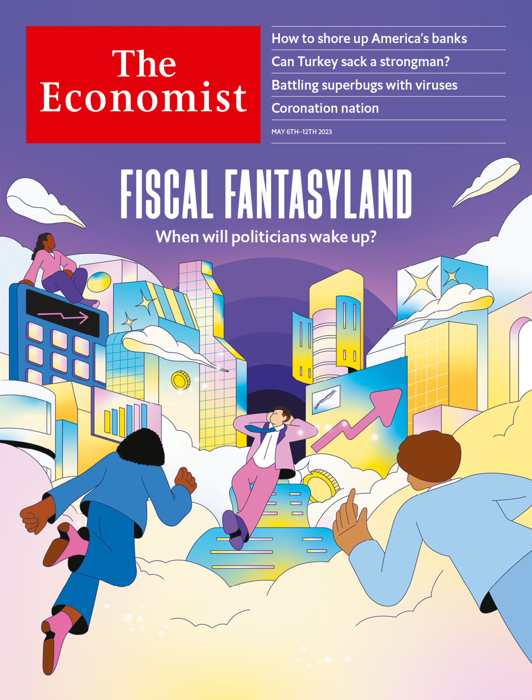
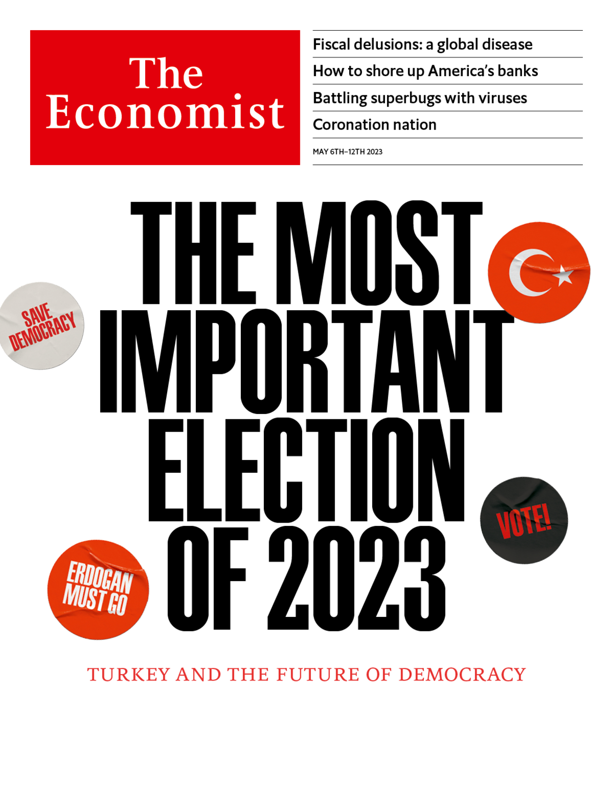

###### The Economist

# This week’s covers 

##### How we saw the world 

> May 4th 2023 

Our cover story in most of the world this week looks at the failure of governments to confront . We estimate that America’s fiscal deficit could reach around 7% of gdp a year by the end of this decade. The country has not seen shortfalls like this outside wars and economic slumps, and no one has a sensible plan to shrink them. Governments elsewhere face similar pressures, and appear just as oblivious. All are stuck in a fiscal fantasyland, and must find a way out before disaster strikes.

 


: 

: 


Our cover for readers in mainland Europe, the Middle East and Africa looks at Turkey’s presidential and parliamentary elections on May 14th. After 20 years of increasingly autocratic rule Recep Tayyip Erdogan, the president, . The polls also suggest that the united opposition could wrest control of parliament from Mr Erdogan’s Justice and Development (ak) party and its allies. Were Mr Erdogan to lose, it would be a stunning political reversal with global consequences. 

 


: 

: 

