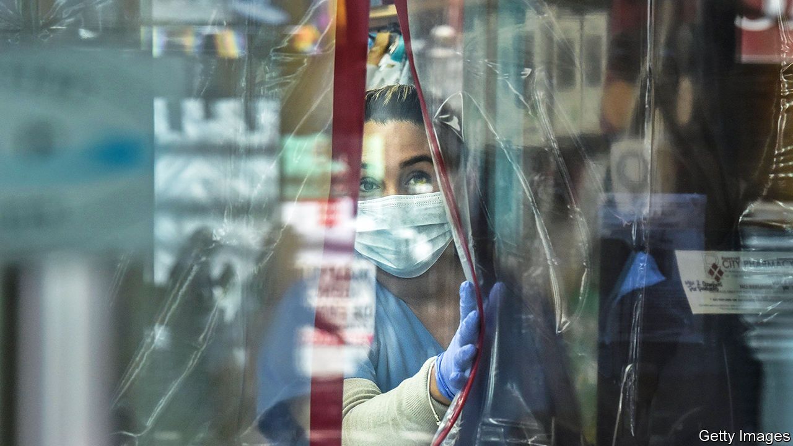

###### Bye-bye covid

# America is ending its emergency declaration for the pandemic 

##### Many services that Americans have come to rely on are about to wind down 

 

> May 4th 2023 

After years of turmoil, America’s covid-19 emergency is formally coming to a close. More than 1.1m Americans died from covid-related causes during the pandemic (in January 2021 weekly deaths were close to 24,000). Now reported deaths are down by over 95% from their peak. And so on May 11th the Biden administration will end the public-health emergency declaration, first issued under President Donald Trump. It enabled the federal government to cut red tape for government programmes and provide urgently needed funds. A programme that allowed FEMA, the Federal Emergency Management Agency, to pay for extraordinary expenses will also end that day. It is a symbolic moment, but also one with real consequences.

Covid-related protections for public health insurance have already been removed, after a change on March 31st. Before the pandemic, many Americans on Medicaid—public health insurance for the poor and those with disabilities—had inconsistent coverage. Some would become ineligible after a rise in income, only to become eligible again once their pay dipped. Others would fail to complete the paperwork properly. The emergency declaration required states to keep patients on the books. In all, up to 24m people could now lose their health insurance.

Covid testing and treatment will be more costly for patients. Under the emergency, Medicare—public insurance for the elderly—and private insurance firms had to cover clients for covid laboratory tests and up to eight at-home tests a month. No longer. Patients may need to pay for tests ordered by a medical professional. Americans with public insurance were treated free; that may end in September.

One thing will remain the same for a while: covid vaccines will be free to all until the federal supply has been depleted, which some estimate could be as early as this summer. Most insurance companies are required to provide vaccines recommended by the Centres for Disease Control and Prevention without cost, so the vaccine will remain free for the fully insured. But the uninsured may be out of luck.

Telehealth services will become more restrictive. For example, providers were allowed to write prescriptions for certain controlled substances, such as drugs used to treat opioid addiction, through virtual appointments. This will end next week, though the Drug Enforcement Administration has proposed a permanent extension.

FEMA, meanwhile, will end special provisions allowing the federal government to reimburse states for disaster-related services. It provided $104bn. “It’s the first time we’ve ever done a simultaneous major disaster declaration in all 50 states and our territories,” says Deanne Criswell, FEMA’s administrator. The agency supported measures such as medical treatment in temporary facilities. This will stop on May 11th. FEMA also gave families up to $9,000 in funeral expenses for covid-related deaths. This will end in September.

“The health system is going to have to absorb a lot of changes at once,” says Jennifer Kates of KFF, a charity focused on health. “We won’t know how smooth or bumpy it will be until it happens.”

And the impact will be felt beyond the medical system. Supplemental Nutrition Assistance Programme (SNAP) benefits, commonly known as food stamps, were more generous and given to more people under the emergency. These benefits will be pared back. Next week additional food stamps for children under six, as well as for children and adults in shelters, will end. A provision covering poor college students will expire in June, and another for schoolchildren finishes in September.

These cuts will hurt the poorest Americans. Some pandemic-related SNAP benefits ended in March, and the affected families lost $90 per person per month on average. New York Common Pantry, a charity that provides food for the needy, says that as a result it saw 35% more clients after the rollback than at the same time last year. “The lines are longer than ever before,” says Judy Secon, its deputy executive director. She expects demand to rise further as those other food benefits come to an end: “The pandemic went away, but food insecurity did not.” ■


