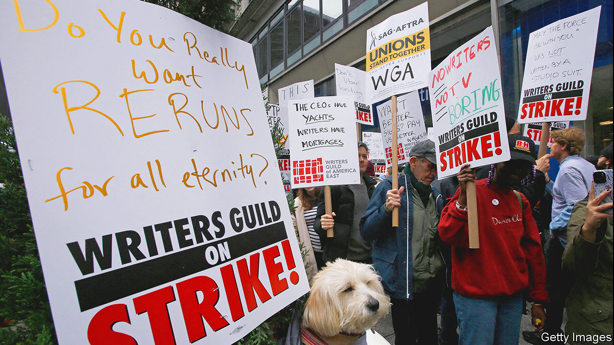

###### Lights, camera, industrial action

# Hollywood’s writers go on strike 

##### Making movies and television isn’t all it’s cracked up to be 

 

> Apr 28th 2023 


ONE HUNDRED years ago, the hills above Los Angeles got a facelift. A giant sign was erected to advertise a new property development. Its 13 letters, each 43 feet tall, spelled “HOLLYWOODLAND” (“land” was later dropped). The modern movie business was forming at around the same time, as  consolidated power and  left Kansas City for Los Angeles. Yet instead of celebrating its centenary, Hollywood faces upheaval: screenwriters are striking for the first time in 15 years. 

Every three years the Alliance of Motion Picture and Television Producers, the trade group for the studios, negotiates a new contract with the , the writers’ union. This year talks soured as studios and writers grappled with how streaming has upended their business models and working conditions. The WGA voted to strike if negotiations failed. On May 2nd, hours after their contract expired, they downed pens. Writers wearing matching blue t-shirts and carrying signs with snarky messages (“My pronouns are pay/me”) picketed in front of studios across LA and in New York City. 

Writers’ complaints boil down to two issues. First is the amount of work on offer. There were nearly 600 original scripted television shows in 2022, more than ever before. But in the age of streaming, more content does not necessarily mean more work. Many writers’ rooms—where scribes try to wrangle ideas into scripts—last for fewer weeks and employ fewer writers than in the past. Inspiring particular ire are “mini rooms”, where a few writers map out several episodes before a show even gets the green light. “I do think it’s a cost-cutting measure,” says Sean Collins-Smith, a writer on NBC’s cop drama “Chicago PD”. 

The second problem lies with “residuals”—what a writer gets paid each time an episode or film they worked on is rebroadcast. In the Netflix era, films and TV shows can be rebroadcast on demand. Writers argue that the industry has not yet found a way to equitably adjust their payment system to account for this huge change.

A writers’ strike is felt across Hollywood. When shows stop production, camera people, costume designers and others are also out of work. Late-night talk shows are the first to go dark. The Milken Institute, a think-tank in Santa Monica, reckons the previous strike in 2007 and 2008 cost California’s economy $2.1bn.

Striking screenwriters may inspire less sympathy than factory workers who down tools, or even the cash-strapped graduate students who went on strike across California last year. “There’s a notion out there of the spoiled, entitled, glitz-and-glam lifestyle of Hollywood writers,” admits Mr Collins-Smith. But “I know people who, when they got out of their last room, immediately started driving for Uber.” 

Los Angeles is the fourth-most-expensive city in the world, according to an annual cost-of-living survey from EIU, ’s sister company. “You come to LA for the land of opportunity,” says Jake Lawler, a 24-year-old writer who moonlights as a stuntman to make ends meet. “But the peace-of-mind tax is way higher than anywhere else in the country.”

For studios, the question is whether the film industry can make money. Before covid-19 shuttered cinemas, theatrical releases accounted for about 45% of a studio’s revenues for a big-budget film, according to FTI Consulting. Americans are again going to the movies, but not in pre-pandemic numbers. The streamers are also hunting for profits. Netflix laid off hundreds of workers in 2022 after it lost subscribers for the first time since 2011, and the firm recently said it would restructure its film department to focus on fewer, better flicks. “There’s going to be a precipitous drop in investments in movies in general, because it’s just hard to make a profit,” warns Howard Suber, who taught film at the University of California, Los Angeles for 45 years.

In some ways, the writers’ strike and the business-model woes are what Hollywood is accustomed to. “Every five to ten years there’s some kind of crisis, going back to the introduction of sound,” says Mr Suber with a chuckle. Hollywood is celebrating its century the only way it knows how: chaotically. ■


