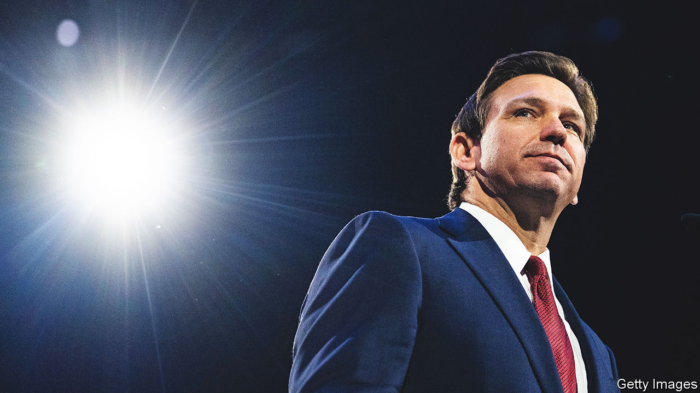

###### DeSantis and his dissenters

# Ron DeSantis’s lurch in Florida hurts his presidential chances 

##### An abrupt shift to the right was meant to showcase the governor’s conservative credentials. Instead it has provoked concern 

 

> Apr 30th 2023 

TALLAHASSEE WAS not always Florida’s capital. Two centuries ago lawmakers from Pensacola on the territory’s western coast and St Augustine on the eastern one grew tired of traversing 400 miles to meet. In 1824 Tallahassee was named the capital as a compromise, because it was in the middle. Today middle ground and compromise have vanished in Tallahassee, where the governor’s office and both chambers of the legislature are controlled by Republicans. On May 5th Florida’s lawmakers will conclude their annual session, which will be remembered as a conservative tide washing over the state. 

“Four sessions’ worth of legislation” was done in one session, boasts Paul Renner, the Republican speaker of the Florida House: “In scope, it is unlike any other.” Ideas that for decades were politically unfeasible have been signed into law. These include a ban on abortions after six weeks of gestation, the “permitless carry” of guns (requiring no training or background check) and a “universal” school-voucher scheme. (Parents can use public-school funds to send their children to private schools or teach them at home, regardless of income.)

This might sound surprising for what used to be a swing state in presidential elections—remember the “hanging chads” of 2000. The Sunshine State still has a large share of independent voters: 28% are registered as having no party affiliation. Two forces are at work. One is , the governor, as a likely presidential contender. After his re-election last November, when he won by more than 19 points, some national donors viewed him as the Republicans’ best chance of defeating Donald Trump. Although he has not yet announced his run, he is using his state as a stage to project his “Florida blueprint” for the rest of the country. In this session, his strategy has been to push to the right of Mr Trump to appeal to primary voters.

Second, though the legislature has been under their control since 1997, the election in November handed Republicans new super-majorities (of at least two-thirds) in both chambers. This is only the second time Republicans have held such majorities, and it is the largest margin they have ever held, says Aubrey Jewett, at the University of Central Florida. Bills have passed without much need for compromise.

The two chambers have fallen into lockstep under Mr DeSantis’s command. Ambition surely plays a part in this, with lawmakers hoping to see their loyalty repaid with plum jobs if . But Jeff Brandes, a former Republican state senator, thinks it is “mostly fear”. Mr DeSantis has shown a willingness to strike back against legislators who cross him. 

Nearly every one of Mr DeSantis’s legislative priorities has passed, as have a few bills pandering to him. One of those reverses the “resign to run” law in Florida, no longer requiring a person to step down from current office if they seek the presidency or vice-presidency. Another shields Mr DeSantis from public-record requests involving his travel with government funds, ostensibly for security reasons.

Around 25-30% of the legislature’s time this session has been taken up with “culture-war issues”, reckons Randy Fine, a Republican House member. As well as guns and abortion, Mr DeSantis’s “anti-woke” crusades have included ratcheting up his long-running  and attempts to restrict “diversity, equity and inclusion” initiatives. Even some of his biggest backers have grown confounded by how far he has pushed things—including a proposal to expand last year’s ban on classroom discussions of gender identity and sexuality, known by critics as the “Don’t Say Gay” bill, from the third grade (ages 7-8) to the 12th (17-18). 

Social issues may stir the Republican base, but none ranks as the main concern for the average Florida voter. (Affordable housing comes top, followed by the economy, according to a poll in March by the University of North Florida.) The legislature has set aside funds and changed height and zoning rules to boost the supply of affordable housing, and passed a tort-reform law to cut lawsuits, including those for property insurance, which in Florida costs nearly triple the national average. Still, many Florida-watchers are unimpressed. “I wonder what this legislative session would have looked like if Governor DeSantis had decided to stay governor,” says Mr Brandes, who thinks “he would have been much more willing to deal with the pressing problems in Florida”.

Questions of character

The session has also given a somewhat unflattering outline of what Mr DeSantis might be like in higher office. “I think he is telling voters who he is, and we should believe him,” says Fentrice Driskell, the Democratic leader of the state House. He has shown a reactive streak. After a jury last year could not reach a unanimous decision about whether to sentence the perpetrator who killed 17 people at Marjory Stoneman Douglas High School in Parkland, Florida, to the death penalty, Mr DeSantis pushed to change the law. Now someone can be sentenced to death with four of 12 jurors dissenting, making Florida one of only two states (together with Alabama) not to require unanimity for the death penalty. 

His fight with Disney has shown a tendency for retaliation and willingness to push to extremes. Last spring, after the then-boss of Disney spoke out against the “Don’t Say Gay” law, Mr DeSantis and the legislature stripped Disney of its special taxation and governance privileges. At first, dressing down a “woke” corporation looked an easy win, but it has turned into a distraction. Mr DeSantis has suggested that the state could build a prison near Disney World. Disney recently filed a lawsuit arguing that the state’s bullying behaviour is unconstitutional, and a board appointed by Mr DeSantis has responded with its own countersuit. Even some of Mr DeSantis’s allies are privately critical, saying a pro-business state should not target a company for speaking out.

More people are questioning his political shrewdness. Some worried about his criticism of American support for Ukraine, which he belittled as a “territorial dispute”. He had already sated the Republican base last year when he signed a 15-week abortion ban; the six-week ban passed in this session pushed away donors. “I can think of a huge number of people down here who don’t want any part of him, because of the last 60 days,” says a Republican businessman and former DeSantis donor in Florida, who calls his behaviour with Disney “vindictive, autocratic and absurd”. 

Although Mr DeSantis has a war chest that Politico, a political-news website, estimates at $110m (including political-action-committee funds), his popularity has flagged compared with Mr Trump’s. A recent poll carried out by YouGov for  shows that 53% of Republicans would prefer to see Mr Trump as the Republican nominee in 2024, compared with 31% for Mr DeSantis. That is a striking reversal from last November, when 46% favoured the governor and 39% the former president. Mr Trump has experience of seeing off a Floridian governor. Jeb Bush, widely thought to be a front-runner for the Republican nomination in 2016, quickly withered in the face of Mr Trump’s attacks.

Recently members of Congress from Florida have come out to endorse Mr Trump, with only one publicly backing Mr DeSantis. “DeSantis lives in a very insular world, where he doesn’t reach out to members,” says Mr Brandes. “I don’t know who in the legislature he’s actually close to, after five years of watching.”

But whatever befalls Mr DeSantis’s presidential run, he will continue to make a mark on the country. Some of his policies, such as the “Don’t Say Gay” law, are already spreading to other states. One of Florida’s new laws raises criminal penalties for transporting illegal immigrants and requires hospitals to record people’s immigration status. It is “one of the most sweeping and targeted immigration bills in the country” and will be used as a model by other states, predicts Maggie Mick of Multistate, a government-relations firm. Even if the “Florida blueprint” does not prove to be a road map to the White House, it will still inspire other Republican-controlled states to copy Florida’s plans. ■


