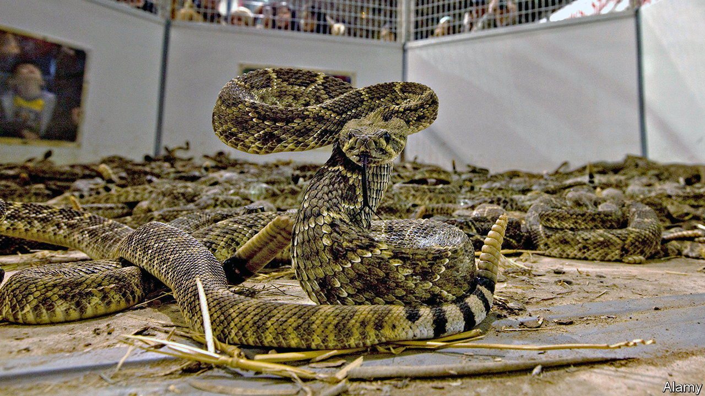

###### Snake, rattle and roil

# The fun and the fury of a rattlesnake derby 

##### A rite—or, to critics, a wrong—of spring in Oklahoma 

 

> May 4th 2023 

Shayne Naylor has some advice for people who want to hunt rattlesnakes: “Be vigilant” and watch “where you’re putting your hands and feet.” Every spring he leads people into the countryside of Oklahoma to seek out snakes. Wielding tongs, hooks and a bucket for stashing their catch, a few dozen hunters look under rocks and into crevices to track down their prey. 

The hunt is part of the Mangum Rattlesnake Derby, held on the last weekend in April. Some 30,000 people visit the town, which is normally home to only 2,800. In a snake-pit tent wranglers perform among the rattlers. At a butchery show snakes are killed and skinned in a gory display. Their meat is fried and served up at a café. Hunters can sell their catch for $10 a pound, and win a prize for the longest snake, overseen by a newly crowned Miss Derby Princess.

The first organised roundup took place in Okeene, Oklahoma, in 1939. Ranch owners banded together to stop the reptiles from harming cattle and people. The events spread to other states. They have drawn the ire of herpetologists and others, who say they are cruel. 

Sweetwater in Texas is home to the largest roundup, held every March. It has been especially controversial because hunters use petrol to chase snakes out of their dens. Such “gassing” can be harmful to other wildlife, including some endangered species, and to groundwater. Efforts to ban it have failed.

Opponents have had more success in Georgia, where declining numbers of eastern diamondback rattlesnakes encouraged greater co-operation from organisers. In 2001 Fitzgerald’s roundup was transformed into a wild-chicken festival. Claxton’s became a wildlife festival in 2012. And last year Whigham’s became a no-kill and no-catch affair. But in Oklahoma, where the western diamondback is more abundant, locals see no reason to stop their roundups. “Kids come out here and run around,” says Caleb Allen, out on the hunt in Mangum. “And who wants their kids running around in a field of rattlesnakes?”■


