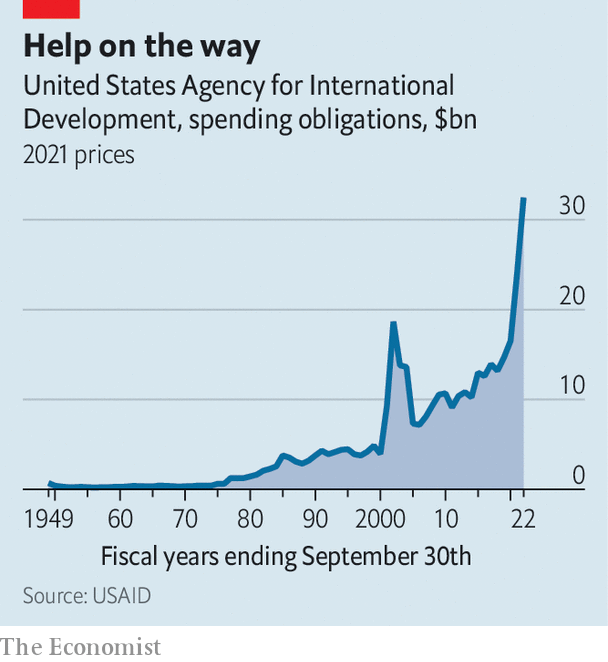
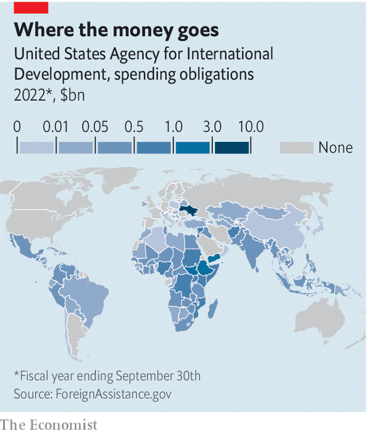

###### Aid and a bet

# USAID is changing the way it tries to do good in the world 

##### The goal for the agency is to put itself out of business 

 

> May 4th 2023 

Rajiv Shah, a former head of the United States Agency for International Development (USAID), took his team out for drinks to celebrate their hard work in the immediate aftermath of the Haiti earthquake in 2010. Mr Shah footed the bill himself. Funding at USAID didn’t stretch that far. But in a cordoned-off area of the bar he spotted a USAID contractor hosting a similar celebration. They were enjoying food and drinks—on the government’s dime.

 


It is tales like this that convince American taxpayers that aid funding is squandered. America is relatively stingy, given the size of its economy. Total official development assistance in 2022 was just over 0.2% of gross national income. But that is enough to make the country the world’s largest donor, ahead of Germany and Japan. USAID, the arm of the government that is responsible for dishing out much of that funding, committed $32.5bn last year, a figure that has climbed markedly over time (see chart). As Joseph Nye at Harvard University puts it, investing in poor countries is a way to both win over foreign governments and “engender a sense of gratitude” towards America. “One shouldn’t neglect the fact that aid has a hard-power dimension as well as a soft-power dimension,” says Mr Nye.

But USAID’s work doesn’t always make America look good. The agency is derided for putting bureaucratic process before real progress. Only a handful of big organisations can handle vast USAID awards and the onerous reporting requirements they come with. A study of three years of the agency’s spending published in 2019 found that over 40% of awards achieved, on average, just half the results intended. Its work in Haiti has become a symbol for waste in the aid industry. A $124m programme to build an industrial park created a tiny portion of the expected 65,000 jobs and booted hundreds of farmers off their land. Plans to expand a nearby port failed, though USAID shelled out $72m on it. 

 


Thanks to the war in Ukraine and the covid-19 pandemic, which have spurred aid spending (see map), the agency is in the spotlight. Lawmakers from both sides of the aisle are pushing it to be more efficient and innovate. And the current USAID chief, Samantha Power, a Pulitzer prize-winning historian of genocide and former ambassador to the UN, is hanging her reputation on plans to overhaul the agency. “I don’t want to exaggerate the degree to which we can snap our fingers and shift the way we do business or the shift in mindset that this entails,” she says. Still, two years into her term, efforts to cut red tape, hire more staff and open the door to new partners suggest a shift is, indeed, under way.

Aid and a bet

To understand USAID, start from its beginning. The agency was set up by President John F. Kennedy in 1961 to bring America’s foreign assistance under one umbrella. There was never any pretence of altruism. USAID is obliged to use American suppliers even when they are vastly more expensive. The goal, as Maura O’Neill, a former innovation chief at the agency, puts it, was to “catalyse more South Koreas and less North Koreas”. In the 1990s talk of waste mounted and calls to abolish the agency, led by Senator Jesse Helms, grew louder. The workforce was slashed by 30% between 1995 and 2000. The agency still sees itself as rebuilding from that nadir.

At that Washington bar Mr Shah put his finger on the root of USAID’s inefficiency: its stratified way of operating. As at most aid agencies, its staff design projects but don’t run them themselves. Its funds generally go to big international organisations, including UN agencies, international non-profit groups and private-sector contractors. A handful of firms in the Washington area, like ABT Associates, Chemonics International and Palladium, have been nicknamed the “Beltway Bandits” for their ability to grab government funds. These intermediaries then identify organisations doing good work on the ground, and hand out money via layers of subcontracts, grants and other awards. USAID staff get involved in monitoring that work.

For an agency that has Congress breathing down its neck, using middlemen is a way to reduce risk. USAID partners have to fill in environment evaluations, gender assessments and myriad other bits of paperwork in return for taxpayers’ money. Its partners have legions of lawyers and book-keepers to meet the rules. These intermediaries take the blame if projects go wrong. What they offer is “compliance as a service”, says Prashant Yadav at the Centre for Global Development, a think-tank. 

But this is an expensive way to do good in the world. Data from the Share Trust, a non-profit group, suggest that aid agencies could save 32 cents of each dollar they spend through overhead and salary costs if they used local intermediaries. 

Across the globe, aid agencies are trying to hand more money directly to local groups, an effort known variously as “localisation” and “decolonising aid”. In 2016 donors and aid organisations struck a “grand bargain”, vowing to provide 25% of global humanitarian funding to local responders by 2020. Yet that target was missed by a wide margin. 

It is impossible to put a number on USAID’s performance versus other aid agencies, says Raj Kumar of Devex, an aid-focused news group: the data are too patchy. But Mr Kumar says the Swedish and Norwegian governments have historically been considered leaders in the quality of aid delivery, including localisation. Countless aid workers say USAID stands out for being the hardest agency to work with.

Successive American administrations have pushed for more localisation. Under President Barack Obama the agency set a target (which it missed) of handing 30% of funding directly to local groups by 2015. In the Trump era, the “Journey to Self-Reliance” strategy justified localisation as saving taxpayers’ money. For the current administration, says Donald Steinberg, a USAID veteran now leading the localisation push, it is a way of “changing the power dynamics” and recognising that local groups are best placed to solve local problems. Ms Power has set a goal of directing 25% of USAID funds to local organisations by 2025.

There is a long way to go. Publish What You Fund, a campaign for aid transparency, had a crack at analysing USAID funding between 2019 and 2021 in ten countries, including Haiti, Jordan and Kenya. It reckons that between 6% and 11% of country-level spending goes directly to local groups, depending on how you define “local”. 

Power shifts

In a bid to push that figure higher, USAID is changing the way it works in three ways. First, an organisational reboot is under way. To give staff the time to seek out new partners, USAID has asked Congress to increase its staffing by 38% by 2025. On average, a USAID contract officer dished out $77.6m a year over the past five years, more than five times the average at the Department of Defence. With less pressure to get money out of the door, many could experiment with new organisations that can handle only small sums. 

Second, the agency is making itself more accessible to small, faraway organisations. Piles of paperwork are off-putting. In a survey of small and medium-sized development firms by Unlock Aid, a campaign for foreign-aid reform, one-third said they avoid taking USAID funding as a result. Adeso, a Nairobi-based humanitarian group that was handed a USAID project, ended up tangled in audits and disputes with the agency that took their toll on the organisation. USAID is trying to put an end to all that. A new website, workwithusaid.org, provides online courses to help small organisations bid for awards and connects USAID partners with one another. 

Third, USAID is shaking up its relationship with big intermediaries, like the Beltway Bandits. Christopher Hirst, the CEO of Palladium, says the firm faces growing pressure to go into partnership with local organisations on USAID projects and train them to work directly with the agency. 

Yet there is only so much USAID can do without reforms by Congress. In some missions, as much as 90% of spending is driven by “earmarks”, legislative provisions that direct spending to a particular place. The rules on procurement stretch to over 2,000 pages. Asked in a survey in 2017 to choose the top three things that hold them back in their daily work, 63% of USAID staff pointed to endless approvals and clearances required to get anything done. 

Change is possible. In corners of USAID greater risk has led to good results. The President’s Emergency Plan for AIDS Relief, a $100bn project reckoned to have saved 25m lives since 2003, upped the share of funding it hands directly to local groups from 32% in 2018 to 53% in 2021. Development Innovation Ventures, co-founded by a Nobel economics laureate, Michael Kremer, is a sort of venture-capital fund within USAID. An evaluation of its early investments found that it yielded at least $17 in social benefit for each dollar invested.

Reducing red tape and cutting out the middlemen is something lawmakers on both sides of the aisle should be able to support. As Gayle Smith, another former administrator of USAID, puts it: “Development isn’t something you do to people, it’s something people do to themselves.” Better to fund local communities directly than private contractors in Washington who spend public money on costly overheads—and boozy celebrations. ■


