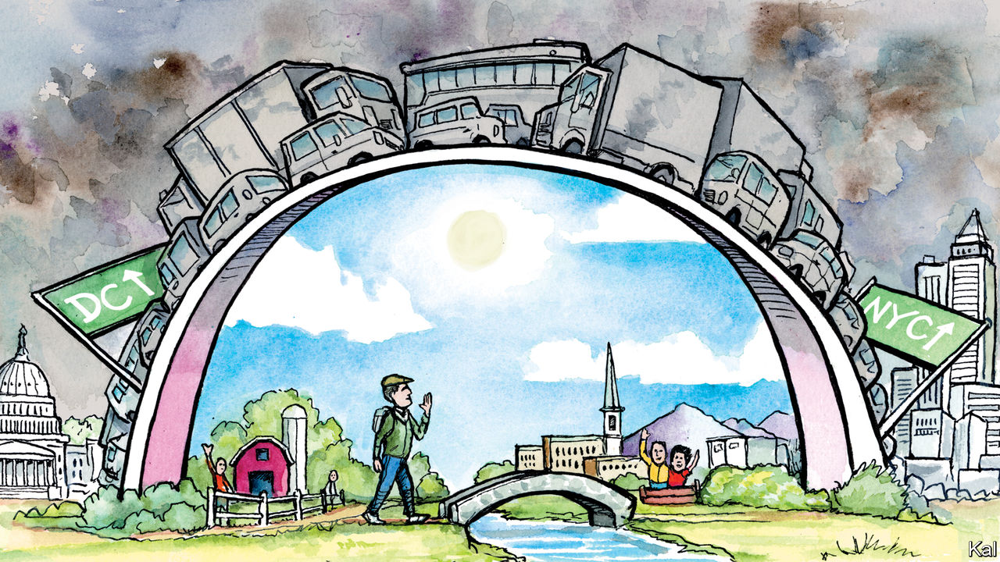

###### Lexington

# What walking from Washington to New York reveals about America 

##### Some pretty great things, it turns out 

 

> May 4th 2023 

How vexing to the masters of America’s Northeast megalopolis that the transit system has failed to compress the tedious 225-mile interval between Washington and New York. If the gods smile on the journey—and they seldom do—the tract houses, big-box stores and occasional gleam of water or shadow of forest might blur past in four hours by car on Interstate 95, or three hours by what passes for a high-speed train, the Acela. Flying can take as long, given Uber rides and security queues. More often, some idly tossed thunderbolt snarls transit, prompting travellers to curse their fate, postpone their meetings and despair over America’s odds against China, with its bullet trains and other irritating proofs of competence. 

In a rebuff to this yearning for speed, Neil King junior, a former reporter for the , chose to walk from his home on Washington’s Capitol Hill to New York’s Central Park. It may be too much to ask those charging along the Acela corridor to pause to visit York, Pennsylvania, or Perth Amboy, New Jersey. But what Mr King discovered on his 26-day walk, recounted in his new book “American Ramble”, should at least make them prize the landscape they are hurrying through, and its people. 

With a rucksack packed with such essentials as a rain jacket, a laptop and an extra pair of trousers, Mr King, at 61, walked out of his front door in late March 2021. Pandemic restrictions were easing and the forsythia was just starting to bloom. He walked by the fences and National Guard troops protecting the Capitol, attacked less than three months before by supporters of Donald Trump. He headed west to Rock Creek, then followed it upstream.

Mr King planned his route carefully, arranging places to sleep and local mavens to consult. Yet serendipity had its way with him. Walking through Amish country in Pennsylvania he heard a bat thwack a softball and spotted a girl in a dress and baseball mitt field the fly ball. He watched the game, among pupils at the Farmersville Mennonite School, then, at the prompting of their teacher, told them about his journey. 

The children rewarded him by singing hymns about death and the afterlife—“My weary feet will cease to roam/Someday I’m coming home”—and the teacher explained the tenets of the Mennonite faith. “Be not conformed to this world,” the teacher said, quoting Romans, “but be transformed by the renewing of your mind.” It was not the only moment Mr King was astonished to find his walk’s aim not just affirmed but elevated. 

Mr King’s project—“giving in to the landscape”, he calls it—is not really an American thing. One recalls more readily such British walker-writers as Patrick Leigh Fermor, Bruce Chatwin, Robert Macfarlane or Rory Stewart. Paul Salopek, another American journalist, is ten years into a 24,000-mile walk around the globe. But Americans on literary excursions into their country’s landscape and soul, such as Jack Kerouac, William Least Heat-Moon and John Steinbeck, have tended to choose a conveyance besides their feet. Henry David Thoreau may have written the classic essay on the subject, “Walking” (Thoreau delivered an early version in a lecture in Perth Amboy, Mr King learned), but even he tended to favour the canoe for serious travel. One of Thoreau’s main points was that you didn’t have to walk far: “Two or three hours’ walking will carry me to as strange a country as I expect ever to see.”

A hard truth is that America is not a very welcoming place, particularly if you are not a white man, as Mr King is. Unlike Britain, it never had a right to roam, and after the civil war states began imposing no-trespassing laws to restrict black Americans. The authorities say a black teenager was shot and wounded this spring after ringing the wrong doorbell in Kansas City, and a white woman was shot dead when she and her friends turned into the wrong driveway in rural New York. The governor of Texas recently chose to describe the victims of a mass killer, including a child, as “five illegal immigrants”. This is no country for strangers.

Mr King is sensitive of his privilege, so much so that on Staten Island, near the end of his journey, his female host, a Polish architect turned innkeeper, impatiently exclaimed: “If you have certain advantages, do me the favour of enjoying them.” And he encountered suspicion along the way. Yet he reports more acts of kindness. “Does this provoke any thoughts?” a man asked about his yard display of Trump regalia, then offered food and drink. Another stranger lent Mr King a kayak to navigate the swamp below the dozen lanes of I-95, where, under the traffic, he spotted a doe.

The sapience of strangers

Again and again, Mr King reaped the rewards of a serious walker (the sight of “wind-tossed cloth” drying on a line, the way the spring advances through the trees) and those of an empathetic reporter: the intelligence and moral seriousness of fellow people. In places pivotal to the revolution and civil war, he found Americans sifting for the truth of their history. Others confronted America as it is. On top of a dump at the Edgeboro landfill in New Jersey, the site manager reflected on the ancient Mound Builders of the Ohio and Mississippi river valleys. “Those mounds had sacred and religious purposes,” he said. “Us, on the other hand, we’re brutal.”

Mr King began his journey after beating back a cancer he was given scant chance of surviving. Along the way he spoke by phone with a brother who had hoped to join him but was stricken with his own cancer, which proved fatal. A man at the end of his driveway near Randallstown, Maryland, asked Mr King about his journey, then told him: “As you heal, somebody else is going to get in tune and pick up on your vibe and heal.”

“You know,” this man said, “this is the Passover, this is the resurrection, this is the renewing.” That is aiming high. But at least Mr King’s pilgrimage should remind the politicians, lobbyists, executives and journalists clamped to the Acela’s rails that this land is their land, and it is worthy of a more noble politics. ■


