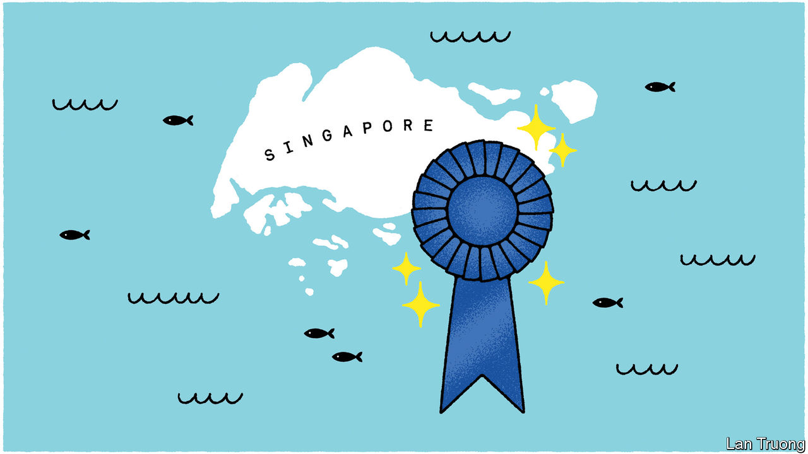

###### Banyan

# A winner has emerged in the old rivalry between Singapore and Hong Kong 

##### From business to city life, Singapore comes out on top 

 

> May 11th 2023 

Dinner-party conversations across Asia have often been animated by an old debate. In economic dynamism, the state of the urban fabric and the vibrancy of civic life, which city comes top: Hong Kong or Singapore? Until not long ago, it was obvious to Banyan, who spent a decade working there, that Hong Kong won hands down. But recently the balance shifted. There is clearly no contest anymore. It is game over in favour of Singapore. As a consequence, Banyan has moved there.

Hong Kong and Singapore, once dirt-poor, have astonishing success stories to tell. Both are hubs for international finance, trade, transport and tourism. Both have attracted the brightest professional minds. Both built world-beating universities. Nothing tops the drama of Hong Kong’s topographical setting. It is hard to think of a cleaner, greener city than Singapore.

The imposition of a draconian national-security law in 2020 marked the obvious break in Hong Kong’s trajectory. The law ended any prospect of more representative government and curtailed the space for civic expression. Dozens of activists, lawyers and politicians are in jail. Stringent pandemic travel restrictions compounded the sense of claustrophobia. Some 200,000 expatriates have left Hong Kong in the past three years, along with even more Hong Kongers. By contrast, in 2022 the number of foreign professionals in Singapore grew by 16%, Banyan among them.

But a deeper divergence has occurred in economic performance, on which leaders in both places have always asked to be judged above all. In 1997, the year of Hong Kong’s return to China, the two cities’ GDP per person was remarkably similar ($26,376 in Singapore, $27,330 in Hong Kong). Today Singapore’s is 1.7 times higher than Hong Kong’s. Singapore’s economy has grown by one-seventh since 2017; Hong Kong’s not at all.

In reality, Hong Kong was never as freewheeling as it claimed. Cartels or oligopolies operate in power, construction and supermarkets, among other sectors. Singapore’s economy is more innovative and diversified. Given China’s economic slowdown, Singapore is now in a more vibrant region.

Yet the biggest divergence is in governance—defined by Donald Low at the Hong Kong University of Science and Technology, writing in , a new Singaporean magazine, as “the capacity to anticipate, plan and prepare for the future”. By that test, Hong Kong fails dismally. The government’s answer to poor job prospects is to urge Hong Kong’s young to seek work across the border.

Its strict “zero-covid” policy, mimicking mainland China, undermined its standing as an international financial centre. Like the mainland, Hong Kong bungled, failing to vaccinate the old quickly enough. Excess deaths per 100,000 people were nearly three times higher than in Singapore.

Hong Kong is also a harder place to live in the literal sense. The presence of rich foreigners pushing up property prices calls for big public-housing programmes. Yet so strong is the grip of Hong Kong’s property tycoons that less than 50% of the population lives in public housing, for which there is a six-year wait. In Singapore, the figure is over 80%. Private rents, high in both places, are even steeper in Hong Kong, for worse flats.

Singapore is no paradise. The pleasantness of its urban fabric is thanks mainly to the toil of the foreign migrant workers who make up nearly a third of the workforce. Their contribution is a curious blind spot. Meanwhile, politics is tightly constrained, as is civil society: you may be arrested for holding up a placard with a smiley face. The media is cloyingly tame, while foreign journalists, it is made clear, are here on sufferance. With nearly 500 executions in the past three decades, 70% of them for drug offences, Singapore’s use of capital punishment is grotesque.

Still, a far brighter future beckons for Singapore’s young than for their counterparts in Hong Kong. They are slowly pushing at Singapore’s rigid boundaries. This month, in a first, a few hundred activists gathered on Labour Day to call for greater rights for, among others, foreign workers. The launch of  reflects a growing desire for independent voices. In Hong Kong, by contrast, a transport-news website promoting road safety, of all things, this week became the latest target of the authorities and was forced to close. Singapore is at a crossroads. Hong Kong has hit a dead end.


