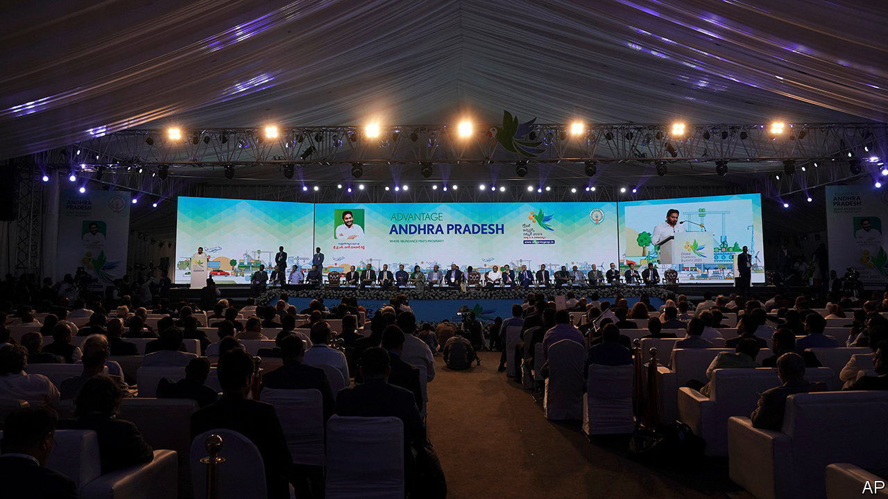

###### Rolling out the red carpet

# How India’s states compete for investment 

##### Putting CEOs in an air-conditioned tent works wonders for the business climate 

 

> May 11th 2023 

DRIVING FROM Visakhapatnam airport into the city in March, it was hard to spot a billboard advertising anything other than the serenely smiling face of Y.S. Jagan Mohan Reddy. At just one roundabout, your correspondent counted at least 13 billboards with his image, each bearing the words “Advantage Andhra Pradesh: Global Investors Summit 2023”. 

Mr Reddy is the chief minister of Andhra Pradesh (AP), the rump of a bifurcation in 2014 that cleaved off a new state, Telangana, which took with it AP’s erstwhile capital of Hyderabad. That left AP without its economic powerhouse, so Mr Reddy’s desire to attract investment is understandable. But he is not the only chief minister to lay out the red carpet (literally—there was one at the airport, with dancers and musicians to welcome delegates). Investment summits have become the norm in Indian states, from thriving economies (“Magnetic Maharashtra”; 2019-20 GDP: $340bn) to some of the weakest (“Investgarh Chhattisgarh”; $43bn). 

The model was established in 2003 by Narendra Modi, now India’s prime minister. The previous year the state of Gujarat had witnessed religious riots in which more than 1,000 people were killed, mostly Muslims. The episode turned Mr Modi, the state’s chief minister at the time, into a pariah. With the support of sympathetic CEOs, he organised the first “Vibrant Gujarat” summit, now a biennial event, to remake himself as a business- and development-friendly leader. In that, at least, it was a resounding success. Mr Modi won the national election in 2014 in part because Indians believed he would make them richer. 

At the Visakhapatnam event, held in air-conditioned tents on a dusty university ground, Mr Reddy and assembled business leaders sat in armchairs on a stage as each made speeches extolling the virtues of the state government. At the end of the hours-long session, CEOs lined up to sign a “memorandum of understanding” (MoU) with Mr Reddy. In two days, the state agreed 352 MoUs totalling 13trn rupees ($159bn) with the potential to create 600,000 jobs, reported one business newspaper. 

Such numbers attract headlines and make voters feel good. But enterprising journalists combing through data have pointed out that the actual investment coming in is a fraction—usually a quarter to a third—of the announced figures. 

Yet that may be missing the point. Summits serve at least three functions other than signing deals. The first is marketing. After 1991, when India started opening up and liberalising investment rules, policy action shifted to the states, says Suyash Rai of Carnegie India, a think-tank in Delhi. As India’s 28 states compete among each other, such events remind companies of the states’ ease-of-doing-business rankings, their growth and the incentives they offer. The summits are a sign that what Indian policymakers like to call “competitive federalism” is working. 

A second function is to show state bureaucracies that the political leadership is serious about investment. Government departments are roped into organising summits. Leaders expect civil servants to follow up on promises to grant speedy licences and permits. Summits are “a starting point”, says Sonal Varma, chief India economist at Nomura, a bank. “But ultimately the aggregate business climate is going to determine whether companies invest.”

Third, the summits are a way to understand the needs of businesses. One CEO at the Visakhapatnam event says that following through on MoUs is contingent on a host of actions from the state government, and signing one is a way for the state’s functionaries to engage more closely in the nuts and bolts of what companies say they require in order to invest and expand.

There are spillover effects too. Attracting a firm may lure its competitors. The presence of one or two companies in a particular sector could help seed a cluster. If nothing else, the summits, as Visakhapatnam’s streets showed, are great business for billboard-advertising companies. ■

