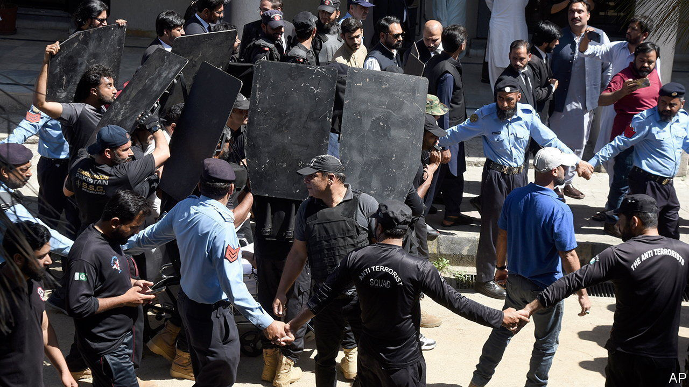

###### Fuel to the fire

# Imran Khan’s arrest brings Pakistan closer to the edge 

##### His supporters are willing to take their fight to the army 

 

> May 9th 2023 

When he travelled from Lahore to Islamabad to appear before the Islamabad High Court on May 9th, Imran Khan may have been expecting an uneventful day in court. It was not to be. Thirteen months after he was ousted as Pakistan’s prime minister in a vote of no confidence, Mr Khan was bundled off the court’s premises and into a car by paramilitary toughs and deposited in the custody of the country’s anti-corruption bureau. Rather than contest early elections, which he has been , Mr Khan may have to watch general elections scheduled for later this year unfold from a jail cell—provided they are held at all.

The stated reason for Mr Khan’s arrest is alleged graft. On May 10th, before being taken back into judicial custody, he was charged with and pleaded not guilty to corruption in connection with a land deal. Yet the arrest appears more likely to be related to his escalating quarrel with Pakistan’s armed forces. On May 6th Mr Khan claimed at a public rally that Major-General Faisal Naseer of the army’s intelligence service was plotting to murder him. Mr Khan had earlier blamed Shehbaz Sharif, who replaced him as prime minister, and other senior officials for an attempt on his life in November, when he was shot in the leg. 

In a rare public statement, the army called Mr Khan’s latest allegations “extremely unfortunate, deplorable and unacceptable”. That did not stop Mr Khan from repeating them in a video recorded en route to the court in Islamabad, where he was arrested shortly afterwards. 

The arrest has escalated a political and constitutional crisis that has dragged on for months. Mr Khan has never accepted his removal from the premiership last year as legitimate. In January he tried to force the government to hold early national elections by getting his party, Pakistan Tehreek-e-Insaf (PTI), to effect the dissolution of two provincial assemblies it controlled, including the one in the crucial province of Punjab. But Mr Sharif wants polls in all four provinces and the centre in October, after parliament completes its term. The crisis turned constitutional when the Supreme Court ordered elections to be held in Punjab on May 14th, as demanded by Mr Khan, an order the central government and parliament have rejected.

Mr Sharif and his government appear keen to buy time to improve the economy before elections are held. Inflation hit an annual rate of 36.4% in April. Food-price inflation is running at 48.1%. GDP growth is projected to be a dismal 0.5% this year. With an estimated $77.5bn in loan repayments due by June 2026, and no sign that the IMF will soon agree to resume a lending programme worth $6.5bn, Pakistan remains in danger of defaulting, despite bilateral support from China. On a visit to Islamabad over the weekend China’s foreign minister called on the country to sort out its chaotic politics and focus on improving the economy.

The more immediate risk is a breakdown of law and order. At least eight people have been killed in violent protests since Mr Khan was nabbed; hundreds have been arrested. The government has shut down mobile internet and social media, declared a state of emergency across much of the country and called in the army to quell unrest. 

Unusually, given the respect for and fear of the army in Pakistan, protests have been directed at military sites. In Lahore the usually heavily fortified residence of the city’s top military commander was breached by stick-wielding protesters, who smashed windows, set furniture alight and made off with household objects. One protester was seen cradling a peacock. “I took it from the corps commander’s house. It is the people’s money. What they stole, we’re taking back,” the protester said. Other fans of Mr Imran also breached the gate of the army’s headquarters in the garrison city of Rawalpindi. 

There is nothing new about a political leader falling out of favour with Pakistan’s army. What is new is Mr Khan’s willingness to take the fight to the generals. Mr Sharif and his government may fancy their odds of staying in power as their rival skirmishes with the army. But Pakistan could be closer to the edge than they realise. ■


