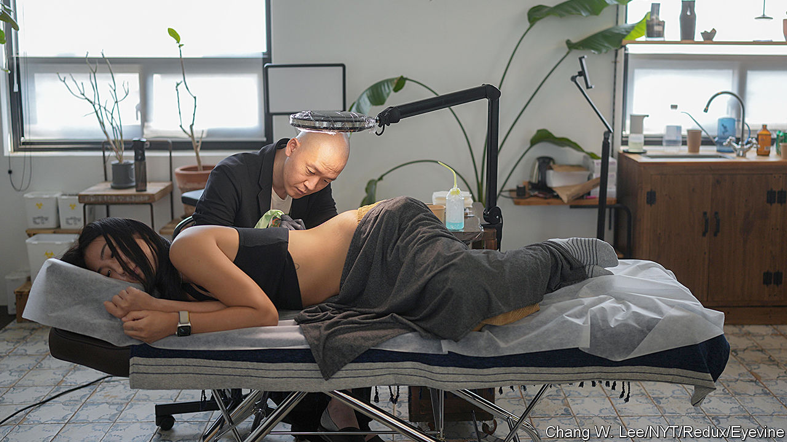

###### Art in the dark

# Why South Korean tattooists are being marked as criminals 

##### As it promotes its culture abroad, the government locks up artists at home 

 

> May 11th 2023 

The unmarked grey door in central Seoul could lead to just another office in South Korea’s capital. Yet behind it Kim Do-yoon creates intricate artwork that has garnered commissions from K-pop stars,  bosses and Hollywood royalty, including Brad Pitt. Better known as Doy, the tattooist is careful not to advertise the presence of his studio. For each of his artworks is also a crime.

Worth some 200bn won ($151m) a year according to the Korea Tattoo Association (KTA), South Korea’s tattoo industry is small but culturally significant. Spring brings blooms of colour as short sleeves and skimpy tops reveal the inked-up arms of the country’s hipsters. Outside South Korea, the reputation of its artists has grown alongside the taste for the country’s other cultural exports. A tattoo from a South Korean artist confers a similar level of cool as a taste for South Korean music or cinema. 

Yet its artists are forced to work underground. In 1992 a South Korean court ruled that tattooing creates health risks and ought to require a medical licence. Tattooists without that qualification can receive a fine of 50m won ($38,000) or up to five years in prison. Doy reckons a couple are locked up every year. The ban also means that tattooists are vulnerable to blackmail, exploitation or sexual assault because they cannot report perpetrators for fear of incrimination. 

Young politicians have tried to drag the industry into the mainstream. Ryu Ho-jeong, a 30-year-old MP, introduced a bill in 2021 that would improve working conditions and allow tattooists to report their income. Doy has taken a more aggressive approach, frequently appearing in court for the past four years to appeal a conviction and draw attention to the plight of less famous colleagues.

South Korean society is increasingly siding with Doy and Ms Ryu. The elderly still disapprove of tattoos, considering them signs of criminality. Yet over half of South Koreans as a whole and more than four-fifths of those in their 20s believe qualified tattooists should be allowed to ink up customers. Far from “a deviant act”, for young people a tattoo is just another consumer product, says Ha Ji-soo of Seoul National University. 

Unsurprisingly, the tattooists’ main adversaries are doctors, who claim it is risky to let non-doctors tattoo. They stand to lose a lucrative sideline: in 2022 the market for semi-permanent tattoos, used mostly for cosmetic procedures, was worth as much as 1.8trn won ($1.4bn), reckons the KTA. 

The South Korean government, usually keen to promote its culture, has so far been hesitant to upset this powerful lobby. Yet that may be changing: apparently aware of tattooists as a potential source of revenue, the government has already assigned them a tax code.

