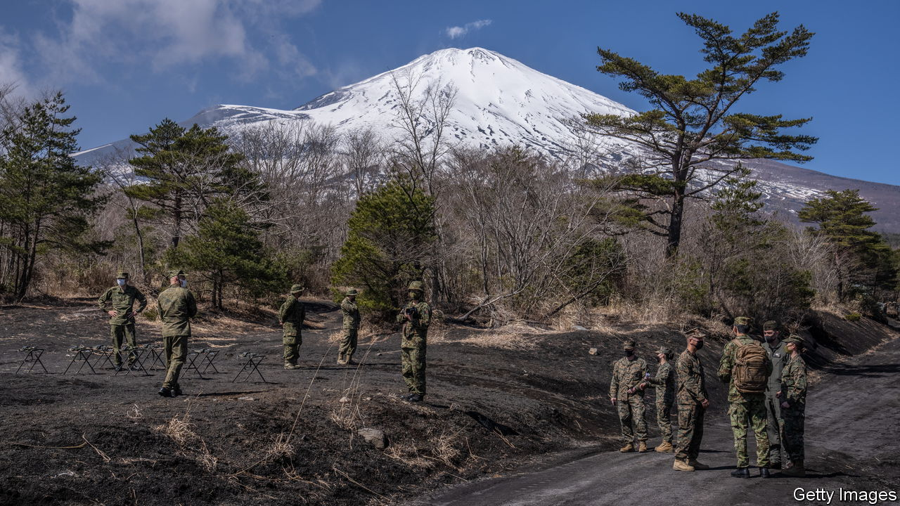

###### Pacific jitters

# Will Japan fight? 

##### America’s ally is nervous about waging war to defend Taiwan 

 

> May 10th 2023 

THE ROAR of the Japanese F-35 fighter jets above Misawa, in northern Japan, is formidable. At the base, which houses Japanese and American forces, pilots from the two countries practise flying together. The risk of war with China over Taiwan has made those preparations ever more urgent. Japan plans to double its defence budget by 2027 and acquire long-range missiles to make its Self-Defence Forces (SDF) fiercer. But it has not fired a shot in battle since 1945. Will Japan fight? 

Geography puts Japan on the front line: its westernmost island sits 111km from Taiwan. Conflict is probably less likely if China believes Japan would join the fray. If war does break out, keeping Taiwan from falling may hinge on Japanese support and firepower. “Japan is the linchpin,” concluded a recent war game by the Centre for Strategic and International Studies, a think-tank in Washington. At a minimum, America would need to use its bases in Japan. And if Japan’s forces engaged in combat, success would be far more likely. 

If a crisis around Taiwan were to occur, “there’s no way Japan won’t be involved,” says Otsuka Taku, a lawmaker with the ruling Liberal Democratic Party. In such a scenario, “we will fight with the US”. Yet the extent of that involvement is less clear. Much like America, Japan maintains ambiguity over its potential role. Unlike America, Japan has no legal commitment to help Taiwan defend itself. Despite forceful talk from politicians, Japan’s official policies towards the island have not changed. Interpreting its security-policy reforms “to mean that Japan is all-in on a Taiwan fight” is a mistake, says Christopher Johnstone, a former American security official. 

In a time of war, the alliance between America and Japan would face several tests. If America came to Taiwan’s defence—itself hardly a given—it would need approval from Japan to use its bases there, which host 54,000 American troops. Would Japan accede? China might offer not to harm Japan if it refused. But America would remind Japan of the long-term consequences. “If we don’t say yes, the alliance is over,” says Kanehara Nobukatsu, a former Japanese official.

Then Japan would have to decide whether to act itself. The Diet, Japan’s parliament, would probably at least consider the situation to have “important influence”, a legal designation that authorises non-combat support, such as providing fuel, medical care and logistical assistance. Entering combat would be trickier. The SDF is allowed to use force if Japan itself is attacked. Those powers would be invoked if China fired missiles at American bases in Japan, or launched a simultaneous assault on the Senkaku/Diaoyu islands, which Japan controls but China claims. A law passed in 2015 also permits the use of force if another country is attacked and the Diet deems it “survival-threatening” for Japan. This construct makes it easy, with enough political will, to unshackle the sDF. Yet it also creates every opportunity not to. 

If Japan decided to fight, it would have to choose where and in what capacity. Japanese law limits any use of force to “the minimum extent necessary”. Planners foresee Japan largely as the shield to America’s spear—defending its own territory and American bases, freeing America to take on China. “Japan takes care of itself, and America defends Taiwan,” says Kawano Katsutoshi, a former chief of Japan’s joint staff. That might involve dispatching its diesel-powered submarines to choke points in the East China Sea. But it probably does not mean venturing into the Taiwan strait. Even so, Japanese and American forces would have to operate around each other, especially in the air, says Zack Cooper of the American Enterprise Institute, another think-tank in Washington.

The alliance between Japan and America was not designed for such fighting. Japan was seen less as a military partner than as a platform from which America could project power, as it did during wars in Korea and Vietnam. Unlike the NATO charter, which enshrines the principle of collective defence, the US-Japan Security treaty of 1960 obliges America to protect Japan in exchange for bases in the country, but not the other way around. Japanese and American troops have parallel chains of command. This is unlike America’s alliance with South Korea, where the forces answer to a single combined command boasting the mantra “fight tonight”.

Being ready for a fight would require revamping the alliance’s institutions. The lack of a combined American-Japanese command means that the forces answer to different sets of orders and follow different rules of engagement. Military units have found ways to work together. At Misawa, a rare example of a jointly used base, the two countries’ pilots can sync up in the air. But if missiles fly, the two forces will need a way to sync their “sensors” and “shooters” at scale. “We need more efficient and real-time situational awareness,” says Isobe Koichi, a retired lieutenant-general.

Experts are searching for models. The Sasakawa Peace Foundation USA, a think-tank, recently studied examples, including the command structure America and Britain used during the second world war and multinational counter-drug operations in the Caribbean. “The Americans and Japanese need to be working shoulder to shoulder, even if they don’t have a combined command,” says Jeffrey Hornung of the RAND Corporation, another think-tank. 

Japan plans to create permanent joint headquarters, which are expected to serve as a counterpart to America’s Indo-Pacific Command (INDOPACOM). Yet that may take years. America also needs to make changes: United States Forces Japan, the American headquarters in the country, is empowered to manage the alliance and keep troops ready, but has no real operational role. The American warfighting commanders are currently at iNDOPACOM, far away in Hawaii. It will be hard to co-ordinate with Japanese forces if Tokyo is under attack, and doubly so if America’s own communications are mucked up. 

And any proposed changes will confront political realities. Japan fears abandonment by America, but is wary of too much entanglement. Japan’s prime minister, Kishida Fumio, has assured the Diet he is not considering sharing command authority, or transferring it to America.

Polling finds robust support for the alliance in Japan. But the public remains opposed to a more active military role for the SDF. One survey offered respondents choices for how to react to a conflict between America and China: 27% said the SDF should not work with America at all; 56% said it should limit itself to rear-area support; and just 11% said Japan should fight alongside America. “No one knows the truth” about how such choices would pan out, says Michishita Narushige of the National Institute for Defence Studies in Tokyo. If Japan and America are forced to find out, they will already have failed. ■

