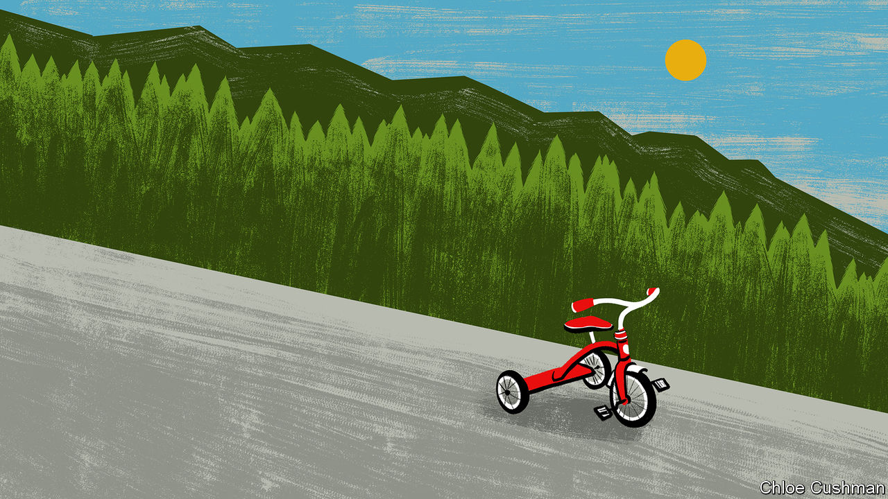

###### Chaguan

# China learns to manage decline 

##### Lessons from Yichun, a Chinese city where children are a rarity 

 

> May 11th 2023 

THE DEMOGRAPHIC milestones come thick and fast in “My Home in the Forest”, the official tourism anthem of Yichun, a sprawling city in China’s far north-east. The song was released in 2018 to promote the area’s pine-clad hills and temperate summers. It follows a couple from their courtship in a holiday treehouse to their marriage, then years of child-rearing (the lyrics hint at repeated family visits to a local lake). It ends with their contented old age, holding hands as the sun sets over Yichun.

This musical sales pitch is revealing and poignant, for several reasons. Its focus on ecotourism reflects hopes and fears that are specific to Yichun, a city trying to reinvent itself after its vast state-owned timber mills closed about a decade ago. Its boosterism shows off the entrepreneurial side of Chinese bureaucrats, who for several decades now have earned bonuses and promotions by presiding over local economic growth. When Chaguan visited recently, city officials tirelessly showed off Yichun’s attractions, from tasty blueberries to its dinosaur museum. By way of emphasis, officials unexpectedly interrupted an interview to break into “My Home in the Forest”, clapping and swaying as they sang.

Still, the ballad’s wistful evocation of family life should haunt Communist Party bosses all across China. Chaguan was not in Yichun to talk about berries, but because the city is at the leading edge of a demographic crisis that will soon hit the whole country. Birth rates are falling in China. The most recent national census, in 2020, revealed a total fertility rate (births per woman) of 1.3. The UN put the number at 1.2 last year. That is among the world’s lowest and far below that needed to maintain a stable population, namely, just over two children per woman.


The census found an extreme situation in Yichun. No Chinese city has as few children, as a share of its population. Just 7.4% of its 879,000 residents are under 14. For comparison, children in the same age range account for almost 18% of the Chinese population as a whole. Even in some of the greyest cities in Japan or South Korea, children are more common than in Yichun. The latest numbers are grim. In 2021 just 2,321 babies were born there, against 8,817 deaths. A generation earlier, in 2000, the city’s overall population was about a third larger than today. Yichun saw over 17,000 births that year, or eight times as many babies as now.

Though exceptionally bad, Yichun’s baby bust reflects demographic woes across China’s north-east rustbelt. The total fertility rate in the province of Heilongjiang, of which Yichun is part, is just 0.76 babies per woman of child-bearing age. One cause is working adults heading south. Marriage rates are also falling among those who stay.

A shrinking population will test China’s growth-orientated political system. On May 5th President Xi Jinping signalled new realism about this challenge at a meeting of the Central Commission for Financial and Economic Affairs, a powerful body that he chairs. The commission heard that lower birth rates, an ageing population and demographic disparities between regions are a “new normal” to which policymakers must adapt. Officials were told to focus on education, on building a “childbirth-friendly society” and on helping the old to lead active lives. Rather than growth, the talk is of “high-quality population development”.

Few cities like to admit to shrinking. That is in part because officials are rewarded for GDP growth, and in part because land sales are a big source of local-government revenue. As long as cities kept expanding, officials could easily justify auctioning new plots to developers. But the latest census leaves less room for denial. 

Yichun is a good place to see these trends. In 2001 the city published a plan predicting that the population would grow to 1.4m by 2020: a spectacular overestimate. In person, officials still dodge questions about birth statistics, preferring to offer anecdotes about friends having babies. Wang Hao, head of the city’s Communist Youth League branch, enthuses about Yichun supporting new jobs that appeal to the young, such as tagging traffic lights on maps and street-view images for makers of autonomous cars. Tellingly, though, Mr Wang admits that he has only one child, murmuring that he and his wife are too busy for more.

The politics of contraction

Meanwhile, Yichun has quietly merged some urban districts and combined some schools. In January it shed a series of outlying subdistricts, turning them into rural townships: a rare example of de-urbanisation. Dusty, apparently deserted housing estates are not hard to spot on the edge of town. Long Ying, an urban planner at Tsinghua University, co-wrote a recent study that used satellite images of night-time lighting to identify over 750 cities in China that shrank between 2013 and 2018. He describes different causes. Some cities lose people because natural resources run out. Others shed working-age adults to nearby big cities. Remote border towns are a third category. Not all are economic laggards. Professor Long wonders if China will see a fourth category in the near-future: coastal cities that lose workers to robots while still booming. Managing decline is very new for Chinese officials, he says. But he sees examples of pragmatism, pointing to north-eastern cities that turned derelict neighbourhoods into large parks.

China’s one-child policy limited births from 1980 to 2016. It left a heavy mark on cities like Yichun, with large state employers that enforced family-planning rules strictly. Now Heilongjiang offers subsidies to promote second and even third births. The money offered does not offset the economic pain of losing Yichun’s timber industry, says a man collecting his only grandchild from primary school. Before, he scoffs, “people wanted to have children but weren’t allowed. Now they allow it but people can’t afford children”. Politically, expansion is an easier sell than squeezing more from less. Party bosses are becoming more open about the task ahead. Do not expect them to sing about it. ■


