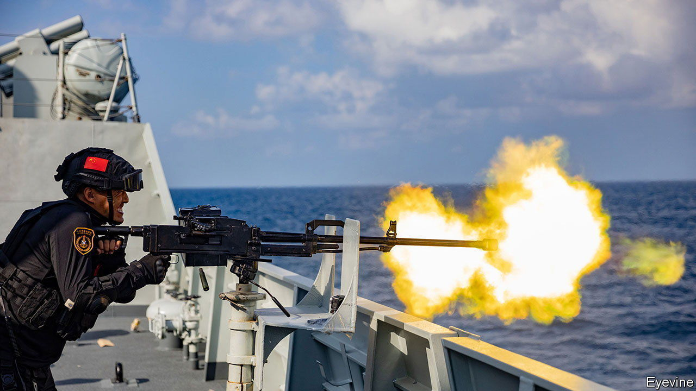
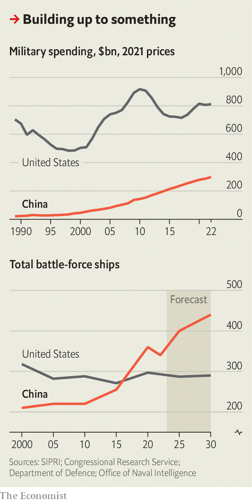

###### Superpower showdown

# China v America: how Xi Jinping plans to narrow the military gap 

##### From subs to nukes he is adding firepower despite a slower economy 

 

> May 8th 2023 

EVER SINCE British troops vanquished Qing dynasty forces in the Opium Wars of the 19th century, Chinese modernisers have dreamed of building world-class armed forces with a strong navy at their core. China’s spears and sailing ships were no match for steam-powered gunboats, wrote Li Hongzhang, a scholar-official who helped set up the country’s first modern arsenal and shipyard in Shanghai in 1865. If China systematically studied Western technology, as Russia and Japan had, it “could be self-sufficient after a hundred years”, he wrote. 

It took longer than Li imagined, but today his dream is within reach.  surpassed America’s as the world’s largest around 2020 and is now the centrepiece of a fighting force that the Pentagon considers its “pacing challenge”. The question vexing Chinese and Western military commanders is this: can China continue on the same path, relentlessly expanding its capacity to challenge American dominance? Or does a slowing Chinese economy, and a more hostile, unified West, mean that China’s relative power is peaking? 

In recent months, some American scholars have made the latter case, arguing that China might soon attack Taiwan, the self-governed island that it claims, as its relative advantages erode. “We live in an age of ‘peak China’,” write Hal Brands and Michael Beckley, two American political scientists, in a book released in August. “Beijing is a revisionist power that wants to reorder the world, but its time to do so is already running out.”


China’s supreme leader, Xi Jinping, certainly faces severe challenges, including an , runaway  and an American government bent on curbing the People’s Liberation Army’s (PLA) access to advanced Western technology. America is also overhauling its armed forces and galvanising alliances to prepare for . Yet there is still plenty of evidence that, in military terms, Chinese power is far from topping out. 

 


Take China’s defence budget. It has risen by an average of over 9% annually since Chinese leaders launched an ambitious military modernisation programme in the late 1990s. In 2023 China’s official military budget is projected to be $224bn, second only to America’s, which is about four times bigger. Increasing defence spending at such a pace is harder with a slowing economy. 

Nonetheless defence spending is budgeted to rise this year by 7.2%, roughly in line with China’s forecast rate of nominal GDP growth. The military budget excludes some key items such as weapons development. Still, it is a useful trend indicator, suggesting that Mr Xi is ring-fencing core defence spending at 1.6-1.7% of GDP—roughly the same as for the past decade.

If he can maintain that, based on the IMF’s current GDP forecasts, China’s annual military spending will still be far smaller than America’s by 2030, according to the Asia Power Index compiled by the Lowy Institute, an Australian think-tank. But China will narrow the gap substantially by then, it predicts, increasing military expenditure in purchasing-power-parity terms by $155bn, compared with America’s $123bn. 

Even if his economy grows slower than forecast, Mr Xi has considerable leeway to divert resources to the armed forces from the civilian economy. And within the armed forces, he can prioritise areas that he considers more strategically important, for example by downsizing the army, which accounts for almost half of the PLA’s 2.2m active-duty personnel.


Defence spending does not always translate into military power. That depends on many other factors, including technology, alliances and goals. But in China’s case, another useful indicator is the navy. It uses lots of different equipment, including missiles and aircraft, and would spearhead any effort to take Taiwan or project power globally. Building ships is costly and needs a strong industrial base, so it reflects economic health. It is also possible to compare China’s naval shipbuilding plans with America’s, which are made public. 

So what do the numbers show? China’s navy has grown in the past two decades from a puny coastal force of outdated ships to a largely modern, home-made one that can conduct some missions far from China’s shores, such as evacuating its citizens from Sudan in April. But it still falls short of Mr Xi’s needs in several key ways—in particular by not having enough large amphibious ships to guarantee a successful invasion of Taiwan. 

That will change over this decade, the Pentagon predicts, as the Chinese navy retires the last of its older ships and adds larger, modern, multi-role ones. It now has about 340 “battle force” vessels (ones that can contribute to combat), including carriers, submarines, frigates and destroyers. That number is likely to reach 400 by 2025 and 440 by 2030, according to the Pentagon. Among the new ships will be about a dozen more large amphibious ships.

Even assuming low defence-budget growth, China’s navy would still grow to an estimated 356 ships by 2033, adding three carriers and nine big amphibious ships, according to the Centre for Strategic and Budgetary Assessments (CSBA), a think-tank in Washington that has designed a digital tool for assessing China’s military procurement choices. “I don’t think the resource constraints are so formidable that Chinese leaders will begin to think that their relative power advantages are eroded,” says Jack Bianchi of CSBA.

America’s navy, by comparison, had a battle force of 296 ships in April (about half its cold-war peak) and expects that number to drop to about 290 by the end of this decade. Thereafter, America may start to narrow the gap. Its navy still has an official goal of 355 ships. But budget constraints, political changes and other factors could make that difficult to achieve even by 2040. And while China is focusing its military build-up on Taiwan, America has to maintain a global presence.

Ship numbers can be misleading. America’s vessels are still bigger and more capable. Yet China is likely to catch up on those counts too in the coming decade. It is already “largely composed of modern multi-role platforms featuring advanced anti-ship, anti-air, and anti-submarine weapons and sensors,” says the Pentagon. The Office of Naval Intelligence states that Chinese naval-ship design and material quality is in many cases comparable to America’s “and China is quickly closing the gap in any areas of deficiency.”

One of China’s advantages is its vast shipbuilding industry, which is the world’s largest, accounting for 44% of commercial ships produced worldwide in 2021. A single state-run company, the China State Shipbuilding Corporation (CSSC), accounted for more than a fifth of global orders that year. But it also produces most of China’s navy ships, often at the same shipyards as commercial vessels. For instance, the CSSC-owned Jiangnan shipyard (the one founded by Li Hongzhang in 1865) completed China’s  in 2022 but has also made dozens of cargo ships, including for Taiwanese customers. Combining production in this way helps to sustain the shipyards in economic downturns, to apply civilian technology and mass-production techniques to naval shipbuilding, and to circumvent sanctions targeting the PLA, says Monty Khanna, a retired rear-admiral in the Indian navy. America’s naval shipbuilders, meanwhile, focus almost exclusively on defence contracts, making it hard to scale up production or to sustain a stable supply of skilled workers.


Yet there is one crucial area in which China will struggle to match America for many years, if not decades: experience. China has not been to war since one with Vietnam, fought largely on land, in 1979. It has not yet perfected carrier operations in peacetime, let alone combat. And it has not mastered the art of keeping its submarines hidden, while tracking potentially hostile ones. America, by comparison, has honed those capabilities over decades. China is also struggling to attract enough well-educated recruits to operate its new ships.

There is still, of course, a risk that Mr Xi goes to war before his armed forces are ready. The most likely triggers for that would be Taiwan formally declaring independence or America taking steps to significantly enhance the island’s status or defences. As he grows older and more vulnerable to ill health and political challenges, there is the possibility that he miscalculates or grows impatient, as Vladimir Putin, Russia’s president, apparently did over Ukraine.

Some see signs of such impatience already in Mr Xi, who American officials say has ordered his armed forces to develop the capability to take Taiwan by 2027, the PLA’s centenary. But that does not mean he plans to attack by then, says the CIA. Many PLA experts believe that 2027 is more of a short-term milestone designed to maintain momentum towards the medium-term target of complete PLA modernisation by 2035. His ultimate goal is still to build a  by 2049, the centenary of Communist rule. 

Recent war games suggest that China could perhaps win a conflict over Taiwan this decade, but not for sure, and losses on all sides would be devastating. The longer Mr Xi waits, the more the military balance tips in China’s favour—and not just in conventional terms. The Pentagon predicts China’s nuclear arsenal will almost quadruple in size by 2035. Chinese strategists hope that will facilitate a peaceful solution by persuading both Taiwan and America that conflict would be too costly. “Peak China” proponents may be correctly predicting a fraught decade ahead. But Mr Xi still has time on his side.■


