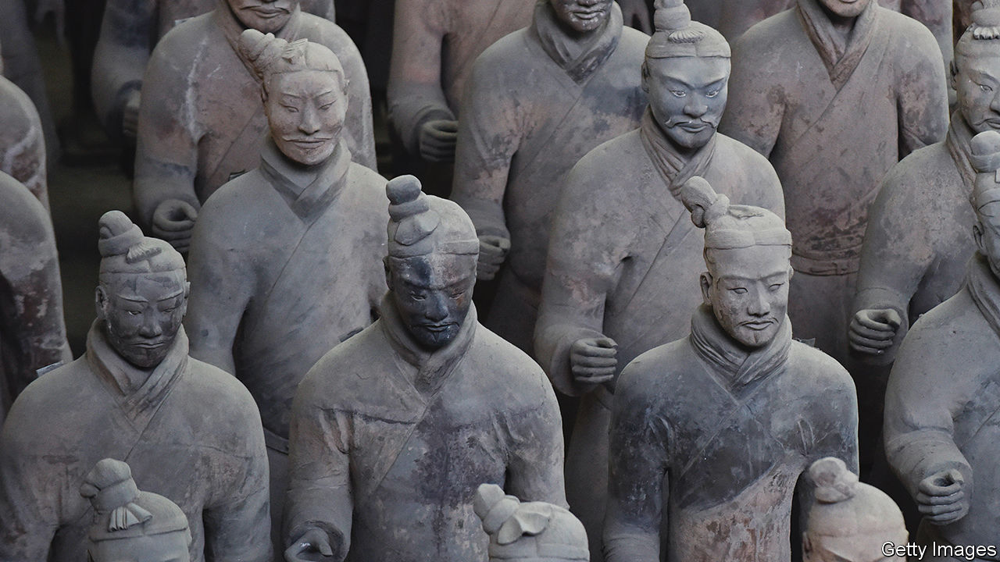
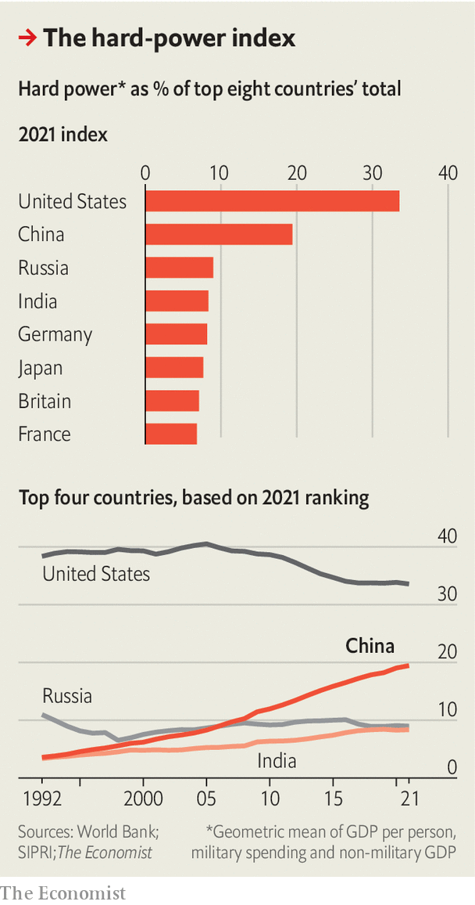

###### Sun Tzu’s slide-rule

# How China measures national power 

##### And how we would do it 

 

> May 11th 2023 

IN “GUANZI”, a text from the seventh century BC, a statesman thought to be called Guan Zhong lays out the “eight views” needed to assess a country’s status. “Tour its mountains and lakes,” he says, “observe its agriculture, and calculate its production of six types of livestock. Then, it will be apparent whether a country is wealthy or destitute.” These days, Chinese scholars employ different methods, but their aim is the same: to assess the balance of power in a hostile world. 

Measuring power matters because you do not want to fight a war unless you are confident of winning. As the military strategist Sun Tzu explained a century after Guan Zhong: “He who knows himself and knows others shall be victorious in every battle…he who knows neither shall be defeated in every battle.”

If the theory is simple, actually measuring power is fraught with arbitrary judgments and subjectivity. But that has not stopped Chinese scholars from trying to compute what has come to be known as Comprehensive National Power, or CNP. 


In the 1980s Chinese scholars started by looking at the power equations drawn up in the West, but found them wanting. A formula devised by Ray Cline, a CIA analyst, was dismissed for being too narrow in scope and too subjective. Deng Xiaoping, China’s reformist leader, had stated: “In measuring a country’s national power, one must look at it comprehensively and from all sides.” To cater to these demands, Chinese experts started to design their own models.

They ran into some problems. One is that the more complete the range of variables, the harder it is to allocate weights to them. In a paper from 2002, Hu Angang and Men Honghua, then of Tsinghua University, listed eight categories of resources, taking in everything from farmland to computers. CNP is calculated as a weighted average of these resources as a share of the world’s total. The Chinese Academy of Social Sciences has a similar model, but uses different indicators and weightings. Who is right? Some indexes rely for their weightings on polls of experts, but that’s just a sophisticated version of the conventional wisdom.

 


Another problem is that the calculation of CNP produces a single number, but the components that make it up are not interchangeable. In theory CNP could predict that a widely admired country which defends its world-class dance troupes with a gunboat and a couple of tanks will be able to hold its own against a Philistine horde that spends all its money on weapons. 

What’s more, effective power depends on the context. A country’s cultural exports can convey soft power, but they are of little use in a war. David Baldwin of Princeton University writes that assessing power without a context is like discussing what makes up a good hand without specifying the card game. 

You might think all those complications would be enough to knock CNP on the head. Instead, it has spurred researchers to come up with their own, improved versions.  has counted 69 of them. Not to be deterred, we have added to the pile. Drawing inspiration from an article by Michael Beckley of Tufts University, we zoom in on the three essential ingredients of national power: economic heft, productive efficiency and military might. 

A country cannot be powerful if its economy is inefficient. In the 19th century China lost two opium wars to Britain, despite having a GDP twice the size. On the other hand, neither can a country be powerful if its economy is efficient but small. Luxembourg has not won many wars. And countries cannot fight without a decent army. In the Song dynasty the deadly Mongol cavalry outmatched even the finest Chinese infantry.

Our hard-power index therefore uses GDP per person to stand for efficiency, military expenditure for might, and non-military GDP for economic heft. These are multiplied, so that countries suffer for their deficiency in any one of them. In the extreme, if any element is zero, then a country’s power is zero, too. 

Of course, old weapon stocks and nuclear arms also convey might. And GDP does not always translate into economic heft or efficiency. But, at least in the current era, our proxies seem reasonable enough. 

By our measure, China has been gaining on America, but the latter is still comfortably on top. Sun Tzu would predict peace for a good few years yet. ■


