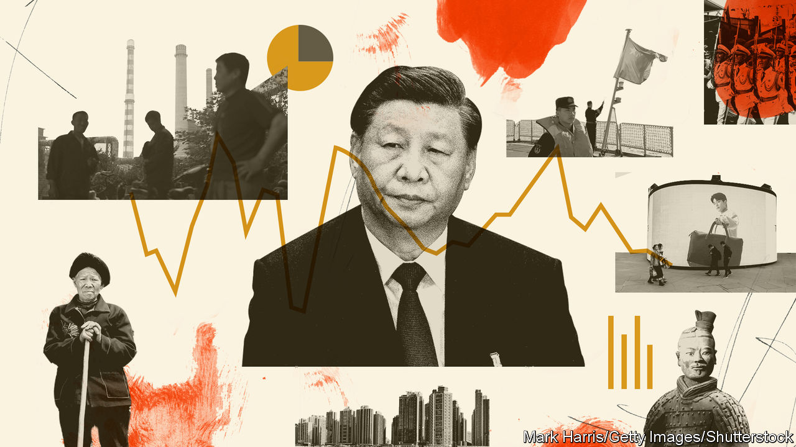
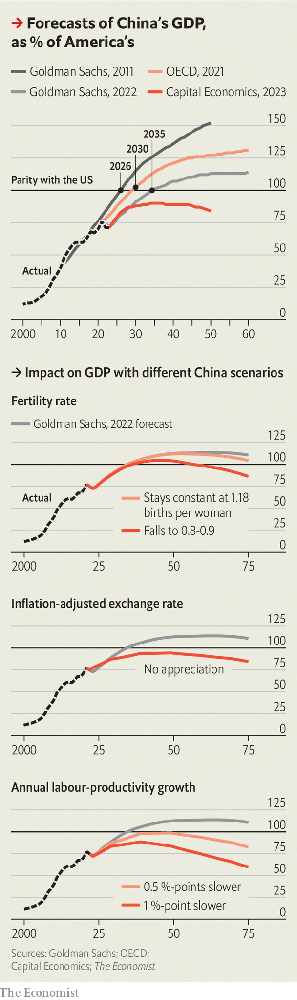

###### Mountain range

# How soon and at what height will China’s economy peak? 

##### Estimates vary, depending on assumptions about population, productivity and prices 

 

> May 11th 2023 

CHINA HAS this year liberated its economy from the lockdowns, quarantines and other strictures of its “zero-covid” regime. But it has not freed itself from longer-term worries about its growth prospects. Its population is shrinking. Its epic housing boom is over. Thanks to a regulatory crackdown on e-commerce firms, the Communist Party has cowed the tech billionaires it once courted. Jack Ma, a former teacher who became one of China’s most celebrated entrepreneurs, has returned to teaching—in Japan.

The Communist Party now prizes security over prosperity, greatness over growth, sturdy self-reliance over the filigreed interdependence that distinguished China’s past economic success. Foreign investors are more wary, seeking to relocate or at least diversify their supply chains. And America is eager to limit Chinese access to some “foundational technologies”. The economics of mutual benefit has yielded to the geopolitics of mutual suspicion.

All this has led many analysts to cut their long-term forecasts for China’s growth, even as they raise predictions for this year. Some ask how much longer China’s economy can grow faster than America’s. The answer will affect far more than factory orders or personal incomes. It will shape the world order.


The previous consensus, both within and outside China, was that its economy would soon eclipse America’s. That, in turn, would allow China to become the world’s pre-eminent military power, and so supplant America as the world’s most powerful country. This remains a common view. Yao Yang, a respected economist at Peking University, believes China’s GDP can overtake America’s by 2029. 

But others believe China’s economic clout relative to that of its rivals is nearing a peak. Hal Brands and Michael Beckley, two American political scientists, argue that China’s rise is already coming to a halt. The age of “peak China”, as they call it, is upon us—and it is far less Olympian a summit than most had predicted. 

 


In 2011 Goldman Sachs projected that China’s GDP would surpass America’s in 2026 and become over 50% larger by mid-century. No peak was in sight. At the end of last year the bank revisited its calculations. It now thinks China’s economy will not overtake America’s until 2035 and at its high point will be only 14% bigger (see chart).

China’s peak looks similar in an influential forecast from last year by Roland Rajah and Alyssa Leng of the Lowy Institute, an Australian think-tank. Others see an even lower summit. Capital Economics, a research firm, argues that China’s economy will never be number one. It will reach 90% of America’s size in 2035 and then lose ground. In so far as the Peak China thesis can be captured in a single projection, this is it.

What accounts for the lower expectations for China’s economy? And how much of a reduction is warranted? The answers hinge on three variables: population, productivity and prices. Start with population. China’s workforce has already peaked, according to official statistics. It has 4.5 times as many 15- to 64-year-olds as America. By mid-century it will have only 3.4 times as many, according to the UN’s “median” forecast. By the end of the century the ratio will drop to 1.7.

But China’s demographic prospects have not changed much over the past decade, even as forecasts for economic growth have shrunk. In fact, Goldman Sachs’s new predictions assume a gentler decline in China’s workforce than the old ones, because improvements in health may keep older workers at the grindstone for longer. The bank believes the labour supply in China will drop by about 7% from 2025 to 2050.

The biggest swing in sentiment relates not to population but to productivity. Back in 2011 Goldman Sachs thought labour productivity would grow by about 4.8% a year on average over the next 20 years. Now the bank thinks it will grow by about 3%. Mark Williams of Capital Economics takes a similar view. China will fall “off the path of an Asian outperformer onto the path of a solidly respectable emerging economy”, he says.

There are good reasons to be gloomy about Chinese workers’ productivity. As China ages, it will have to devote more of its economic energies to serving the elderly, leaving less to invest in new kit and capacity. What is more, after decades of rapid capital accumulation, the returns to new investments are diminishing. A new high-speed rail line across mountainous Tibet yields far smaller benefits at much greater cost than connecting Beijing and Shanghai, for instance.

China’s rulers are trying to impose more discipline on local governments, which build much of China’s questionable infrastructure. Unfortunately, they seem equally keen to impose their will on China’s private enterprises. In China, unlike elsewhere, firms earn a smaller return on their assets as they grow bigger, points out Capital Economics: “Get to a certain size and companies have to give as much thought to meeting the needs of officials as those of consumers.”

It is not just their own government that is hobbling Chinese businesses. In October America imposed controls on sales of advanced computer chips to China. This will hurt Chinese firms making products like mobile phones, medical equipment and cars. Goldman Sachs has not incorporated this damage into its long-term forecasts, but estimates that China’s GDP towards the end of this decade could be about 2% smaller than it would otherwise have been.

The tech war could go further. Diego Cerdeiro of the IMF and his co-authors have examined a scenario in which America curtails its own technology trade with China, persuades other OECD members to follow suit, and forces countries outside this club to pick sides in the battle. Under this extreme scenario, China’s economy could be about 9% smaller in ten years’ time than it otherwise would be. The idea that China’s productivity growth might be closer to 3% than 5%, in other words, is not far-fetched.

Any predictions of the economic future must, of course, be taken with a pinch of salt. Forecasts often go awry. Small differences in the evolution of productivity or population when combined and compounded over many years can yield starkly different outcomes. 

Forecasts are also sensitive to prices—especially the relative price of currencies. Unexpected shifts in exchange rates can make a mockery of predictions of relative economic heft. At the moment, a basket of goods and services that costs $100 in America costs only about $60 in China. That suggests its currency, the yuan, is undervalued. Capital Economics thinks this undervaluation will persist. Goldman Sachs, on the other hand, believes it will narrow, either because the yuan strengthens or because prices rise faster in China than in America. This process will, in Goldman’s view, add about 20% to China’s GDP by mid-century.

If China’s prices or exchange rate fail to rise as Goldman Sachs expects, then China’s GDP might never overtake America’s. If China’s labour productivity grows just half a percentage point slower than Goldman Sachs envisages, its GDP, everything else constant, will also never surpass America’s (see chart). The same is true if America grows half a point faster (as Capital Economic projects). If China’s fertility rate declines further (to 0.85 children per woman by mid-century), it might eke out a lead in the 2030s only to lose it in the 2050s. Even if China’s economy does become the biggest in the world, its lead is likely to remain small. It is unlikely to establish an edge over America equivalent to the 40% lead America now enjoys over it, Mr Rajah and Ms Leng argue.

It also seems safe to say that China and America will remain in a position of near-parity for decades. In Goldman Sachs’s scenario, China maintains a small but persistent lead over America for more than 40 years. Even in Capital Economics’s projection, China’s GDP will still be over 80% of America’s as late as 2050. China will remain a geopolitical rival to be reckoned with. That is crucial: if China’s peak is more Table Mountain than K2, its leaders will have little incentive to rush to confrontation before decline sets in. ■


