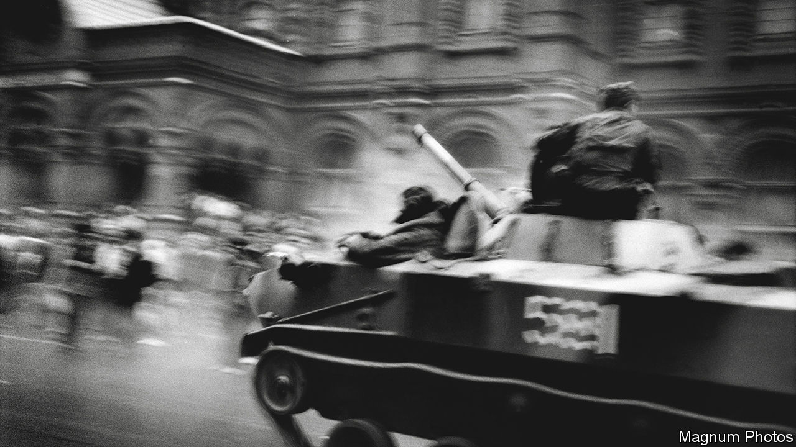
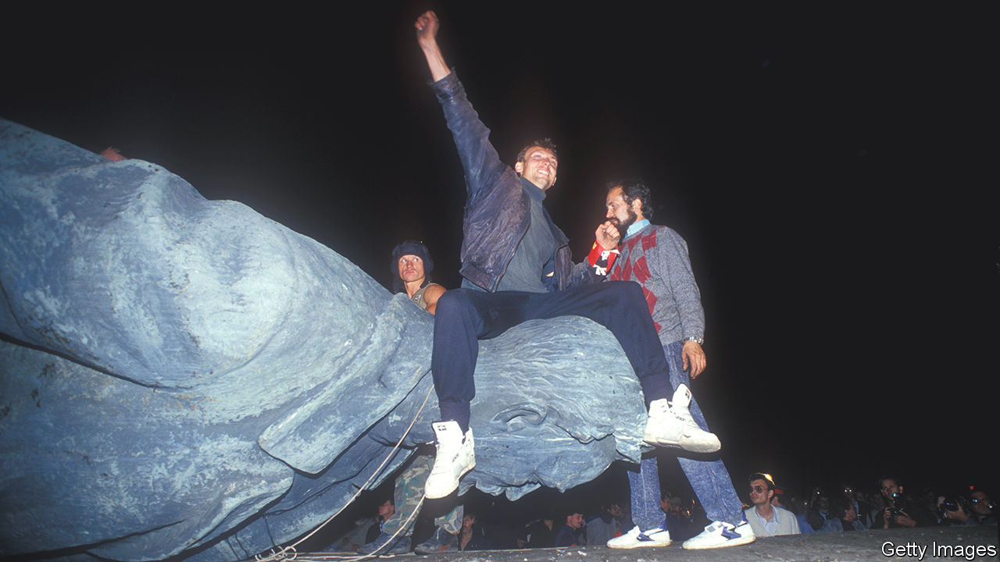

###### History lessons

# The fall of empires preys on Xi Jinping’s mind 

##### As economic growth slows, so will the president’s anxiety 

 

> May 11th 2023 

By late January China had emerged from a tsunami of covid-19 infections that began to crash over the country a few weeks earlier, after the lifting of nearly three years of draconian pandemic controls. Officials were covering up the horrific scale of the wave’s lethality, but most people’s lives were returning to normal. The Communist Party felt the time was right to publish a speech by Xi Jinping, China’s supreme leader, that he had delivered a year earlier, as the economy reeled from the impact of his “zero-covid” policy. It was not about the crisis at hand, but about history. 

Long before foreign analysts began their recent musings on whether “peak China”—the height of the country’s power—has been reached or is imminent, Mr Xi had been urging China’s citizens to reflect on the peaks and troughs of the country’s past. He insists that China‘s “great rejuvenation”, to be achieved by the 100th anniversary of Communist rule in 2049, is “irreversible”. That is, the country will, by then, become even stronger and more influential. But he has stressed the need to avoid mistakes that caused the fall of dynasties during the country’s 2,100-year-long imperial era, which ended in 1911, as well as those that led to the collapse of the Soviet Union 80 years later. Since he took power more than a decade ago, he has often mused on the inconstancy of national greatness and threats to the party’s rule. History clearly haunts him. 

Mr Xi talks of the “cyclical nature of history”, whereby strong and prosperous regimes sooner or later unravel. The speech he gave a year ago, to the party’s chief enforcers of internal discipline, was about how China must “jump out” of this historical pattern. State media summarised Mr Xi’s remarks shortly after he delivered them, but the (still only partial) text that was published in January was fuller and more dramatic. In it, Mr Xi’s anxiety is clear. He told the officials that the cyclical tendency was a “major issue”, relating to “the life and death of the party, and the rise or fall or success or failure of our country’s socialist system”.

Discussion of this cycle has a long history in China. Official literature traces it back to the party’s days as a guerrilla force at the end of the second world war when its leader, Mao Zedong, was reportedly asked by an inquisitive visitor to his base how the party would avoid the trap. His (disingenuous) answer was “democracy—only if people are allowed to supervise the government will it dare not to relax”. Mr Xi insists that China has become democratic already, far more so than Western countries. But state media credit him with another means of avoiding decline. He calls it “self-revolution”, a euphemism for endless purges of officials who are corrupt or disloyal. 


Mr Xi dwells on the collapse of the Soviet Union even more than his predecessors did. In his view, its causes were chiefly political: ideological laxity and a lack of discipline within its ruling party. In his published speeches, he does not spend much time on other problems that may have played a part, such as the financial burden of military competition with the West, or the costs of having swathes of the economy under the control of inefficient state-owned enterprises. To Mr Xi, the simple moral is that China’s Communist Party needs to be much tougher. As he puts it, nobody in the Soviet Union was “man enough” to crush opposition when the crunch came. 

 


Mr Xi endlessly calls on citizens to show confidence in China’s political system and the party’s policies. But he also warns of mounting perils ahead. “At present and in the future, we are facing many contradictions, risks and challenges at home and abroad, and we must not take it lightly,” he said in 2016, even before Donald Trump was elected as president and tensions with America began to escalate. If China were to fail to respond effectively, he added, problems in areas such as the economy, society and the environment could “evolve into political contradictions, risks and challenges that will ultimately endanger the party’s ruling status and national security”. 

As more difficult years loom—with an ageing society, shrinking population and slowing growth—logic might seem to prod Mr Xi to consider economic and social reforms. Useful ones would include scaling back state-owned firms, giving private businesses freer rein in critical parts of the economy and providing rural migrants with fairer access to state-funded health care and education in cities. But his end-of-dynasty fears will complicate decision-making. He views state enterprises as a bulwark of party rule and big private firms, notably those in the tech industry, with suspicion. He sees the middle class as another pillar of support: he may not want to alienate it by appearing to splurge on urban society’s underdogs. 

The dilemma is captured in a mid-19th-century book by Alexis de Tocqueville: “The Old Regime and the Revolution”. Translations of the French historian’s classic work about his country’s revolution in 1789 have been hot sellers in China since the months before Mr Xi took over. It owes its popularity to an unexplained recommendation by Wang Qishan, a party bigwig who became Mr Xi’s chief enforcer of discipline and, later, vice-president (he stepped down in March). Readers comb Tocqueville’s analysis of France’s turmoil for insights into China’s future. 

One clause is usually highlighted. It is that “experience teaches that the most critical moment for bad governments is the one which witnesses their first steps toward reform.” It is unlikely that Mr Wang meant to imply that the party was ruling badly, or that reforms should cease. But he could have been suggesting that a period of relative prosperity, such as France experienced before the revolution, can be fraught with political danger. The party must be on its guard. 

Learning from Tacitus

There is little sign of regime-threatening discontent brewing in China. But Mr Xi is certainly watchful. In 2019 China’s head of public security said that preventing a “colour revolution” in China was a priority for the police. Protests in November against the zero-covid policy, though small and scattered, will have reinforced Mr Xi’s concerns. Such open displays of dissent are rare. Even more unusually, some demonstrators called on Mr Xi to step down. 

As economic growth slows in the years ahead, unease over living standards is likely to grow, and with it Mr Xi’s anxiety. In 2014 he referred to what Chinese scholars call the “Tacitus trap”. This is the idea, taken from the Roman historian’s writings, that “when a ruler once becomes unpopular, all his acts, be they good or bad, tell against him.” Mr Xi said: “Of course, we haven’t got to this stage yet, but the problems we face can’t be described as unserious. We must use huge energy to resolve them.” Since then, his warnings have become more strident. “The more we proceed, the harder and more dangerous it gets,” he said in 2018. Mr Xi has yet to refer publicly to the Peak China concept, but the risks of stalling are clearly on his mind. ■


